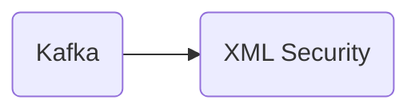

# Connect Kafka to XML Security

Quix helps you integrate Kafka to XML Security using pure Python.

<a class="md-button md-button--primary" href="https://share.hsforms.com/1iW0TmZzKQMChk0lxd_tGiw4yjw2?__hstc=175542013.2303933fbd746c0ac86d9ccbe9bc9100.1728383268831.1729603416735.1729620918855.31&__hssc=175542013.1.1729620918855&__hsfp=2132701734" target="_blank" style="margin-right:.5rem;">Book a demo</a>
 

## XML Security

XML Security is a technology that provides a set of protocols and standards for securing data exchanged between applications using the Extensible Markup Language (XML). It encompasses a range of cryptographic and security measures to protect sensitive information such as authentication, confidentiality, integrity, and non-repudiation. XML Security includes features such as XML Encryption for encrypting data, XML Signature for signing and verifying the authenticity and integrity of XML documents, and XML Key Management for securely managing encryption keys. This technology ensures that data transmitted over networks is secure and protected from unauthorized access or tampering.

## Integrations

Quix is a good fit for integrating with XML Security technology because it offers a comprehensive platform for developing, deploying, and managing real-time data pipelines with a focus on security and compliance. 

With features such as secure management of secrets, dedicated infrastructure options, and compliance with SLAs, Quix ensures that data pipelines are protected and meet regulatory requirements. This aligns well with the requirements of XML Security, which involves securing and encrypting XML data to protect sensitive information.

Additionally, Quix's enhanced collaboration features, flexible scaling and management capabilities, and robust CI/CD processes make it easier to integrate XML Security into data pipelines and ensure that security measures are consistently applied and monitored throughout the development and deployment process.

Furthermore, Quix's support for Kafka integration through Quix Streams enables seamless processing of data in Kafka using Python, which can be beneficial for implementing XML Security measures in real-time data pipelines.

Overall, Quix's focus on security, compliance, and streamlined development processes make it a suitable choice for integrating with XML Security technology to ensure data confidentiality and integrity in data pipelines.

