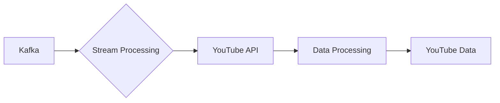

# Connect Kafka to YouTube

Quix helps you integrate Kafka to YouTube using pure Python.

## YouTube

YouTube is a widely popular video-sharing platform that allows users to upload, share, and view videos on a variety of topics ranging from entertainment, music, gaming, tutorials, to educational content. Founded in 2005, YouTube has become one of the largest social media platforms in the world, with billions of users and millions of videos being uploaded daily. The platform utilizes advanced algorithms to recommend videos based on user preferences and viewing history, making it a personalized experience for each user. YouTube also offers live streaming features, monetization options for content creators, and a community of viewers and creators who engage through comments, likes, and shares. Overall, YouTube has revolutionized the way we consume digital content and has become an essential part of our daily lives.

## Integrations

Quix would be a good fit for integrating with YouTube because of its robust features designed for real-time data processing and management. With its streamlined development and deployment tools, developers can easily create and deploy data pipelines to handle the massive amounts of data that YouTube generates. Additionally, its real-time monitoring capabilities would allow for efficient tracking of pipeline performance and critical metrics, ensuring smooth and reliable data processing.

Furthermore, the enhanced collaboration features of Quix Cloud would promote teamwork and project visibility, making it easier for teams to work together on integrating YouTube data. With its security and compliance measures, users can rest assured that their data is well-protected and in compliance with regulations. The integration with Kafka also provides seamless connectivity with third-party services, further enhancing the capabilities of the platform.

Quix Streams, with its cloud-native approach and Python interface, would be especially useful for processing data in Kafka, making it a suitable choice for integrating with YouTube's data streams. Its support for serialization formats, stateful operations, and time window aggregations makes it well-equipped to handle the diverse and complex data generated by YouTube. The ability to scale resiliently via container orchestration ensures that the platform can handle the increasing volume of data from YouTube as the platform grows. Additionally, its support for local and Jupyter Notebook development provides a convenient environment for developers to work with YouTube data and develop custom solutions. Overall, Quix would be an excellent choice for integrating with YouTube due to its comprehensive feature set tailored for real-time data processing and management.

