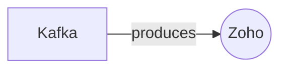

# Connect Kafka to Zoho

Quix helps you integrate Kafka to Zoho using pure Python.

## Zoho

Zoho is a comprehensive online platform that offers a wide range of tools and services for businesses of all sizes. From customer relationship management (CRM) software to project management tools, Zoho provides solutions to help companies streamline their operations, enhance collaboration among teams, and improve efficiency. With a user-friendly interface and a suite of customizable applications, Zoho allows businesses to manage their sales, marketing, customer support, and other key functions all in one place. Additionally, Zoho offers cloud-based services, making it accessible from anywhere with an internet connection. Overall, Zoho is a powerful and versatile technology that can help businesses optimize their processes and drive success.

## Integrations

Quix is a good fit for integrating with the technology called Zoho because it provides a comprehensive platform for developing, deploying, and managing real-time data pipelines, which aligns well with the data processing and integration needs of Zoho users. The key components of Quix Cloud, such as streamlined development and deployment, enhanced collaboration, real-time monitoring, flexible scaling and management, security and compliance features, development tools, data exploration and visualization capabilities, robust CI/CD processes, Kafka integration, and dedicated/BYOC options, make it an ideal choice for integrating with Zoho's technology stack.

Moreover, Quix Streams specifically offers a cloud-native library for processing data in Kafka using Python, which further complements Zoho's technology infrastructure. The benefits of Quix Streams, such as no JVM requirement, seamless integration with the Python ecosystem, support for serialization and state management, time window aggregations, resilient scaling capabilities, and support for local and Jupyter Notebook development, make it a suitable solution for handling data processing tasks within the Zoho ecosystem.

Overall, the advanced features and capabilities of Quix Cloud and Quix Streams make them a good fit for integrating with Zoho's technology, enabling users to efficiently develop, deploy, and manage real-time data pipelines and streamline their data processing workflows.

