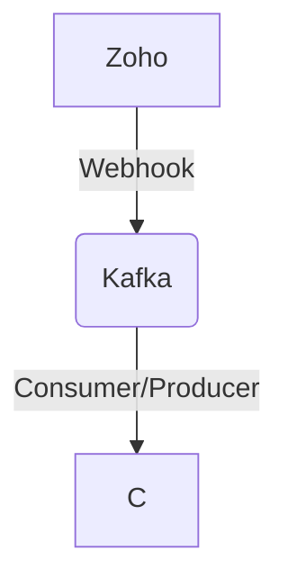

# Connect Kafka to Zoho

Quix helps you integrate Kafka to Zoho using pure Python.

- __Find out how we can help you integrate!__

    <a class="md-button md-button--primary" href="https://share.hsforms.com/1iW0TmZzKQMChk0lxd_tGiw4yjw2?__hstc=175542013.2303933fbd746c0ac86d9ccbe9bc9100.1728383268831.1729603416735.1729620918855.31&__hssc=175542013.1.1729620918855&__hsfp=2132701734" target="_blank" style="margin:.5rem;">Book a demo</a>

## Zoho

Zoho is a suite of cloud-based software used for business management and productivity. It offers a wide range of tools and applications, including CRM, project management, email marketing, accounting, and HR software. Zoho provides an integrated platform for managing various aspects of a business, streamlining workflows, and improving efficiency. With its user-friendly interface and customizable features, Zoho helps businesses automate tasks, collaborate better, and make informed decisions. Overall, Zoho is a comprehensive technology solution that empowers organizations to enhance their performance and achieve their goals.

## Integrations

Quix is a good fit for integrating with Zoho because it offers a comprehensive platform for developing, deploying, and managing real-time data pipelines. Zoho, being a powerful suite of business applications, can greatly benefit from Quix's streamlined development and deployment features. The integrated online code editors and CI/CD tools simplify the process of creating and deploying data pipelines, making it easier for Zoho users to work with real-time data.

Additionally, Quix's enhanced collaboration features, such as organization and permission management, can improve project visibility and control for Zoho users. The real-time monitoring tools provided by Quix Cloud allow for easy monitoring of pipeline performance and critical metrics, which can be extremely valuable for businesses using Zoho's applications.

Furthermore, Quix's flexibility in scaling resources and managing multiple environments linked to Git branches aligns well with Zoho's diverse user base and business needs. The platform's focus on security and compliance also ensures that data management remains secure and compliant with industry standards.

In addition, Quix Streams, with its cloud-native library for processing data in Kafka using Python, can further enhance the capabilities of Zoho's applications. The seamless integration with the Python ecosystem and support for serialization and state management make it easy for Zoho users to work with data in Kafka efficiently.

Overall, Quix's features such as streamlined development, enhanced collaboration, real-time monitoring, and flexible scaling make it a strong candidate for integration with Zoho's technology. By leveraging Quix's capabilities, Zoho users can enhance their data processing workflows and improve overall efficiency in managing real-time data pipelines.

