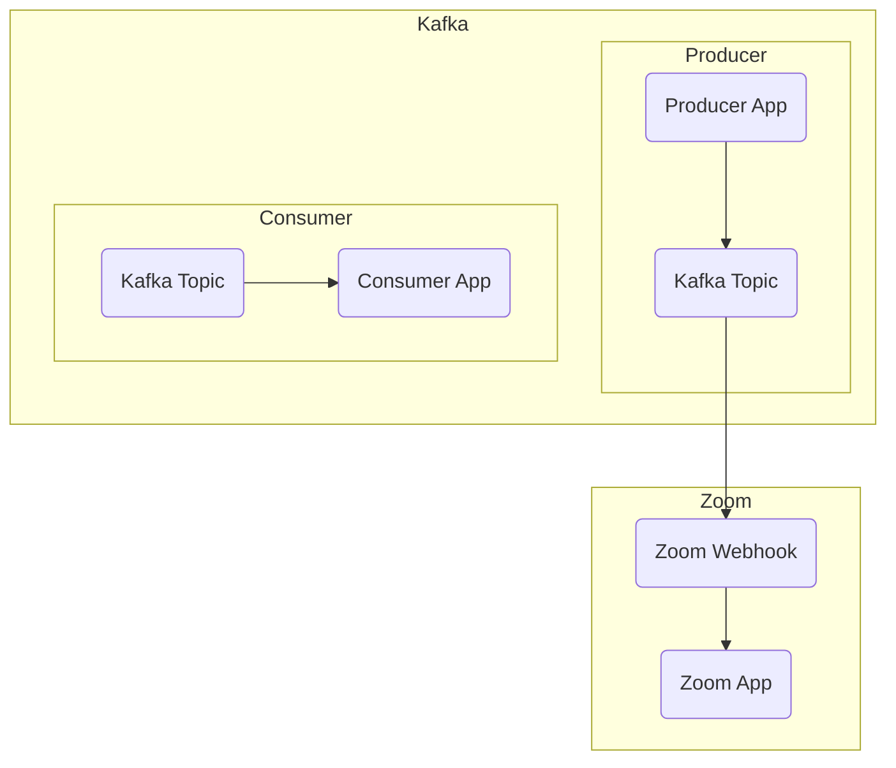

# Connect Kafka to Zoom

Quix helps you integrate Kafka to Zoom using pure Python.

## Zoom

Zoom is a video conferencing platform that allows individuals and groups to connect and communicate in real time from anywhere in the world. With its easy-to-use interface and high-quality audio and video capabilities, Zoom has become a popular choice for virtual meetings, webinars, and online classes. Users can join a Zoom meeting from their computer, smartphone, or tablet, making it convenient for remote collaboration and communication. Zoom also offers features such as screen sharing, virtual backgrounds, and recording capabilities, making it a versatile tool for both professional and personal use. Its ability to bring people together seamlessly and efficiently has made Zoom a trusted and essential technology for staying connected in today's digital world.

## Integrations

Quix is a good fit for integrating with Zoom because it provides a comprehensive platform for developing, deploying, and managing real-time data pipelines. 

1. Streamlined Development and Deployment: Quix Cloud offers integrated online code editors and CI/CD tools that simplify the creation and deployment of data pipelines. This can help streamline the integration process with Zoom and ensure efficient development and deployment of the necessary pipelines.

2. Enhanced Collaboration: The platform supports efficient collaboration with organization and permission management, which can enhance teamwork when integrating with Zoom. This feature allows for increased project visibility and control, facilitating better communication and coordination among team members.

3. Real-Time Monitoring: Quix Cloud provides tools for real-time monitoring of pipeline performance and critical metrics. This can be beneficial when integrating with Zoom, as it allows for the monitoring of data flows and performance in real-time, ensuring smooth and efficient operation of the integration.

4. Flexible Scaling and Management: The platform allows users to easily scale resources and manage CPU and memory, which can be useful when integrating with Zoom to handle varying data loads and resource requirements. This flexibility ensures that the integration can adapt to changing needs and demands.

5. Security and Compliance: Quix Cloud ensures secure management of secrets and compliance with dedicated infrastructure options and SLAs. This feature can be essential when integrating with Zoom to maintain data security and compliance with regulations, ensuring the protection of sensitive information shared through the integration.

Overall, the features offered by Quix Streams and Quix Cloud make them a good fit for integrating with Zoom, providing a robust and flexible platform for developing, deploying, and managing real-time data pipelines that can enhance collaboration, streamline development, and ensure efficient monitoring and scaling capabilities.

