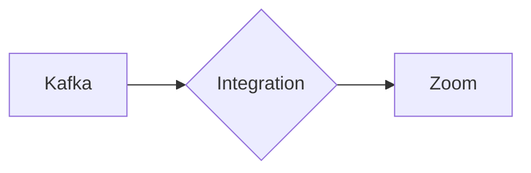

# Connect Kafka to Zoom

Quix helps you integrate Kafka to Zoom using pure Python.

<a class="md-button md-button--primary" href="https://share.hsforms.com/1iW0TmZzKQMChk0lxd_tGiw4yjw2?__hstc=175542013.2303933fbd746c0ac86d9ccbe9bc9100.1728383268831.1729603416735.1729620918855.31&__hssc=175542013.1.1729620918855&__hsfp=2132701734" target="_blank" style="margin-right:.5rem;">Book a demo</a>
 

## Zoom

Zoom is a popular video conferencing technology that has revolutionized the way people communicate with each other, especially in the age of remote work and virtual meetings. It allows users to connect with others through video, audio, and chat functionality, making it easy to collaborate and communicate with colleagues, friends, and family no matter where they are located. Zoom offers features such as screen sharing, recording capabilities, and virtual background options to enhance the user experience. With its user-friendly interface and high-quality video and audio capabilities, Zoom has become a go-to platform for virtual meetings, webinars, and social gatherings.

## Integrations

Quix is a good fit for integrating with Zoom because of its comprehensive platform designed for developing, deploying, and managing real-time data pipelines. With features such as streamlined development and deployment, enhanced collaboration, real-time monitoring, and flexible scaling and management, Quix can easily integrate with Zoom to streamline the process of handling large amounts of data in real-time during video conferences or online meetings.

Additionally, Quix Streams, a cloud-native library for processing data in Kafka using Python, can be utilized to efficiently stream and process data from Zoom meetings. Its benefits such as no JVM requirement, Python ecosystem integration, serialization and state management support, time window aggregations, resilient scaling, and local and Jupyter notebook support make it a valuable tool for integrating with Zoom and enhancing the overall meeting experience.

Overall, the combination of Quix's cloud platform for data pipeline management and Quix Streams for processing data in Kafka using Python makes it a good fit for integrating with Zoom to improve collaboration, real-time monitoring, and data processing capabilities during online meetings.

