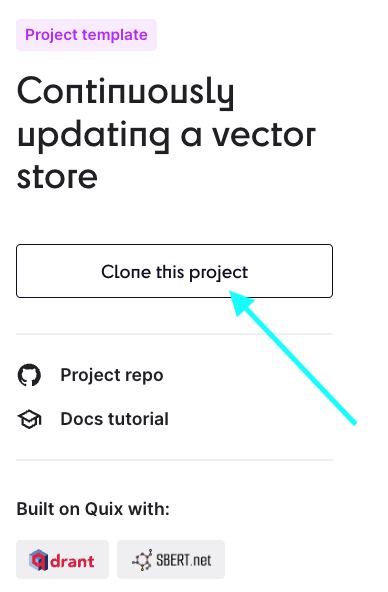
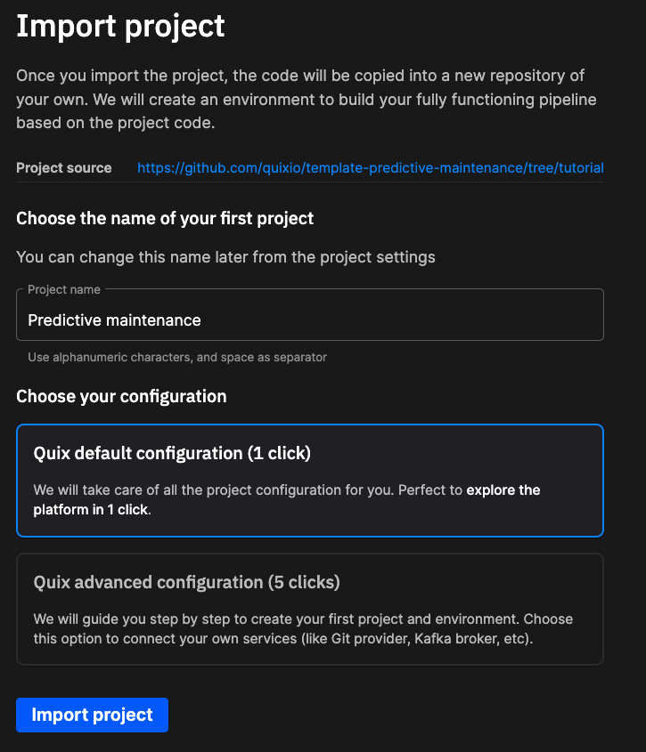
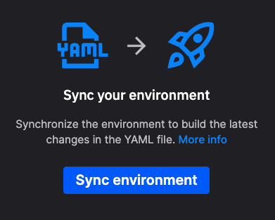

# Clone a project

One of the simplest ways to get started with Quix is to clone one of the projects in the [project gallery](https://quix.io/templates){target=_blank}.

If you see a project that you are interested in, click the `Clone this project` button.

This **copies** the project into your Quix account. The `Import project` dialog is displayed:

You have a couple of options here. The quickest and simplest way is to use the "One click" option, where are the configuration is done for you. 

If you want more control, such as your broker options and data and streaming services option, choose the "Five click" option.

The wizard then creates a copy of the project in your Quix account. 

Enter the project's environment, and the `Sync your environment` dialog is displayed:

Click the `Sync environment` button to make sure all data is synchronized between the project's repository, and your environment.

You now have the opportunity to configure any **secrets** required, such as [Personal Access Tokens (PATs)](../develop/authentication/personal-access-token.md), sometimes referred to as bearer tokens, or input credentials required for external services such as InfluxDB, Redpanda, Aiven, and so on.

Click `Add secrets`, configure your secrets as required, 

See also the [secrets management documentation](../deploy/secrets-management.md).

Once you have added your secrets, click `Synchronize pipeline` and `Go to pipeline` to complete the project configuration. The services in the pipeline now start.

## See also

* [Forking a project](./fork-project.md)
* [Creating a project](./create-project.md)
