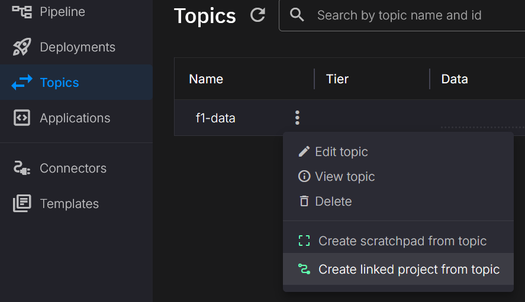
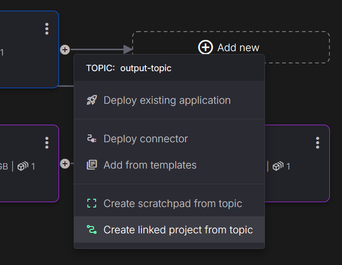
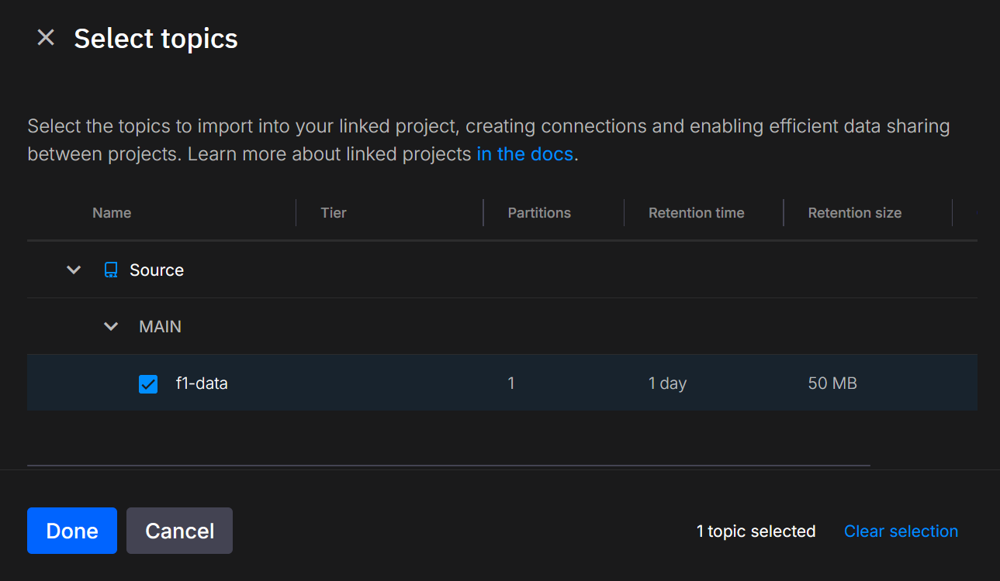
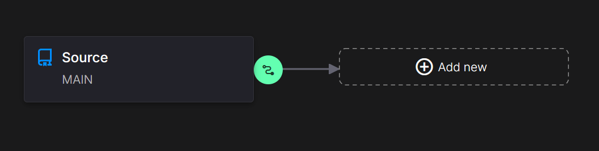
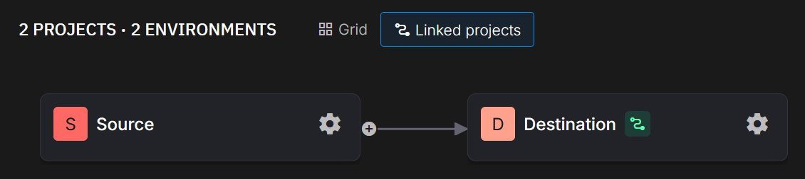

---

title: Create a Linked Project

description: Discover how to create a linked project for cross-team data sharing and collaboration.

---

!!! warning "Version Requirement"
    This feature requires at least version 3.1.1 of QuixStreams.

# Creating a Linked Project

A **linked project** in Quix allows you to connect data streams across different projects, facilitating cross-team collaboration and efficient data sharing. By linking topics between projects, you can harness the power of real-time data in a broader context, enabling better coordination between teams and promoting a unified workflow. The **project pipeline view** provides a graphical representation of these relationships, making it easy to understand how data flows between projects.

Linked projects provide several key benefits for organizations working with real-time data:

- **Seamless Cross-Team Collaboration**: Share data effortlessly between teams without requiring duplication or manual data transfer.
- **Centralized Data View**: Access data from multiple projects in a single pipeline view, providing a holistic understanding of how information moves through your ecosystem.
- **Efficient Resource Utilization**: Link topics across projects to reduce redundancy and maintain data consistency, improving resource allocation and minimizing errors.

## Understanding Topic Linking Across Projects

Linked topics are only available from environments that have a **Quix managed broker**. Any external brokers are not supported.

This linking allows you to efficiently access real-time data across different projects, ensuring a seamless flow of information without direct impact on the original environments.

In a linked project, **topics** from one environment can be linked to an environment in another project. This setup ensures that teams can share relevant real-time data streams without affecting each other's environments directly. The **project pipeline view** then represents these linked topics visually, displaying how data flows across different teams and environments.

## When to Use Linked Projects

Linked projects are particularly useful when multiple teams need to share data across projects efficiently. The key scenarios include:

- **Team Data Dependencies**: One team's output often becomes the input for another. For example, data engineering may provide sales insights used by marketing for targeted campaigns. Linked projects simplify this data handoff, ensuring seamless integration between teams.

- **Cross-Team Data Analysis**: Allow teams across the organization to collaborate on data analysis projects, leveraging diverse data sources for richer, more comprehensive insights.

- **Unified Experimentation Environment**: Create an integrated environment for testing that combines data from multiple sources, helping teams work together effectively on experimental initiatives.

- **Data Consistency and Transparency**: Maintain synchronized, high-quality data across teams, reducing silos and ensuring all stakeholders access the most accurate, up-to-date information.

Linked projects help break down barriers between teams, streamline data access, and provide a unified view of information, fostering collaboration and enhancing overall organizational effectiveness.

## Creating a Linked Project

You can create a linked project in Quix by linking topics from another environment into an environment within your project. If you need to create a new environment before linking topics, refer to the [environment creation guide](./create-environment.md).

### Steps to Create a Linked Project

**1. Navigate to Your Environment**: Begin by selecting the environment where you want to link topics from another project.

**2. Access Environment's Topics or Pipeline View**: You have two options for linking a project:

- **Topics View**: Navigate to the topic list:

  

- **Pipeline View**: Navigate to the environment pipeline and click on the plus icon of an existing deployment:

  

**3. Select the Topics to Link**: Identify and select the topics you want to link from the other environment.

  

**4. Finalize the Linking Process**: Confirm your configurations and click 'Create Link' to add the linked topics. Once completed, you will see the new topics reflected in your environment's pipeline view.

  

**5. Visualize in the Project Pipeline View**: The project pipeline view will now show a graphical representation of the linked topics, clearly illustrating the relationship between projects and environments.

  

## Adding Linked Topics to Your Existing Environment

If you already have an environment and want to add linked topics, you can follow these simple steps:

1. **Navigate to the Topics Page**: Go to the topics page within your environment.

2. **Click on "Import Topics"**: Simply click on the "Import Topics" button, and you'll be able to select the topics you want to link. You'll see the same image below during this process:

  

Alternatively, you can manipulate linked topics using YAML configuration.

Here is an example YAML snippet to specify linked topics directly by referencing the workspace ID:

```yaml
...
# This section describes the Topics of the data pipeline
topics:
  - name: f1-data
    linkedTopic:
      workspaceId: org-source-main
...
```

??? tip "Specify Source Topic Name" 
    Sometimes, the topic name in the source environment may differ from the one used in your current environment. You can specify both names explicitly by using the topicName attribute.
    This helps to avoid confusion or conflicts, especially when different teams or environments have distinct naming conventions.    
    Here’s how to do it:

    ```yaml
    # This section describes the Topics of the data pipeline
    topics:
      - name: f1-data  # Local name in your environment
        linkedTopic:
          workspaceId: org-source-main
          topicName: source-topic-name  # Actual name of the topic in the source workspace
    ```

## Access Control for Linked Topics

To maintain stability and security across projects, linked topics are **read-only**:

- **Read-Only Topics**: Linked topics are always read-only, which protects the original data source and ensures stability.
- **Permissions and Access**: You can only link topics that you have permission to view. This ensures that only authorized users can link or access the topics, helping prevent unauthorized changes or misuse of data.

These measures help keep the data **secure and consistent** across projects, enabling collaboration without compromising integrity.

## 🏃‍♀️ Next Steps

[Learn about Data Tiers in Quix :material-arrow-right-circle:{ align=right }](./data-tiers.md)

