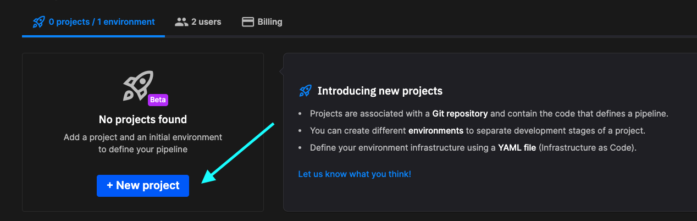
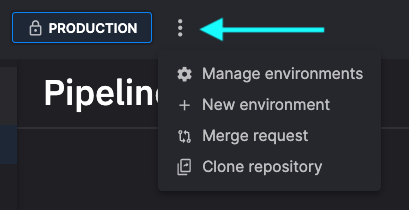

# How to create a project

This page describes how to create a new project, and populate it with two environments: `Production` and `Develop`. The `Production` environment is protected. Development work is done in the `Develop` environment, and then reflected in the `Production` environment through a merge request.

!!! note

    You can create as many environments in a project as you need. You can mark them as protected, and name them as needed, to align with your own development processes. This how-to simply shows one example project.

## Watch a video

<iframe src="https://www.loom.com/embed/b4488be244834333aec56e1a35faf4db?sid=13c128de-df05-46b5-bb1f-03f6af3e7777" frameborder="0" webkitallowfullscreen mozallowfullscreen allowfullscreen style="position: absolute; top: 0; left: 0; width: 100%; height: 100%;"></iframe>

??? "Transcript"

    0:01 Hi there, welcome to this video on creating a quick project. I should point out before I get into this video that I'm using the beta development environment at Quix and so what you see may be slightly different when you're testing Quicks.

    0:21 Okay, so having said that I'll get straight into creating a new project. You can see this button over here. I'm going to click that to create a new project.

    0:33 The new workflow in Quix starts with creating a project. Everything is done inside a project. Generally speaking, I'm simplifying it quite a lot.

    0:44 A project corresponds to a Git repository. So everything that you create, including your pipeline configuration and so on, will be stored in a Git repository.

    0:59 So I'll give my project a name and I'll call it video project. And the first thing I need to do is specify where this Git repository is going to be.

    1:12 Now, the simplest option is to get quick to do all the work for you and just create the Git repository.

    1:21 And the second thing I need to do is a product called gitty to host the Git repository. So we can do that for you.

    1:27 It all happens in the background. And as you'll see in later videos, you have complete control about what happens in that repository.

    1:37 You can review pull requests and do, merges and all of those normal things that you would do in a Git workflow.

    1:47 The other option is to use an external provider. So for example, you could use GitLab, GitHub, Bitbucket and so on.

    1:57 You can use any provider that supports the use of an SS. H key. For the purposes of this video, I'm going to keep it simple for now and just use the Quix manage Git.

    2:11 So I'm now ready to create the project. Now every project will have at least one environment and usually several environments.

    2:28 So what is an environment? An environment roughly corresponds to a branch in your Git repository, but there's a specific for an environment.

    2:41 As well as you'll see as we go through this dialogue. But the first thing we need to do is give our environment a name.

    2:52 So I'm going to name it. Based on the typical development workflow, so usually we'd have production. Branch or environment and you might have staging and development.

    3:09 So I'm going to create the production environment and as I was saying earlier, that's going to roughly correspond to a branch.

    3:17 So in this next section, we're going to specify the, ,branch that this environment corresponds to and I want production to correspond to the main branch.

    3:30 And so there's nothing really I need to do here. I could create a new branch if I wanted to, ,but I want to use the default branch which is main.

    3:41 The other, thing that I can do here is protect this branch and what that means is that prevents developers from merging or committing content, making changes directly to the main branch.

    3:58 In order to change the main branch you'll have to raise, a pull request, a git pull request and that would have to be reviewed and approved and then merged in the usual way.

    4:13 So we definitely want that because for production we don't want changes being made directly. So I'm protecting that and you'll, We'll see later how we go about taking changes that we've made and say the develop branch or the dev branch and merge those into the main branch.

    4:32 I'll cover that in another video. So for now let's just click continue. Now for each environment that you create you can specify how you want to host Kafka.

    4:45 Now as you probably know Quix uses Kafka as its broker. And you have several options here. You if you want the simplest option and most convenient option is to just let Quix do all the hard work for you.

    5:01 We will create them. Kafka broker and you don't need to do any configuration. We just do it all for you.

    5:08 We make sure that scales nicely as well. We use Kubernetes and you know as I say it's the least. It's it's the quickest option especially.

    5:22 If you're testing things out, but there are other options as you can see here. You can use your own self hosted Kafka or you can connect to a Confluent Cloud and we'll cover those options in later videos.

    5:39 So for now, I'm just going to go with the simplest option and click. Continue. The other thing that you'll need to do here is specify the storage option for the environment.

    5:51 So the key thing to point out at this point is we were talking about environments as corresponding to a branch in get.

    6:02 That is true, but it's also these other things like the Kafka options that you select and also the storage options.

    6:11 Now the storage option that you're selecting here is for any data that you might possess. So in Quix it's possible to persist the data that's published to topics.

    6:27 You can store that using our something called the data catalog and if you store, if you persist your topics and store the messages that are in the topics.

    6:43 In our storage facilities, then there's a small charge associated with that. However, you don't have to persist topics. You can use external database solutions for storage of your data.

    7:01 So you can use. Some of our standard connectors or even write your own connector to connect to more or less any database technology that you want.

    7:11 The other thing that's stored here is metadata associated with messages. So for now, I'm just going to choose the standard option and create.

    7:23 The environment. Okay, that's it. We'll wait for the project and the environment to be created. And then we'll have a look at what's in there in subsequent videos.

    7:42 Okay, thanks for watching. And see you in the next video.

## Creating a project

To do anything useful with Quix, you'll need at least one project, and one environment. You can think of a project as corresponding to a Git repository, and an environment as corresponding to Git branch within that repository. 

1. [Sign up](https://portal.platform.quix.io/self-sign-up){target=_blank} and log into Quix.

2. Click on `+ New project`.

    

3. Give your project a name, such as `My project`.

4. Select either Quix-hosted Git, or a third-party Git provider. The third-party provider must support SSH keys.

5. Click `Create project`.

You are taken automatically into the `Environment settings` wizard to create your first environment.

## Creating the `Production` environment

The environment corresponds with a branch in your project. Typically you'll have multiple environments. As well as correpsonding to a branch, an environment contains your selected Kafka hosting options, and also the storage requirements.

1. Enter the environment name, `Production`. Note: it can be named anything that suits your own development processes.

2. Select the repository branch. By default this is `main`. Leave this as the default value.

3. Check the `This branch is protected` checkbox. This prevents modifications directly to your production environment.

4. Click `Continue`.

5. You can now select your broker settings for the environment. The options are Quix-hosted Kafka, Self-hosted Kafka, and Confluent Cloud. Select `Quix Broker` and then click `Continue`.

6. Select the `Standard` storage option, and then click `Create environment`.

## Creating the `Develop` environment

You'll now create an environment in which you can do your development work (remember, the production environment is protected in this example, so you can't change it directly).

1. There are various ways to add an environment. One way is to click the kebab menu next to the panel that displays your environments:

    

2. Now click `+ New environment`.

3. Enter the environment name, `Develop`. Note: it can be named anything that suits your own development processes.

4. Select the repository branch. Activate the repository branch dropdown menu, and click `+ New branch`. 

5. In the `New branch` dialog enter `dev` as the branch name. In this case you want to branch from `main`. Note: again, values entered here can be anything that suits your development process, for example, you may create branches from branches if required.

6. Click `Create branch`.

7. As you are going to do development work here, leave the `This branch is protected` checkbox clear.

8. Click `Continue`.

9. You can now select your broker settings for the environment. The options are Quix-hosted Kafka, Self-hosted Kafka, and Confluent Cloud. Select `Quix Broker` and then click `Continue`.

10. Select the `Standard` storage option, and then click `Create environment`.

You have now created your `Develop` environment.

## Performing a merge request

Once you have carried out development work, you will want to have those changes reflected in production. As your `Production` environment is protected you have to do this by creating a merge request.

1. Click the kebab menu next to the panel that displays your environments.

2. Select `Merge request`.

3. Select a source and target environment. In this example the source is `Develop` and the target is `Production`.

4. Click `Create pull request`.

    At this point, you will be taken into your Git provider where you can review the merge commit. Use your usual development processes to review and approve the merge.

    !!! tip

        If using the Quix-hosted Git provider and you are asked to log into Gitea, you need to obtain your Git credentials. To do this click on your profile image in Quix, and then select `Manage Git credentials`. Generate a password, and use the email and generated password to log into Gitea.

## Syncing your environment

When you select your `Production` environment, you will see that it is now flagged as `out of sync` with the Git repository. You now need to synchronize the environment to have the changes submitted using the merge commit reflected in the Quix view of the environment. To do this:

1. In the top right corner click the blue `Sync environment` button. The `Sync environment` dialog is displayed.

2. Review the changes that will be made to the `quix.yaml` file. Note: the `quix.yaml` file is an important file that defines the entire pipeline in your environment. Your pipeline view in Quix is built from this file.

3. Click `Sync environment`. You also have the options of editing the YAML or exiting the sync process.

4. Once synchronized, click the `Go to pipeline` button. 

The pipeline in `Production` now reflects the work that was done in the `Develop` environment.

## 🏃‍♀️ Next step

[Learn more about environments :material-arrow-right-circle:{ align=right }](./create-environment.md)
