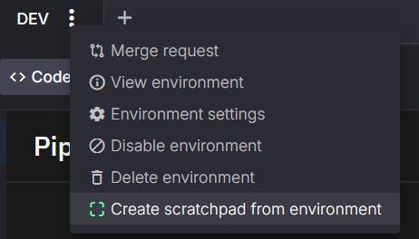
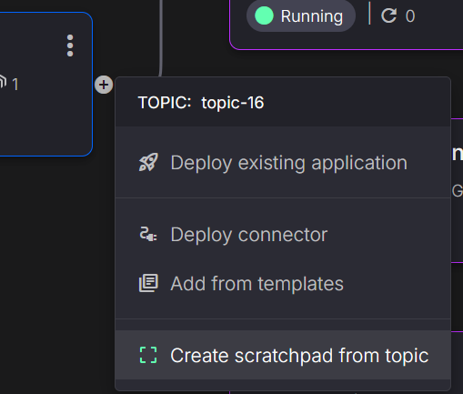
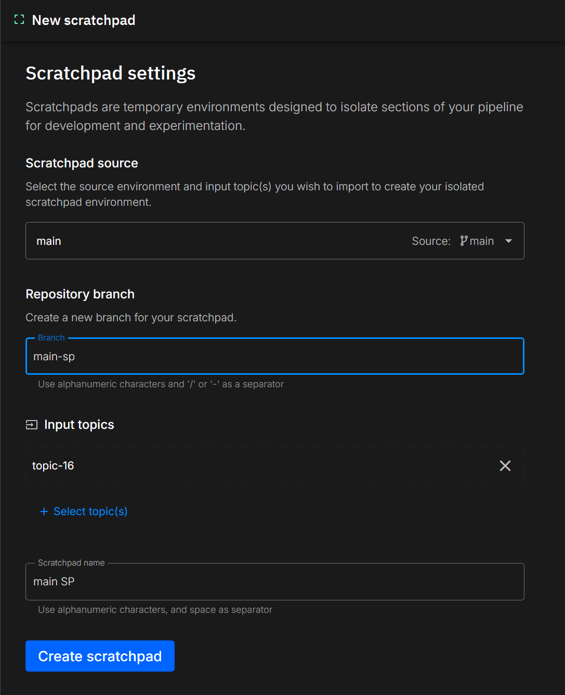
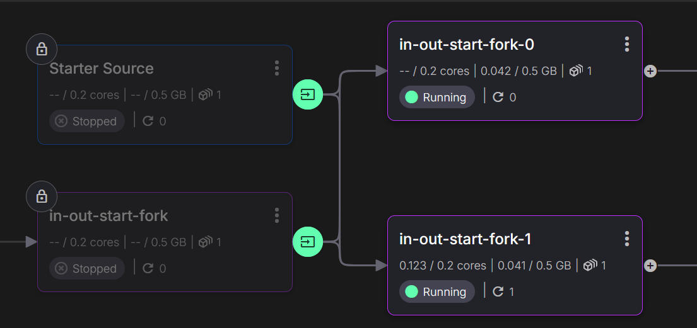

# Creating a Scratchpad

A **scratchpad** in Quix is a temporary environment designed for quick iterations and experimentation with real-time data. Scratchpads are particularly useful for testing new features, analyzing data, or running experiments without affecting production or staging environments. They are lightweight, easy to set up, and allow developers to isolate their changes.

Scratchpads work by **linking one or more topics** from an existing environment within the same project. These linked topics provide real-time data, enabling accurate testing without altering the original data source.

## What Are Linked Topics?

**Linked topics** are topics that have been forwarded from another environment into the scratchpad. This provides access to real-time data without the need for duplication or modification of the source data. Linked topics maintain data integrity, allowing for seamless experimentation while ensuring the original environment remains stable and unchanged.

## Locked Deployments and Topics

Within a scratchpad, certain elements are **locked** by default to maintain stability and data protection. These include:

- **Locked Deployments**: Services or applications from the source environment are made available but cannot be modified. This ensures that changes in the scratchpad do not inadvertently impact other environments.
- **Locked Topics**: Linked topics are read-only, providing access to real data while preventing changes that could affect the original environment.

This approach ensures that you can experiment freely while safeguarding the integrity of your production or staging systems.

## When to Use a Scratchpad

Scratchpads are ideal for scenarios that require rapid iteration and access to real data, such as:

- **Testing New Features**: Validate new features or bug fixes in a controlled environment before rolling them out.
- **Running Experiments**: Conduct experiments that require real-time data without risking disruptions to live services.
- **Analyzing Data Behavior**: Observe and analyze data flows, experiment with transformations, or validate assumptions without affecting ongoing operations.

Scratchpads provide a **safe and isolated space** for innovation, enabling flexibility while minimizing risk.

## Creating a Scratchpad

You can create a scratchpad in Quix using two different approaches:

1. **From an Environment**: Use the environment dropdown to create a scratchpad from an existing environment.
2. **From a Topic in the Pipeline View**: Create a scratchpad directly from a topic by accessing the pipeline view.

Both methods redirect you to the scratchpad creation page, where you can configure the settings as needed.

### How to Create a Scratchpad

Follow these steps to create a scratchpad in Quix:

**1. Navigate to the Project**: Begin by selecting the project where you want to create a scratchpad.

**2. Choose the Creation Method**: You have two options for creating a scratchpad:

- **Create from Environment**: Use the dropdown menu in the environment list to start creating a scratchpad.

  

- **Create from Topic**: You can also create a scratchpad directly from a topic in the pipeline view.

  

**3. Name Your Scratchpad**: Assign a name that indicates its purpose, such as "Scratchpad" or "Temporary Environment".

  

**4. Configure Branch and Link Topics**: Choose an existing branch or create a new one (e.g., `dev-temp`) to keep your scratchpad changes isolated. In the configuration settings, select which topics to link from the existing environment, such as those from staging or production.

**5. Finalize and Create**: Complete the scratchpad setup by configuring settings such as Kafka broker options. You can use default settings or customize them as required. Once finished, create the scratchpad.

**6. View the Result**: After creating your scratchpad, you will see an overview of the environment. Confirm that your linked topics and deployments are correctly set up. Once verified, your scratchpad is ready for use, allowing you to test and experiment without impacting other environments.

  

To maintain stability, scratchpads feature certain elements that are locked:

- **Locked Topics**: Linked topics are read-only to ensure data integrity.
- **Locked Deployments**: Services or applications inherited from the original environment are locked, preventing unintended modifications.

These precautions help maintain the **reliability and stability** of your project environments while giving you the freedom to explore and test in isolation.

## 🏃‍♀️ Next Steps

[Learn about creating an application in Quix :material-arrow-right-circle:{ align=right }](../develop/create-application.md)
