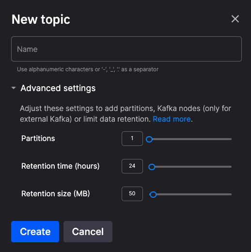

# Create a topic

Typically, when you deply a configured service, topics will be created automatically for you, with default settings. However, you can create topics manually and configure the topic settings.

To create a topic:

1. On the right-hand main menu, click `Topics`.
2. In the top right of the screen click `+ New topic`. The `New topic` dialog is displayed:

    

3. Give your topic a suitable name.
4. If you want to set some specific parameters for the topic, click `Advanced settings` to display the panel with configurable parameters for your broker.
5. Once you've configured your topic, click `Create`.

The system will then create the topic, which might take a few moments.

## Advanced settings

The parameters in the `Advanced settings` panel are as follows:

| Parameter | Description |
|---|---|
| Partitions | The basic unit of paralellism in a Kafka topic. The more partitions the more messages can be processed concurrently. You can think of partitions in Kafka topics as lanes on a motorway. Each partition acts as an independent lane where messages (like vehicles) flow in an ordered sequence.  Just like lanes on a motorway, partitions enable parallel processing of messages within a Kafka topic. Multiple consumers (or subscribers) can each read from their own partition concurrently, enabling efficient and scalable message processing.  Additionally, partitions provide fault tolerance similar to lanes providing redundancy on a motorway. If one lane (partition) becomes congested or experiences issues, the others can continue operating independently without affecting the overall flow of traffic (messages) on the motorway (topic). **Default = 1** |
| Retention time (hours) | Messages are retained in the topic for this amount of time, regardless of whether they have been consumed or not. After the specified time period elapses, Kafka will automatically delete messages older than the retention period. **Default = 24** |
| Retention size (MB) | Messages are retained in the topic until the topic reaches this size. Once the topic size exceeds this threshold, Kafka starts deleting the oldest messages to make space for new ones. **Default = 50** |

## To change the advanced settings

In the `Topics` view, hover over the topic you want to edit until the kebab menu (vertical dots) is display. Click the kebab menu, and then select `Edit topic`. Change your configuration as required. Click `Save` and your changes are applied to the topic.
