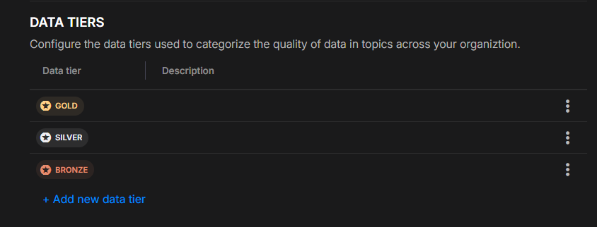
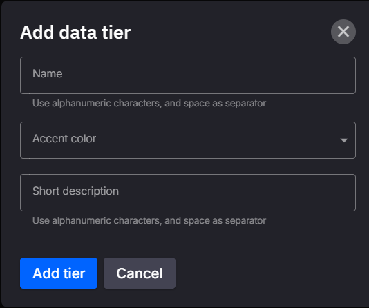
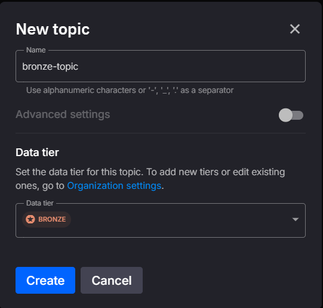
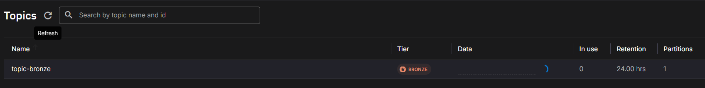

# Data Tiers

## Overview
Our platform uses **Data Tiers** to categorize data into distinct levels, helping users understand the data’s readiness, quality, and processing level. By organizing data within a structured tier system, we ensure a clear and consistent approach to data management.

### Medallion Architecture Basis
Our Data Tier system aligns with the principles of the Medallion Architecture, using a structured approach to categorize data into **Bronze**, **Silver**, and **Gold** tiers by default. This common approach helps organizations maintain consistency and clarity across data pipelines:

- **Bronze Tier (Raw Data)**: Stores raw data exactly as received from external sources, maintaining original structures and metadata. The focus is on capturing change history, data lineage, and auditability for reprocessing when necessary.

- **Silver Tier (Cleansed and Conformed Data)**: Consolidates and cleanses data from the Bronze layer to create a unified "Enterprise View" of business entities and transactions, like master customers and non-duplicated transactions. Designed to support ad-hoc reporting and advanced analytics.

- **Gold Tier (Curated Business-Level Data)**: Optimized, consumption-ready data curated for specific business needs such as analytics and reporting. This layer applies final transformations and quality checks to create project-specific, read-optimized tables, like Customer Analytics or Inventory Analytics.

While **Bronze**, **Silver**, and **Gold** tiers are pre-populated as defaults, users have full flexibility to define and manage their own data tiers as needed, adapting them to fit unique organizational needs.

## Managing Data Tiers

The **Data Tiers** configuration can be found within the **Organization Settings** section. This area allows you to manage existing data tiers and add new ones to suit your organization’s requirements.

#### Organization Settings Section



In the Organization Settings section, you can see the list of current data tiers, including the default **Gold**, **Silver**, and **Bronze** tiers. You can edit, delete, or add new tiers as needed.

#### Adding a New Data Tier

To add a new data tier, click on **Add new data tier**. This will open a dialog where you can specify:



- **Name**: The name of the tier (e.g., "Gold", "Silver").
- **Accent Color**: A color to visually distinguish the tier.
- **Description**: A brief description outlining the tier's purpose.

Click **Add tier** to save your changes or **Cancel** to discard.

## Setting Topic Data Tier

You can set the data tier for topics in two ways: through the **UI** and by using **quix.yaml** for Infrastructure as Code.

### Setting Data Tier in the UI

In the topic configuration section within the UI, select the desired data tier (e.g., Bronze, Silver, or Gold) when adding a new topic. This is a straightforward way to categorize topics based on data quality and processing level.



This visual interface allows users to easily assign tiers without requiring code, making it accessible for quick, manual configurations.

Additionally, you can view a list of topics with their respective data tiers in the topics list:



### Setting Data Tier Using quix.yaml

You can set the **dataTier** property in the `quix.yaml` file for Infrastructure as Code, specifying the data tier directly within this configuration file. Once set, sync the `quix.yaml` configuration to apply the data tier.

```yaml
topics:
  - name: bronze-topic
    dataTier: Bronze
```

This approach allows systematic management of topic tiers across environments.
