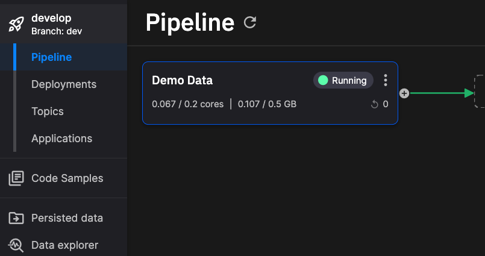
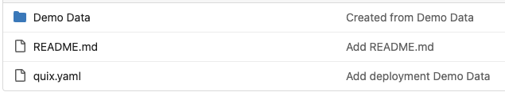
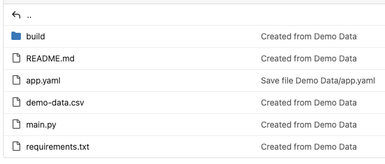

# Explore project structure

This page looks at the file structure of a typical project in Quix, as hosted in its Git repository. 

A project in Quix maps to a Git repository. Within a project you can create multiple environments, and these correspond to branches in the Git repository. Within a branch (environment) there are some root files. One example of this is `quix.yaml` which defines the pipeline, and then each application in the pipeline has its own folder, containing code and configuration, such as the `main.py` and `app.yaml` files.

## Pipeline

This section shows an example pipeline consisting of one application, `Demo Data`, as illustrated by the following screenshot:



Looking at the project stored in Git, it would have the following structure:



Note the `quix.yaml` file that defines the entire pipeline. There is aso a folder for the application, `Demo Data`.

The complete `quix.yaml` file is shown here:

``` yaml
# Quix Project Descriptor
# This file describes the data pipeline and configuration of resources of a Quix Project.

metadata:
  version: 1.0

# This section describes the Deployments of the data pipeline
deployments:
  - name: Demo Data
    application: Demo Data
    deploymentType: Job
    version: ada522b5199fc9667505b4dd19980995804ca764
    resources:
      cpu: 200
      memory: 200
      replicas: 1
    libraryItemId: 7abe02e1-1e75-4783-864c-46b930b42afe
    variables:
      - name: Topic
        inputType: OutputTopic
        description: Name of the output topic to write into
        required: true
        value: f1-data

# This section describes the Topics of the data pipeline
topics:
  - name: f1-data
    persisted: false
    configuration:
      partitions: 2
      replicationFactor: 2
      retentionInMinutes: -1
      retentionInBytes: 262144000
```

This defines one or more deployments, and their allocated resources, as well as other information such as the code commit version to use, in this case `ada522b`. The topics in the pipeline are also defined here.

## Application

Opening the `Demo Data` folder in the Git repository, you see the structure of the application (one service in the pipeline) itself:



The notable file here is the `app.yaml` file that defines important aspects of the application. The full `app.yaml` for this application is shown here:

``` yaml
name: Demo Data
language: python
variables:
  - name: Topic
    inputType: OutputTopic
    description: Name of the output topic to write into
    defaultValue: f1-data
    required: true
dockerfile: build/dockerfile
runEntryPoint: main.py
defaultFile: main.py
```

This provides a reference to the Dockerfile that is to be used to build the application before it is deployed. This is located in the `build` directory, and the full Dockerfile for this application is shown here:

``` yaml
FROM python:3.11.1-slim-buster

ENV DEBIAN_FRONTEND="noninteractive"
ENV PYTHONUNBUFFERED=1
ENV PYTHONIOENCODING=UTF-8

WORKDIR /app
COPY --from=git /project .
RUN find | grep requirements.txt | xargs -I '{}' python3 -m pip install -i http://pip-cache.pip-cache.svc.cluster.local/simple --trusted-host pip-cache.pip-cache.svc.cluster.local -r '{}' --extra-index-url https://pypi.org/simple --extra-index-url https://pkgs.dev.azure.com/quix-analytics/53f7fe95-59fe-4307-b479-2473b96de6d1/_packaging/public/pypi/simple/
ENTRYPOINT ["python3", "main.py"]
```

This defines the build environment used to create the container image that will run in Kubernetes.

As well as the `app.yaml` the application folder also contains the actual code for the service, in this case in `main.py` - the complete Python code for the application.

There is also a `requirements.txt` file - this is the standard Python file that lists modules to be installed. In this case there is only one requirement that is "pip installed" as part of the build process, the [Quix Streams client library](https://quix.io/docs/quix-streams/introduction.html).

Any data files required by the application can also be located in the application's folder. In this example there is a `demo-data.csv` file that is loaded by the application code.

While this documentation has explored a simple project consisting of a pipeline with one application (service), pipelines with multiple applications have a similar structure, with a `quix.yaml` defining the pipeline, and with each application having its own folder, containing its application-specific files and an `app.yaml` file.

!!! tip

    Your project repository can also include Git submodules to reference external repositories. See [Git submodules](submodules.md) for details and limitations. 
