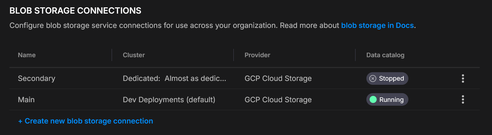
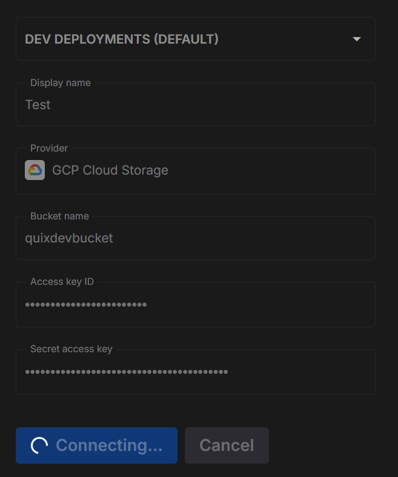
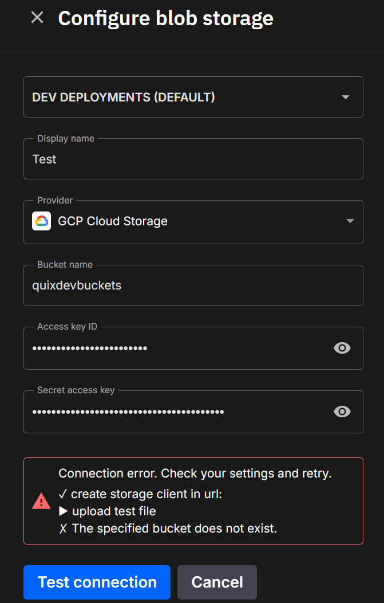

# Blob storage connections

Connect your cluster to a bucket/container so Quix can enable **Quix Lake**-the platform’s open storage layer for Kafka topic data.

!!! important "One connection per cluster"
    Each **cluster** supports **one** blob storage connection.  
    You can configure different connections for different clusters.
    
???+ info "Quix Lake at a glance"
    **Summary** - Quix Lake persists Kafka topic data as **Avro/Parquet** in your own bucket (S3, GCS, Azure Blob, MinIO), partitioned for fast discovery and full-fidelity **Replay**.

    **Why it exists** - Preserve exact Kafka messages (timestamps, headers, partitions, offsets, gaps) with indexed metadata so **Catalog**, **Replay**, **Sinks**, and future services operate on open formats you control.

    **Key properties**
    - **Portable** - open Avro & Parquet
    - **Efficient** - Hive-style partitions + Parquet metadata
    - **Flexible** - historical + live workflows
    - **Replay** - preserves order, partitions, timestamps, headers, gaps

    **Flow** - **Ingest** (Avro) → **Index** (Parquet metadata) → **Discover** (Data Catalog & Metadata API) → **Replay** (full fidelity back to Kafka) → **Use** (explore, combine historical + live, run queries/export).

    [Learn more about Quix Lake →](../quix-cloud/quixlake/overview.md)

## Create a connection

1. **Settings → Blob storage connections → Create**
2. Pick **Cluster**, set **Display name**, choose **Provider**, fill the fields
3. **Test connection** (below)
4. **Save**

## Test before saving

When you click **Test connection**, Quix runs a short round-trip check to make sure your details are correct and that the platform can both see and use your storage.

**Here’s what happens:**

1. **Connect** - Quix creates a storage client using the details you entered.  
2. **Upload** - it writes a small temporary file into a `tmp/` folder in your bucket or container.  
3. **Check visibility** - it confirms the file shows up in the storage listing.  
4. **Query** - it runs a simple check to ensure the file is discoverable for later Quix Lake operations.  
5. **Clean up** - the temporary file is deleted so your storage stays tidy.

**Success**  
Each step is shown in the dialog. Successful steps are marked with a ✓, and you’ll see confirmation when everything checks out.

**Failure**  
If a step fails, you’ll see ✗ next to it along with the reason (for example, “Access denied” or “Wrong region”). This makes it easy to fix permissions or update your settings.

## Providers

=== "Amazon S3"

    1. Log in to the **AWS Management Console**.  
    2. Go to **IAM**.  
    3. Open **Users**.  
    4. Select an existing user or click **Add user** to create a new one.  
    5. **Permissions**  
       - In the **Permissions** tab, attach a policy that allows bucket access.  
    6. **Security credentials**  
       - Open the **Security credentials** tab.  
       - Click **Create access key**.  
    7. **Save credentials**  
       - Copy the **Access Key ID** and **Secret Access Key** (the secret appears only once).  
    8. Copy the information into the Quix S3 form.  
    9. Click **Test Connection**.  

=== "Google Cloud Storage (GCS)"

    1. **Ensure access**  
       - Have Google Cloud project owner or similar permissions where your bucket resides or will be created.  
       - Create a service account and assign it to the bucket with R/W (e.g., `roles/storage.objectAdmin`) or equivalent minimal object roles.  
    2. **Open Cloud Storage settings**  
       - In the Google Cloud Console, go to **Storage → Settings**.  
    3. **Interoperability tab**  
       - Select **Interoperability**.  
       - If disabled, click **Enable S3 interoperability**.  
    4. **Create (or view) keys**  
       - Under **Access keys for service accounts**, click **Create key** and follow the process to assign one to the service account.  
    5. **Save credentials**  
       - Copy the **Access key** and **Secret** (the secret is shown only once).  
       - Paste this information into the Quix S3 connector form.  
    6. Click **Test Connection**.  

=== "Azure Blob Storage"

    1. **Ensure access**  
       - Your Azure user must have at least the **Storage Blob Data Contributor** role (or higher).  
       - Open the **Azure Portal** and go to your **Storage account**.  
    2. **Navigate to credentials**  
       - In the left menu, expand **Security + networking**.  
       - Click **Access keys**.  
    3. **Copy credentials**  
       - Note the **Storage account name**.  
       - Copy **Key1** (or **Key2**) value.  
       - Paste the information into the Quix Azure Blob connector form.  
    4. Click **Test Connection**.  

=== "MinIO (S3-compatible)"

    1. **Ensure access**  
       - Your MinIO user or role must include permissions to create and list access keys (e.g., `consoleAdmin` or a custom PBAC policy).  
    2. **Log in** to the MinIO Console.  
    3. **Go to Access keys**  
       - Select **Access keys** in the left menu.  
    4. **Create a new key**  
       - Click **Create access key** to generate an **Access Key** and **Secret Key**.  
    5. **Save credentials**  
       - Copy the **Access Key** and **Secret Key** - the secret is shown only once.  
    6. Copy the information into the Quix MinIO connector form.  
    7. Click **Test Connection**.  

## Security & operations

- Dedicated principals per connection (IAM user / Service Account / MinIO user)  
- Scope credentials to **one** bucket/container  
- Rotate keys regularly; store secrets securely  
- Consider server-side encryption and access logging

## See more

* [What is Quix Lake](../quix-cloud/quixlake/overview.md) - what it is and why it exists
* [Open format](../quix-cloud/quixlake/open-format.md) - layout and schemas (Avro, Parquet)
* [Quix Lake Catalog](../quix-cloud/quixlake/catalog.md) - browse, search, and manage datasets
* [Quix Lake Sink](../quix-cloud/managed-services/sink.md) - persist topics to your bucket/container
* [Quix Lake Replay (managed)](../quix-cloud/managed-services/replay.md) - re-run datasets back to Kafka
