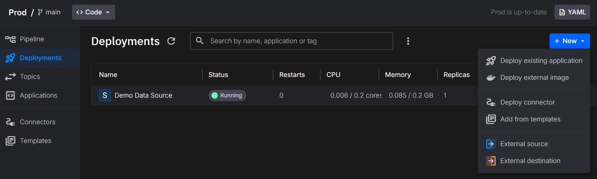
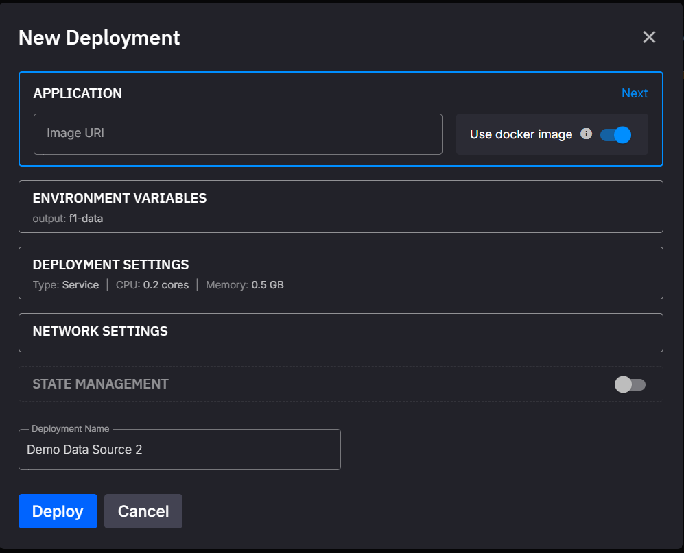

# Deploy an External Image

This section of the documentation provides guidance on how to ***deploy an external image*** within the pipeline.

Deploying an external image directly allows you to bypass application and version configurations, offering flexibility for non-standardized services or third-party containers. The deployment process is straightforward and integrated into the UI.

To summarize, the steps for deploying an external image are:

1. **Prepare the external image**: Ensure it's built and pushed to a container registry accessible by the platform.

2. **Access the `New deployment` dialog in the UI**: Select the option to deploy an external image from the menu.

   

3. **Provide the external image uri and configure settings**: In the dialog, specify the image and adjust settings like resources, replicas, and public access.

   

## External Image Reference

The external image reference specifies the image to deploy. It must include:

- The container registry (e.g., DockerHub, AWS ECR, GCR).
- The image name.
- The tag (e.g., `latest`, or a specific version like `1.2.3`).

Example external image reference:

```plaintext
dockerhub.io/myorg/my-service:1.2.3
```

## Deployment Settings for External Images

The deployment settings for external images are similar to application deployments, with slight differences. Below is a description of the main features:

| Dialog Item          | Description                                                                 |
|----------------------|-----------------------------------------------------------------------------|
| **External Image**   | The full external image reference, including registry, name, and tag.      |
| **Environment Variables** | Any environment variables your container needs can be specified here.      |
| **Deployment Settings**  | Configure whether the image runs as a service or a job. Also, set CPU, memory, and replicas for scaling. |
| **Public Access**    | Configure whether the container is accessible externally via a public URL. |
| **State Management** | If state is enabled, a `state` folder is created to persist data across restarts. See [state management docs](./state-management.md). |
| **Deployment Name**  | The name of the deployment. You can change it to something descriptive.    |

## Working on the Command Line

To deploy an external image from the command line, modify your [`quix.yaml`](../quix-cli/yaml-reference/pipeline-descriptor.md) file to include the image. 

Example:

```yaml
- name: custom-service
    image: my-registry.com/my-service:1.2.3
    deploymentType: Service
    resources:
      cpu: 300
      memory: 600
      replicas: 2
    desiredStatus: Running
```

Then use the following commands:

- **Sync local changes**: Use the `quix local pipeline sync --update` command. This updates your pipeline in Quix Cloud based on your `quix.yaml` file.
- **Sync remote environment**: Use the `quix envs sync` command to synchronize an environment with its project repository.

For more details on CLI usage, see the [CLI documentation](../quix-cli/overview.md).

## Private Container Registries

If the external image you wish to deploy is hosted in a private container registry, check out [this](./private-container-registries.md) page to learn how to configure it.