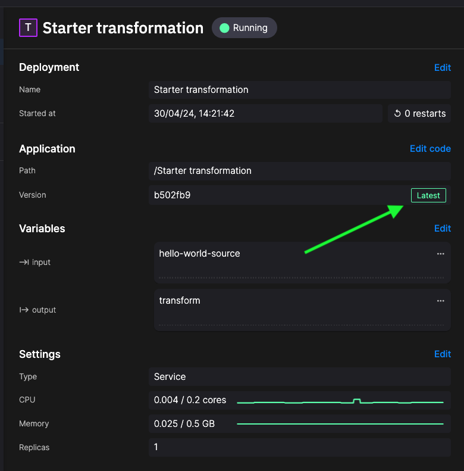
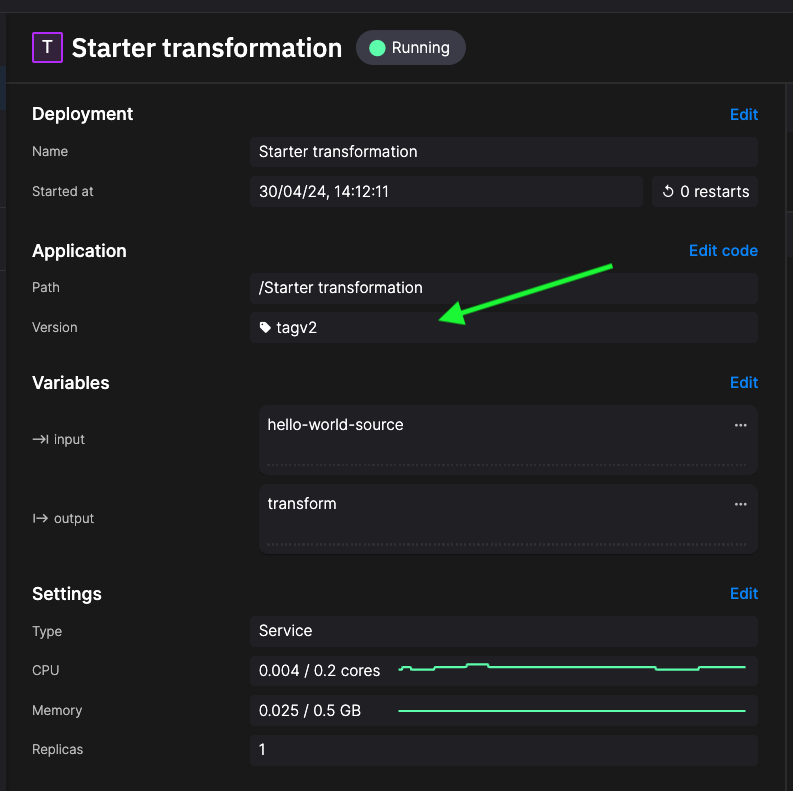
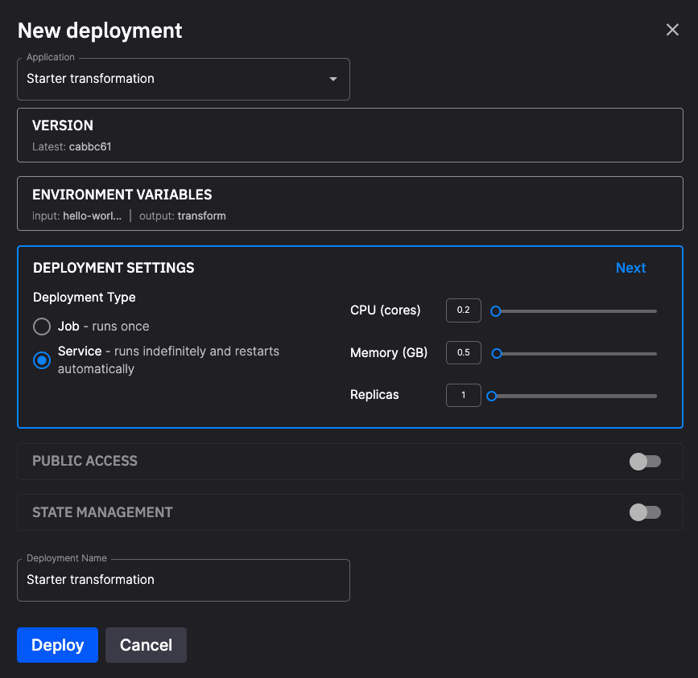

# Deploy your application

This section of the documentation covers how to **deploy and scale your application**. 

An application can be deployed as a service or job. A service runs continually, a job runs just once and then terminates.

To recap, your typical workflow is:

1. Create a project (a Git repo).
2. Create an environment (a branch, with broker, streaming services, and storage options).
3. Develop your application code.
4. Deploy your application (as a service or job).

When you deploy your application the dialog you see is the `New deployment` dialog:

{width=80%}

## Deployment version

The version of the code you are going to deploy. You can use the latest version available in the branch, or you can select a pinned version. Using the latest version makes sure you always use the most recently committed code in the service. A pinned version is usually one you have created a specific tag for, or it could be a specific commit. You can select the pinned version you want from the dropdown. The version tag needs to be unique for the project.

If you're using the latest version of the code you'll see `Latest` displayed in the corresponding service panel:

If you're using a pinned (tagged or specified commit) you'll see the tag or commit number as appropriate:

!!! tip

    If you modify the code for a deployment and commit it, then the system recognizes that your pipeline is out of sync with the code in the project, and you are prompted to sync your environment. 
    
    
    
    However, this deploys the service with the new code immediately, which might not be what you want. If you want to continue editing your code, simply ignore the sync request, edit your code, then redeploy to either the latest version or a pinned version as required. The `sync environment` prompt will disappear at this point, as your project is now synchronized, that is the pipeline is running the version of code you specified.

## Deployment settings

The following screenshot shows the deployment settings panel:

{width=80%}

The main features are described in the following table:

| Dialog Item | Description |
|----|----|
| Application | You can select the name of the application you are deploying from here. |
| Version | The version of the code you are going to deploy. See [deployment version](#deployment-version) for further details. |
| Environment variables | Any environment variables your application uses are shown here. |
| Deployment settings | Here you can select whether you want the application to run as a job or a service. You can also provide vertical scaling here by allocating more CPU and memory to the application. You can also provide some horizontal scaling by having more than one replica. A replica is an instance of the application running. When replicas are part of a consumer group, they can spread processing of streams across all replicas. |
| Public access | This is where you want to make the application accessible to the Internet. For example, if the service implements a UI it will usually be available through the web. |
| State management | If you enable state, your application can preserve state between restarts. A `state` folder is created that is used for data structures and files you want to preserve in the event of service crashes or restarts. See also the [docs on state management](./state-management.md). |
| Deployment name | You can change the name of the deployment. |

## Redeploying a service

If you subsequently edit your service code (application) and then click `Redeploy`, you are presented with the `Edit deployment` dialog. The same options previously mentioned are displayed in the dialog. Change the deployment settings as required (perhaps to allocate more resources, or use the latest or a pinned version of the code), and then click `Redeploy`.

## Working on the command line

If you are working on the command line and want to deploy local applications, you can use the `quix local deploy --push --sync` command. The `--sync` option includes a sync between your pipeline (as viewed in Quix Cloud) and the project repository. This command also prompts you to include other applications that need to be synched if required. The deployments use the settings specified in the `deployments` section of the project's `quix.yaml` file.

To sync a remote (cloud-based) environment you can use the `quix envs sync` command. This syncs the environment in the current (default) selected context with its project repository.

See the [Quix reference guide](../cli/cli-reference.md) for more about working on the command line.