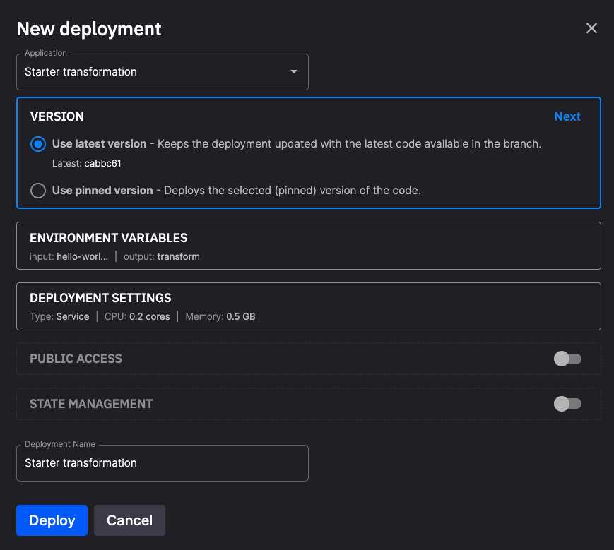

# Deploy your application

This section of the documentation covers how to **deploy and scale your application**. 

An application can be deployed as a service or job. A service runs continually, a job runs just once and then terminates.

To recap, your typical workflow is:

1. Create a project (a Git repo).
2. Create an environment (a branch, with broker, streaming services, and storage options).
3. Develop your application code.
4. Deploy your application (as a service or job).

When you deploy your application the dialog you see is the `New deployment` dialog:

{width=80%}

If you are redeploying your application you see a similar dialog.

The main features are described in the following table:

| Dialog Item | Description |
|----|----|
| Application | You can select the name of the application you are deploying from here. |
| Version tag | The version tag for the code you are going to deploy. The version tag needs to be unique for the project. |
| Environment variables | Any environment variables your application uses are shown here. |
| Deployment settings | Here you can select whether you want the application to run as a job or a service. You can also provide vertical scaling here by allocating more CPU and memory to the application. You can also provide some horizontal scaling by having more than one replica. A replica is an instance of the application running. When replicas are part of a consumer group, they can spread processing of streams across all replicas. |
| Public access | This is where you want to make the application accessible to the Internet. For example, if the service implements a UI it will usually be available through the web. |
| State management | If you enable state, your application can preserve state between restarts. A `state` folder is created that is used for data structures and files you want to preserve in the event of service crashes or restarts. See also the [docs on state management](./state-management.md). |
| Deployment name | You can change the name of the deployment. |

