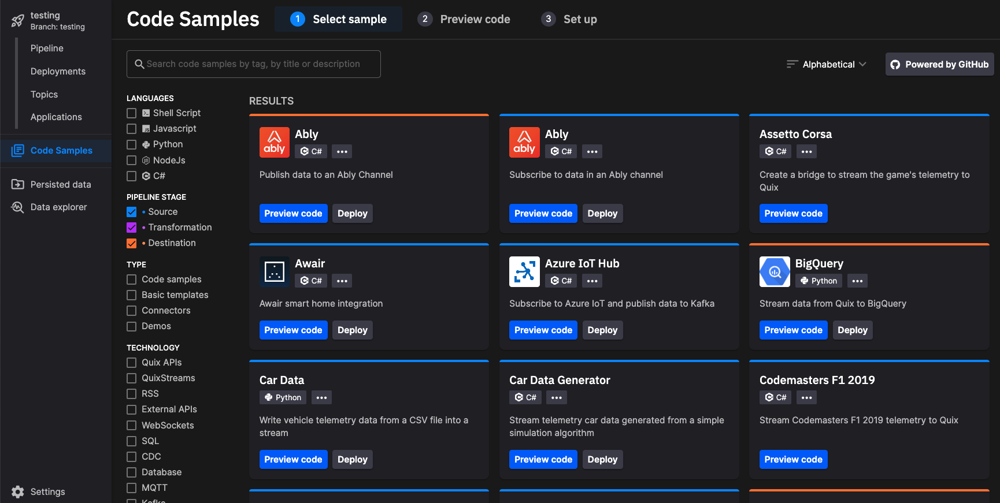

# Using Code Samples

Quix includes an extensive collection of Code Samples, that can help you rapidly build your application. Code Samples are organized into three main types:

1. Source
2. Transform
3. Destination

Sources, and Destinations are collectively known as "Connectors". In the `TYPE` facet selector you can choose `Connectors` to list just the connectors. Source connectors provide a way to get data into Quix, and Destination connectors provide a way of getting data out of Quix. 

You can of course create your own custom code samples or connectors, if the functionality you require is not already available.

Once you have selected a code sample, you can either preview the code, edit the code, or simply immediately deploy the sample, perhaps with some simple configuration. 

## GitHub repository

The Code Samples are all stored in a public [GitHub repository](https://github.com/quixio/quix-samples){target=_blank}. 

You can become a contributor of our Code Samples by generating new samples or updating existing ones.

!!! important

    Note that when you use a public code sample in the Quix Portal, it is added to your private repository, so any changes you make can be kept private if you so wish. Of course, if you are working in a public repository, then any code samples you add or modify will also be public.
