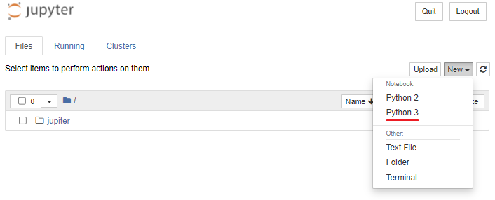
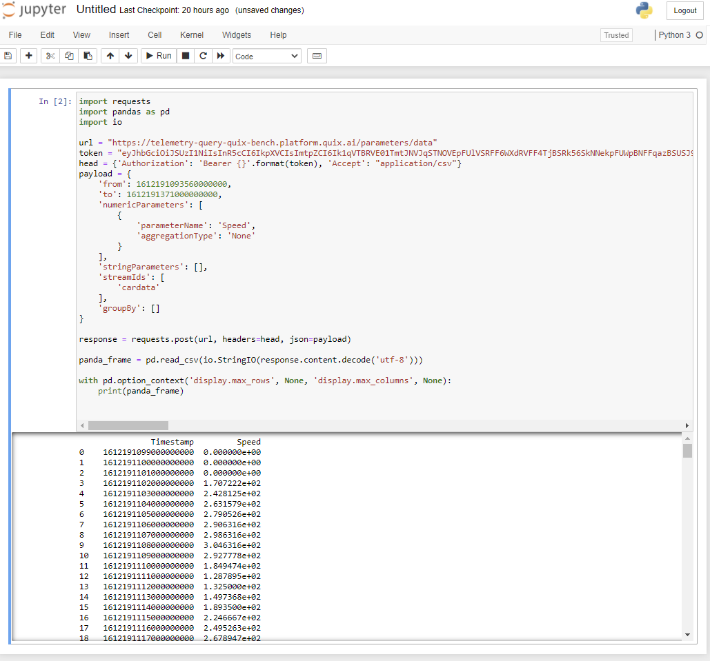

# Exporting Quix data to Jupyter Notebook

In this documentation, you learn how to use Jupyter Notebook to analyze data persisted in Quix.

!!! danger "Legacy features"

	Some of the features on this page are not available to new users, including those related to the Quix Data Explorer and the topic Persistence feature. However, legacy users may still have access to these facilities. 

## Why this is important

Although Quix is a real-time platform, to build real-time in-memory models and data processing pipelines, you need to understand data first. To help with that, Quix offers the option to persist data in topics. This data can be accessed using the [Query API](../../apis/query-api/overview.md). This helps make data discovery and analysis easier.

## Prerequisites

You'll need some data stored in Quix. You can use any of the Quix [data sources](../../connectors/index.md) available in the Quix Code Samples. 

You can also follow the onboarding process after you [Book a demo with us](https://meetings.hubspot.com/mike-rosam/product-demo){target=_blank} to get your free Quix Cloud account. The onboarding process helps you create your first `source`.

You also need Python 3 environment set up in your local environment.

Install Jupyter Notebook as directed [here](https://docs.jupyter.org/en/latest/install/notebook-classic.html){target=_blank}.

### Create a new notebook file

You can now run Jupyter from the Windows start menu, or with the following command in an Anaconda Powershell Prompt, or the equivalent for your operating system:

``` shell
jupyter notebook
```

Then create a new Python 3 notebook:



## Connecting Jupyter Notebook to persisted data

The Quix web application has a Python code generator to help you connect your Jupyter notebook with Quix.

You need to be logged into Quix for this. To import persisted data:

1. Select an environment.

2. In the main left-hand navigation, click `Data explorer`.

3. Add a query to visualize some data. Select parameters, events, aggregation and time range.

4. Select the **Code** tab.

5. Ensure **Python** is the selected language:

	

6. Copy the Python code to your Jupyter notebook and click `Run`:

	

!!! tip

	If you want to use this generated code for a long time, replace the temporary token with a [Personal Access Token](../../apis/portal-api/setup.md#personal-access-token-pat).

## Too much data

If you find that the query results in more data than can be handled by Jupyter Notebook, then try using the aggregation feature to reduce the amount of data returned.

For more info on aggregation you can watch this [short video](https://youtu.be/fnEPnIunyxA){target=_blank}.
