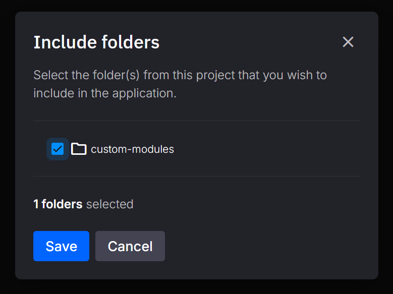

# Shared Folders

## Before we start

Complete the [previous steps](./create-application.md) or the [CLI Quickstart](../quix-cli/cli-quickstart.md) to ensure you can edit code both locally and in Quix Cloud.

## Why use Shared Folders

Shared folders let you include additional directories when you build or deploy your Quix application, enabling code reuse and easier maintenance. For example, if multiple applications share common utility scripts, you can place them in a shared folder instead of duplicating the code in each project. This reduces redundancy and makes updates easier—changing a shared module automatically updates all applications that depend on it.

## Default `app.yaml`

When you create a new application, you’ll have a default `app.yaml` like this:

```yaml title="app.yaml"
name: sample
language: python
variables: []
dockerfile: dockerfile
runEntryPoint: main.py
defaultFile: main.py
```

For example, if your project has the following structure:

```
root
  ├─ .git
  ├─ sample
  │  ├─ app.yaml
  │  ├─ main.py
  │  ...
  └─ custom-modules
     ├─ __init__.py
     ...
```

### Adding Folders in the Online IDE

#### Click the folder button

   {: style="max-width:500px"}

#### Select your folder

   {: style="max-width:500px"}

!!! tip
    You can also edit `app.yaml` manually to add or remove folders.

Your `app.yaml` is now updated as follows:

```yaml title="app.yaml"
name: sample
language: python
variables: []
dockerfile: dockerfile
runEntryPoint: main.py
defaultFile: main.py
includedFolders:
  - custom-modules
```

#### Confirmation

   {: style="max-width:500px"}

Whenever you [deploy your application](../deploy/overview.md), run it in the online IDE, or execute it [locally using the CLI](../quix-cli/local-development/local-debug.md), all directories listed under `includedFolders` will be bundled with your application to ensure they are available at runtime.

!!! warning
    Make sure your Dockerfile is up-to-date if you’re updating an existing application. Refer to the [dockerfile reference](../quix-cli/yaml-reference/dockerfile.md) for details.
