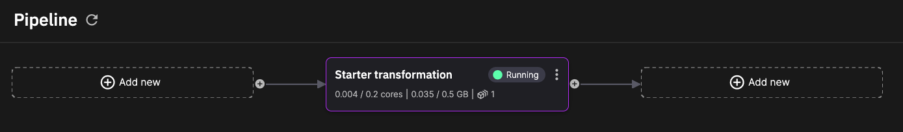

# Build a pipeline using Quix CLI

In previous sections of the documentation you explored using Quix Streams. You now continue on your command-line journey by installing the Quix CLI, and then using it to connect with Quix Cloud. You create a simple project on the command line, and sync it with your Quix Cloud pipeline view.

## Step 1: Install Quix CLI

```
curl -fsSL https://github.com/quixio/quix-cli/raw/main/install.sh | sudo bash
```

For further details on installation see the [install guide](https://github.com/quixio/quix-cli?tab=readme-ov-file#installation-of-quix-cli){target=_blank}.

## Step 2: Sign up to Quix Cloud for free

Sign up [here](https://portal.platform.quix.io/self-sign-up){target=_blank}.

## Step 3: Log in using the CLI

```
quix login <your-pat>
```

If you're not logged into Cloud, you'll be prompted to log in.

## Step 4: Create a Git repository

Create a Git repo where you can store your files, for example you could use GitHub. Create a repo initialized with a `README.md` file, so it can be cloned more easily. 

## Step 5: Clone your Git repo into your local project directory

For example, if your GitHub repo is named `cli-app`:

```
git clone <url-to-git>/cli-app
cd cli-app
```

## Step 6: Initialize your project as a Quix project

In your Git project directory, enter:

```
quix local init
```

This initializes your Quix project with a `quix.yaml` file, which describes your Quix project.


## Step 7: Create your application locally

Now create a sample application:

```
quix local app create starter-transformation
```

This creates a starter transformation for you. You can explore the files created locally for you. The `main.py` code will look familiar to you if you've tried the [previous sections](./welcome.md) of the documentation.


## Step 8: Sync your application

To sync your application, change into the `Starter transformation` directory and enter:

```
quix local deploy --push --sync
```

This updates your `quix.yaml` project file, and pushes all changes to your Git repository.

## Step 9: In Quix Cloud create a project

In this step you create a project in Quix Cloud from your Git repository.

1. Enter Quix Cloud.
2. Create a new project.
3. Select your Git provider.
4. Link the project to your Git repository using the guide provided for your chosen Git provider.
4. Sync Quix Cloud to your project by clicking the `Sync environment` button.

## Step 10: See your pipeline running

Go to pipeline view, and see your pipeline running, with your Starter transformation.



## Next steps

* TODO