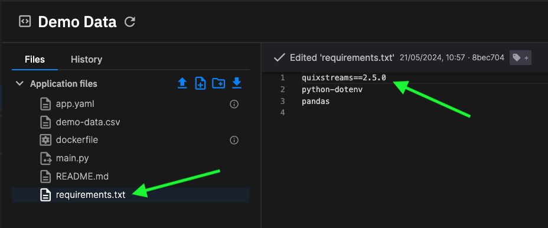

# Install Quix Streams in Quix Cloud

If you're using Quix Cloud, then Quix Streams will be installed for you as long as it is in the `requirements.txt` file for the application you are building. This is typically the case if you are using a Quix predefined code sample.

If you want to use Quix Streams in your application, ensure it is added to the `requirements.txt` file as illustrated here:

