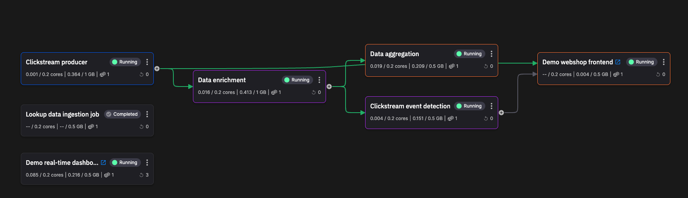
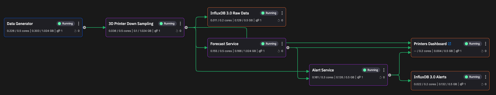

# Project templates

Project templates provide a way for you to examine your use case running in Quix. You don't need to sign up to see these projects running in Quix.

Project templates also provide a starting point for your own projects - our project templates are hosted as open source in the [Quix GitHub repository](https://github.com/quixio), so you can fork them and import them into Quix, and use them to build out your own solution. 

- __Computer vision__

    ---

    

    A project template that implements a real-time computer vision application.

    [Explore :octicons-arrow-right-24:](../tutorials/computer-vision/overview.md)

- __Chat sentiment analysis__

    ---

    

    A project template that implements a chat application with sentiment analysis.

    [Explore :octicons-arrow-right-24:](../tutorials/sentiment-analysis/overview.md)

- __Clickstream analysis__

    ---
    
    

    Clickstream analysis for online shop data. Features real-time dashboard and web shop user interface.

    [Explore :octicons-arrow-right-24:](../tutorials/clickstream/overview.md)

- __Predictive maintenance__

    ---
    
    

    Predicts failures in 3D printers.

    [Explore :octicons-arrow-right-24:](../tutorials/predictive-maintenance/overview.md)

