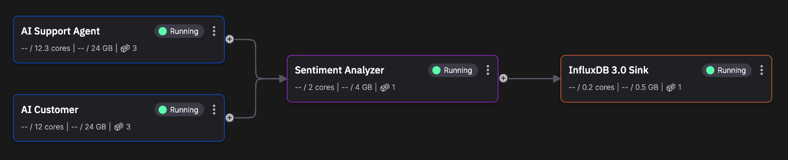

# Stream processing pipelines

In stream processing pipelines, it is important to understand the following terms:

* **Source connector** - an application using the producer API to produce data to a Kafka topic.
* **Destination connector** - an application using the consumer API to consumer data from Kafka and write it to a destination, such as to persist it to a database, or otherwise be transmitted beyond the Quix system.
* **Transformation** - a stream processing application that consumes data from a Kafka topic, processes it, and publishes it back to a Kafka topic.
* **Quix application template** - each application has an `app.yaml` file associated with it that defines the application, including input and output topics, the Docker file used, run entry point and other configuration. These configurations can be changed by editing the file, or more usually using the Quix Cloud UI.  
* **Quix pipeline template** - a Quix project, which corresponds to a Git repository containing the applications that make up the project's pipeline, is described by a `quix.yaml` file. In addition, Quix provides [templates](https://quix.io/templates){target=_blank} that enable you to see what Quix is capable of, or use as a starting point for your own project.
* **Quix Cloud** - a serverless platform for orchestrating and observing streaming data and stream processing applications in a pipeline. It supports multiple projects, with multiple environments, each containing one or more pipelines.

The applications (services) are connected in the pipeline by topics. The services run in dockerized containers managed by Kubernetes. The following screenshot illustrates a simple pipeline. 

[Read more about connectors](../connectors/index.md).
