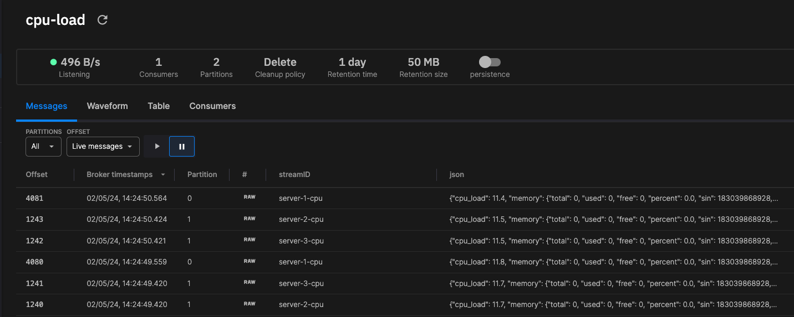

# Streaming

In streaming, it is important to understand the following terms:

* **Topic** - Quix has Kafka at its heart. Kafka is based around the idea of topics. These can be thought of as pipes in which messages flow. Topics enable data to flow between your dockerized microservices.
* **Quix producer** - In Quix, a producer publishes data to a Kafka topic. The data is typically thought of as packaged in a message, each message containing one or more events. 
* **Quix consumer** - A consumer subscribes to a topic, and typically processes the data it receives from that topic, depending on the use case.

More detail on these is provided in the following sections.

## Topic

Topics provide the conduits for data flow in Kafka-based solutions. When you [create a topic](../create/create-topic.md) you can specify important parameters such as the number of partitions in the topic. For an analogy, if you imagine the topic as a motorway, then partitions are the lanes. Clients can publish messages using a key (also known as a stream ID). The messages are divided among the partitions by the message key. For example, if you had two partitions, and three clients (producers) using different keys such as `server-1-cpu`, `server-2-cpu`, and `server-3-cpu`, then messages from client 1 would most likely be sent to partition 0, and  clients 2 and 3 messages would be routed to partition 1. You can see the partitions being used in the Quix Cloud topic explorer, as illustrated by the following screenshot:

Note that all messages of a particular key (stream ID) will be published to the same partition. You would never have, using this example, `server-1-cpu` messages on partition 1, they are always just on partition 0, and similarly, you'd only have `server-2-cpu` and `server-3-cpu` messages on partition 1. This approach guarantees that messages arrive in order.

## Producer

Producers publish messages to a topic. When you publish a message you can also provide a key. The key is used to divide messages among available partitions. Messages of a specific key are always routed to the same partition.

## Consumer

A consumer subscribes to a topic and then consumes all messages in that topic. You can organize consumers into consumer groups. In a consumer group each consumer will process the messages from partitions allocated to it by Kafka. For example, if you had two partitions in a topic, and two consumers in a consumer group, then the first consumer would process messages from one partition, and the second would consume messages from the other partition. If you had three partitions and two consumers, then one consumer would be allocated one partition, and the other consumer would be allocated two. Using consumer groups enables you to perform horizontal scaling of your processing.

[Read more about Quix](../kb/what-is-quix.md).
