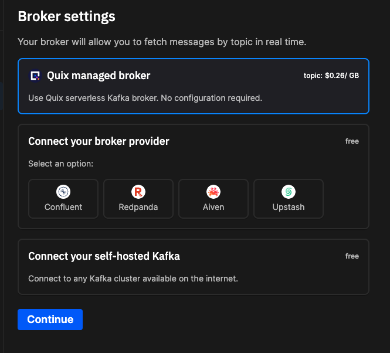

# Broker settings

When you create an environment in Quix, you are presented with the `Broker settings` dialog. This is where you can select the Kafka broker you want to use, as shown in the following screenshot:

## Setup guides

When connecting to a provider, each option comes with its own setup guide. Simply follow the instructions in the setup guide to connect Quix to your preferred broker. For example:

## See also

* [Create an environment](../../create/create-environment.md)
