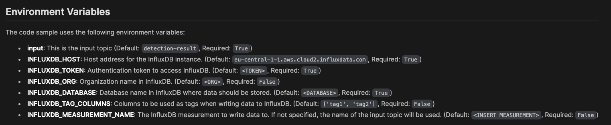
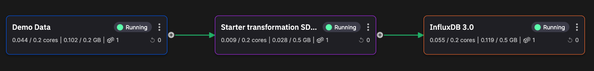

# Quickstart

This quickstart shows you how to integrate Quix with InfluxDB using our standard [connectors](../../../connectors/index.md).

In the first part of this quickstart, you'll read F1 car telemetry data, transform it, and then publish it to InfluxDB.

In the second part you'll get data from InfluxDB and publish it into a Quix topic, explore that data in real time.

This demonstrates various aspects of building a typical ETL processing pipeline, where you extract data, transform it in some way, and then save it to a database. 

This quickstart demonstrates both saving data to InfluxDB and querying data from InfluxDB, using Quix standard connectors, and [Quix Streams](https://quix.io/docs/quix-streams/introduction.html).

## Prerequisites

To complete this quickstart you will need:

* A free [Quix account](https://portal.platform.quix.ai/self-sign-up){target="_blank"}.
* An [InfluxDB account](https://www.influxdata.com/products/influxdb-cloud/serverless/){target=_blank}.

You also need to [create a project](../../../create/create-project.md) with an environment, or simply use your default environment.

## Create your InfluxDB bucket

Log into your InfluxDB account and create a new bucket called `f1-data`.

## Obtain your InfluxDB token

In the InfluxDB token manager, generate an API token for this project. 

An "all access" token can be created. Also provide a useful description such as "Quix Quickstart F1 Data". **Save the token securely for later use**.

## Create your demo data source in Quix

You now need to create a sample data source in Quix, so you have some data to store in InfluxDB. 

Assuming you have [created your project](../../../create/create-project.md) and environment, you can add a sample data source as follows:

1. In the pipeline view of your environment, click `+ Sample data source`. 

2. Click `Deploy` and `Deploy` again to add the sample data source into your pipeline.

Alternatively, click `Add new` (top right corner in pipeline view), select `Source`, and then select `Demo Data`. You can then deploy this sample.

By default, the output topic from this sample is `f1-data`.

## Add a transformation

You'll now add a simple transformation to your pipeline.

1. Switch to the pipeline view and click `+ Add new` and select `Transform`.

2. In the filters select `Python`, `Transformation`, and `Basic Templates`.

3. Click `Preview code` for `Starter transformation SDF`. This is the starter tranformation using the new [Quix Streams v2 client library](https://quix.io/docs/quix-streams/introduction.html).

4. Click `Edit code`, and then `Save` to save the application to your repository.

5. Edit the environment variables so that the input topic is `f1-data`, and the output topic is `processed-telemetry`. The `processed-telemetry` topic needs to be created. You can use the `Add new` button in the `Edit variable` dialog to do this.

    Modify the `main.py` code of the transformation to the following:

    ``` python
    import os
    from quixstreams import Application
    from datetime import timedelta

    # for local dev, load env vars from a .env file
    from dotenv import load_dotenv
    load_dotenv()

    app = Application.Quix("transformation-v1", auto_offset_reset="earliest")

    # JSON deserializers/serializers used by default
    input_topic = app.topic(os.environ["input"])
    output_topic = app.topic(os.environ["output"])

    # consume from nput topic
    sdf = app.dataframe(input_topic)

    # calculate average speed using 15 second tumbling window
    sdf = sdf.apply(lambda row: row["Speed"]) \
        .tumbling_window(timedelta(seconds=15)).mean().final() \
            .apply(lambda value: {
                'average-speed': value['value'],
                'time': value['end']
                })
    
    # print every row
    sdf = sdf.update(lambda row: print(row))

    # publish to output topic
    sdf = sdf.to_topic(output_topic)

    if __name__ == "__main__":
        app.run(sdf)
    ```

    This transform calculates the average speed of the F1 car using a 15 second tumbling window and writes this data to the output topic.

6. Click `Deploy` to deploy your transformation.

Make sure the deployed service starts and is running correctly.

## Add your InfluxDB destination

You can now add an InfluxDB **destination** to enable you to publish data from a Quix topic to InfluxDB.

1. Switch to the pipeline view and click `+ Add new` and select `Destination`.

2. In the search box type "Influx" and click `Preview code` on the InfluxDB 3.0 connector. Take a note of the environment variables you'll need to set and then click the `Edit code` button.

3. Leave the default Application name and Path and click `Save` to save to your repository.

4. You now need to configure the required environment variables:

    

    !!! tip

        This table shows some example values:

        | Variable | Description |
        |----|----|
        | `input` | This should be set to `processed-telemetry`, if not already set. |
        | `INFLUXDB_HOST` | Your Influx host. Example: `https://us-east-1-1.aws.cloud2.influxdata.com/` |
        | `INFLUXDB_TOKEN` | Your all-access token generated in Influx. **This variable needs to be of type `secret`, so your token is not revealed**. Example: `z7E<snip>Og==` |
        | `INFLUXDB_ORG` | In your Influx account you can see your available organizations. Example: `Docs` |
        | `INFLUXDB_DATABASE` | The InfluxDB bucket, in this case `f1-data` |
        | `INFLUXDB_TAG_COLUMNS` | Leave as default, `['tag1', 'tag2']`. |
        | `INFLUXDB_MEASUREMENT_NAME` | The "table" name, in this case `f1-data`. |
        | `CONSUMER_GROUP_NAME` | Consumer group name, for example `influxdb-sink`. |
        | `TIMESTAMP_COLUMN` | This is the field in your data that represents the timestamp in nanoseconds. If you leave this blank, the message timestamp received from the broker is used. Case sensitive. Optional. |

5. Click the `Run` button to test connection with the database. If no errors occur, proceed to the next step, or otherwise check you have configured your environment variables correctly.

6. Click `Deploy` and leave the settings at their defaults to build and deploy your InfluxDB connector. The database will then start receiving data once the build completes.

The pipeline now looks like the following:



## Check your data in InfluxDB

You will now check that your InfluxDB database is receiving data. 

1. In InfluxDB switch to the Explorer and in the schema browser select the `f1-data` bucket. 

2. Under `Measurement` select `f1-data` and click `Run`. You see the data stored in InfluxDB.

You have successfully processed F1 car telemetry data and published it from Quix to InfluxDB.

!!! note

    In the next part of this quickstart you learn how to retrieve data from InfluxDB and publish it to Quix.

## Add an InfluxDB source

You now add an InfluxDB **source** to enable you to query data from InfluxDB and publish it to a Quix topic.

1. In the pipeline view, in the top right click the `Add new` button and then select `Source`.

2. Type "Influx" into the search bar and click `Preview code` for the InfluxDB 3.0 connector.

3. Click `Edit code` and accept the defaults for Application name and path.

4. You now need to configure environment variables, in the same way as you did previously for the destination connector.

    !!! important
    
        For the default output topic, `influxdb`, you need to make sure that topic is created. You can do this once you click edit variable. Accept the defaults in the `New topic` dialog. Also, the database is the bucket you created previously, `f1-data`. The measurement is also `f1-data`. For convenience, you can set the `task_interval` to `1s` - this enables data to come through more quickly, as data changed in the last one second is published to the output topic. You can reuse the InfluxDB credentials you set previously. 

5. Click the `Run` button to test connection with the database. You will see `query success` in the console if the connection is working. If no errors occur proceed to the next step, or otherwise check you have configured your environment variables correctly.

6. Click `Deploy` and leave the settings at their defaults to build and deploy your InfluxDB connector. The connector will then query data from InfluxDB and publish it to the Quix output topic, once the build completes.

7. Switch back to the pipeline view.

## Explore the data from InfluxDB in real time

You can now explore data queried from InfluxDB and published to the Quix topic `influxdb` by the connector.

1. In the main left-hand menu, click on `Topics`.

2. Click the `influxdb` topic.

3. You can now see the live messages. Click on a message to display it.

Data is being queried from InfluxDB by the Quix connector, and then published to the Quix topic, `influxdb`. The Quix data explorer is then used to display this data in real time.

## Summary

In this quickstart you have learned how to publish data to InfluxDB, and also how to read data from InfluxDB. You also learned the basics of adding a simple transform to your stream processing pipeline.

You also learned how to view the messages in a Quix topic in real time, using the Quix data explorer. 

## Next steps

* [See other methods for integrating your data](../../../develop/integrate-data/overview.md)
* [See the predictive maintenance tutorial, which uses InfluxDB](../../../tutorials/predictive-maintenance/overview.md)
* [Try another tutorial](../../../tutorials/overview.md)
