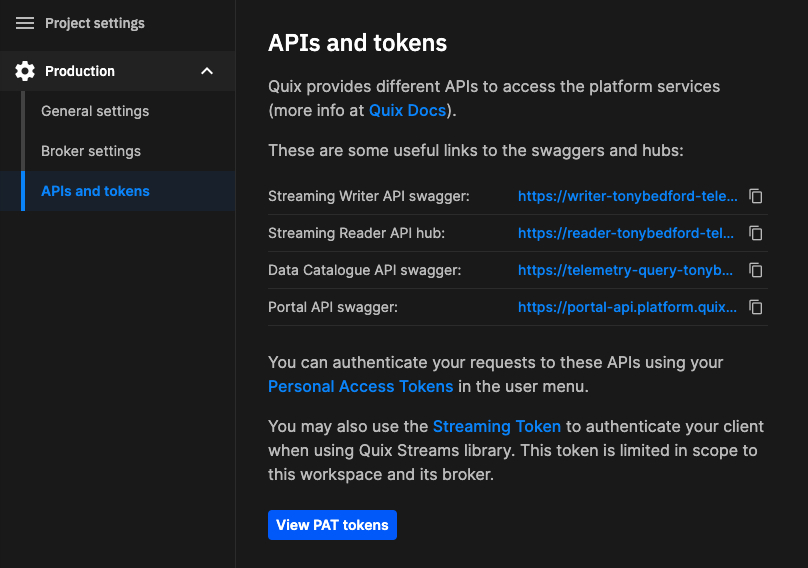

# Using Telegraf to get data into Quix

[Telegraf](https://docs.influxdata.com/telegraf/v1/){target=_blank} is an agent that collects and sends metrics and events from databases, systems, and IoT sensors, to configured outputs. One such output is Quix. This guide shows you how to configure Telegraf to send data of interest to a Quix topic.

## Prerequisites

This guide assumes you have the following:

* A Quix Cloud account.

  ??? info "Start for free"
      [Book a session](https://quix.io/book-a-demo) with us to start for free.
      
      We will create a time-limited free account for you, and our experts will help you get started with your specific use case. 
      
* Telegraf [installed](https://docs.influxdata.com/telegraf/v1/install/){target=_blank}.

You also need to [create a project](../../../create/create-project.md) with an environment.

## Create a Telegraf configuration file

Telegraf requires a configuration file to run. If you don't have a configuration file, you can create one by following this [guide](https://docs.influxdata.com/telegraf/v1/get-started/#configure-telegraf){target=_blank}.

## Create a Quix topic

This guide shows you how to use Telegraf to publish your metrics or data directly into a Quix topic. You therefore need a Quix topic to publish to. If you do not already have a topic available, in Quix you can click on `Topics` in the main left-hand menu, and then click `Add new` in the top right corner. Give the topic a suitable name, such as `metrics`. For the purposes of this guide you can create the topic with the default settings. The topic is then created - this may take a minute or two.

## Configure Telegraf

You now need to configure the Telegraf agent to write any gathered data to Quix. Open `telegraf.conf` in any suitable text editor and add the folllowing:

```
# A plugin that can transmit metrics over HTTP
[[outputs.http]]
taginclude = ["app",
    "chart",
    "container_image",
    "container_name",
    "cpu",
    "database",
    "device",
    "engine",
    "engine_host",
    "host",
    "indexType",
    "namespace",
    "node_name",
    "path",
    "request",
    "pod_name",
    "retentionPolicy",
    "server_version",
    "statefulset.kubernetes.io/pod-name",
    "streamId",
    "url",
    "volume_name",
    "jolokia_agent_url",
    "partition",
    "topic"]

# URL is the address to send metrics to
url = "https://writer-<org>-<project>-<environment>.platform.quix.io/topics/topic>/streams/<stream>/events/<event>/value"

# Timeout for HTTP message
timeout = "5s"

# HTTP method, one of: "POST" or "PUT" or "PATCH"
method = "POST"

# Data format to output.
data_format = "json"

# Additional HTTP headers
[outputs.http.headers]
Authorization = "bearer pat-83f7<snipped>b34"
```

Some of the configuration above is self-explanatory. For example, the data is to be POSTed using HTTP, so `method` is `POST`. 

The Quix-specific configurations are explained in the following sections.

### URL

The `url` configuration points to the [Quix Streaming Writer](../../../apis/streaming-writer-api/overview.md) HTTP endpoint. This enables data to be published to the specified topic and stream using HTTP. 

Note that the URL has the format `https://writer-<org>-<project>-<environment>.platform.quix.io/topics/<topic>/streams/<stream>/events/<event>/value`, where:

| Replaceable text | Description | Example |
|----|----|----|
| `<org>` | Your Quix organization | `acmecorp` |
| `<project>` | Your Quix project | `telegraftesting` |
| `<environment>` | Your environment within your Quix project | `production` |
| `<topic>`| The Quix topic you are publishing to | `metrics` |
| `<stream>` | The stream within the topic you are publishing to | `telegraf` |
| `<event>` | The event name | `raw` |

The easiest way to obtain the base of the URL is to go to `Settings` in Quix and then select `APIs and tokens` as shown in the following screenshot:



Use the copy button to copy the Streaming Writer API Swagger doc endpoint. You will get something similar to the following:

```
https://writer-tonybedford-telegraftesting-production.platform.quix.io/swagger/index.html
```

Remove `swagger/index.html` to obtain your base URL:

```
https://writer-tonybedford-telegraftesting-production.platform.quix.io/
```

You now just need to add your topic, stream, and event name, for example:

```
https://writer-tonybedford-telegraftesting-production.platform.quix.io/topics/metrics/streams/telegraf/events/raw/value
```

In this URL the values are as follows:

| Text | Description |
|----|----|
| `metrics` | The topic name |
| `telegraf` | The stream name |
| `raw` | The event name |

### Authorization

The Quix Streaming Writer HTTP endpoint needs to be authenticated. This is done using a Personal Access Token (PAT). In the previous screenshot you see a button called `View PAT tokens` - click to display existing tokens, or create a new one. The `Personal Access Tokens` dialog can also be displayed from your profile menu. Click your profile picture on the main Quix screen, and the Personal Access Tokens menu item is displayed - click this to display your existing tokens, or create a new one.

Once you have obtained a PAT, you can complete the configuration:

```
[outputs.http.headers]
Authorization = "bearer <pat>"
```

Replace `<pat>` with your PAT.

### taginclude

While not a Quix-specific configuration, `taginclude` is worth mentioning. This configuration filters the metrics that will be published to the outout, in this case Quix. More on filtering can be found in the [Telegraf documentation](https://docs.influxdata.com/telegraf/v1/configuration/#metric-filtering){target=_blank}.

## Run Telegraf

You can now run Telegraf on the command line, which for MacOS is:

``` shell
telegraf --config telegraf.conf
```

Different platforms may have different [command line invocations](https://docs.influxdata.com/telegraf/v1/get-started/#start-telegraf){target=_blank}.

## Check the data in Quix

Now that Telegraf is running, it is publishing data to the specified Quix topic. You can check this in Quix using the Quix data explorer.

In the main left-hand menu select `Data explorer`. Make sure `Live data` is selected. You then need to select your topic, stream, and event(s) of interest. Then, as this is event data, select the `Table` view, and click on an event to see its content, as shown in the following screenshot:


!!! tip

    In this view the data display is automatically paused. Click the `Live` button next to the `Pause` button to resume the real-time display of event data.

## Summary

In this guide you have learned how to configure Telegraf to publish data directly into a Quix topic. You have also learned how to examine this data using the Quix data explorer. Of course, once data is in a Quix topic, you can build a complete [Python stream processing pipeline](../../../quix-cloud/quixtour/overview.md) around it, and persist your processed data in a time series database such as [InfluxDB](overview.md). 

## Next steps

* Learn how to build a complete [Python stream processing pipeline](../../../quix-cloud/quixtour/overview.md)
* Read about [Streaming Writer](../../../apis/streaming-writer-api/overview.md)
* Try one of our [tutorials](../../../tutorials/overview.md)
* Obtain an [InfluxDB account](https://www.influxdata.com/products/influxdb-cloud/serverless/){target=_blank}
* Read the comprehensive [Telegraf documentation](https://docs.influxdata.com/telegraf/v1/){target=_blank}
