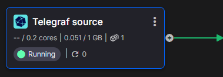
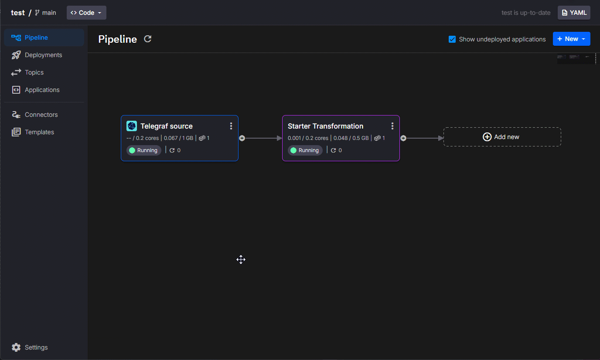

# Telegraf as a Quix data source

[Telegraf](https://docs.influxdata.com/telegraf/v1/){target=_blank} is an agent that collects and sends metrics and events from databases, systems, and IoT sensors, to configured outputs. One such output is Quix. This guide shows you how to configure Telegraf to send data of interest to a Quix topic.

## Prerequisites

This guide assumes you have the following:

* A Quix Cloud account.

??? info "Don't have one?"

      [Contact us](xxxxxxx) to get an account.
      
      We will create a time-limited free account for you, and our experts will help you get started with your specific use case. 
      
You also need to [create a project](../../../create/create-project.md) with an environment.

## Deploy the Telegraf connector

In order to familarise you with the Quix Telegraf connector you will first deploy the connector to your Quix Cloud project, observe the data produced by the connector and later you can configure your own Telegraf nodes to publish data to Quix.

1. Log In

     * Ensure you're logged in to your Quix Cloud account.

2. Telegraf Connector

    * Click `Connectors` on the nav and locate the Telegraf connector.
    * Click `Set up connector` on the "Telegraf source" tile.
    * Provide the name for the output topic, which is where the data will be published.
    * Click `Test connector & deploy`, this will deploy the connector to your project.

## View the data

The Telegraf connector you just deployed is now collecting CPU, memory and disk usage from the services deployed in your project. The Telegraf connector may be the only service you have deployed in which case all the data will relate to it.

At this point you should be on the pipeline view, the "Telegraf source" tile will have a line on the right hand side. This line represents a Kafka topic, which is where the Telegraf data is being delivered.

  

### Inspect the data

 * Click the topic (the line), it might be green or grey.
 * Wait for data rows to be displayed then click a row.
 * On the right you will see the data in JSON format. This includes fields and tags as well as the `name` e.g. "disk".

  

## Next steps

You now know how to deploy the Telegraf data source to Quix Cloud and how to view the data being produced. 

Next you can:

  * Create a service to make use of the data. An example is given below.
  * Configure your existing Telegraf to send data to Quix Cloud.

## Handle the data

You can handle the Telegraf data with code similar to this:

```py
import os
from quixstreams import Application
from datetime import timedelta

from dotenv import load_dotenv
load_dotenv()

app = Application(consumer_group="transformation-v1", auto_offset_reset="earliest")

input_topic = app.topic(os.environ["input"])
output_topic = app.topic(os.environ["output"])

sdf = app.dataframe(input_topic)

sdf = sdf[sdf["name"] == "cpu"]
sdf = sdf.group_by(lambda row: row["tags"]["host"], "group_by_host")
sdf = sdf.apply(lambda row: row["fields"]["usage_system"] + row["fields"]["usage_user"])
sdf = sdf.tumbling_window(timedelta(minutes=1), timedelta(seconds=5)).sum().final()
sdf = sdf.apply(lambda row, key, *_: {
    "time": row["start"],
    "cpu_total": row["value"],
    "tags": {
        "host": key
    }
}, metadata=True)

sdf.print()

sdf.to_topic(output_topic)

if __name__ == "__main__":
    app.run()
```

This code uses the Quix Python library [`Quix streams`](../../../quix-streams) to:

* Filter the data to include only rows with a name field equal to "cpu".
* Group the data by host.
* Calculate the total CPU usage from the system and user based usage.
* Create a 1 minute tumbling window of the total CPU usage in the window.
* Reformat the data for output to another Kafka topic to be consumed by a downstream process.

To deploy this code to Quix Cloud, use the `Starter Transformation` from the templates and replace the code with this.


## Configure existing Telegraf

You can configure your existing Telegraf nodes to transmit data to Quix Cloud.

??? tip "Telegraf configuration"
   
    Telegraf requires a configuration file to run. If you don't have a configuration file, you can create one by following this [guide](https://docs.influxdata.com/telegraf/v1/get-started/#configure-telegraf){target=_blank}.

### Modify your existing Telegraf configuration

To emit data to Quix, navigate to the Telegraf code for the service you deployed previously in this guide.

(This short animated gif shows you how)
  

### Configuration details

These are standard Telegraf plugins and configuration, details of which can be found in the [Telegraf plugin directory](https://docs.influxdata.com/telegraf/v1/plugins/).

* [Telegraf agent configuration](https://docs.influxdata.com/telegraf/v1/configuration/#agent-configuration)
  
    Determines collection parameters including the collection interval, batch sizes and buffer limits.

* [CPU Input](https://docs.influxdata.com/telegraf/v1/plugins/#input-cpu)
  
    Adds and configures collection of CPU usage metrics from the deployed and background services.

* [Memory Input](https://docs.influxdata.com/telegraf/v1/plugins/#input-mem)
  
    Adds and configures collection of memory usage metrics from the deployed and background services.
    
* [Disk Input](https://docs.influxdata.com/telegraf/v1/plugins/#input-disk)
  
    Adds and configures collection of disk usage metrics from the deployed services.
    
* [Quix Output](https://docs.influxdata.com/telegraf/v1/plugins/#ouput-quix)
  
    Adds and configures output of collected data to a Quix project.

    By default, each of the required configuration values is pre-configured and supplied with values from the Quix environment variables.

    If you want to use the Quix Output from your existing Telegraf installation you will need to supply the following values:

    * `Workspace Id` - Go to "Environment Settings" in Quix and copy the Workspace ID which is now called "Environment ID".
    * `Authentication Token` - read: [how to get a streaming token](https://quix.io/docs/develop/authentication/streaming-token.html#see-also)
    * `API Url` - Go to "Settings" "API and tokens" and copy the "Portal API swagger" URL. You only need the first part of the URL. e.g. https://portal-api.X.quix.io/ (replace X to match your URL)
    * `Topic` - Ensure you have a topic in the Quix Cloud UI, navigate to the topics page and copy the "Topic ID".


## Next steps

* Learn how to build a complete [Python stream processing pipeline](../../../quix-cloud/quixtour/overview.md)
* Read about [Streaming Writer](../../../apis/streaming-writer-api/overview.md)
* Try one of our [tutorials](../../../tutorials/overview.md)
* Obtain an [InfluxDB account](https://www.influxdata.com/products/influxdb-cloud/serverless/){target=_blank}
* Read the comprehensive [Telegraf documentation](https://docs.influxdata.com/telegraf/v1/){target=_blank}
