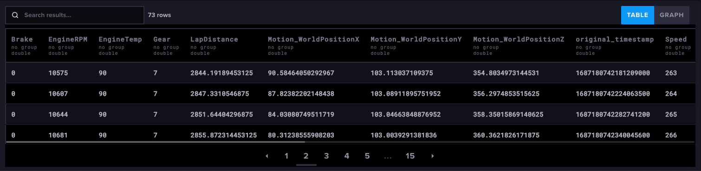
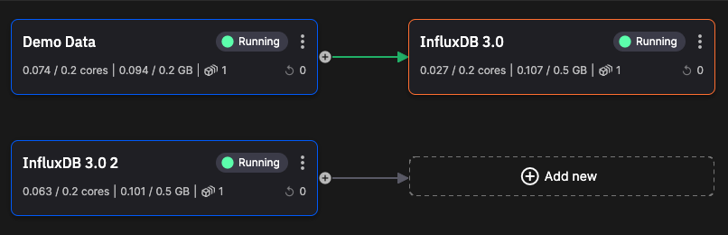

# Quickstart

This quickstart shows you how to integrate Quix with InfluxDB using our standard [connectors](../../connectors/index.md).

In the first part of this quickstart, you'll write data from a Quix topic to InfluxDB, and in the second part you'll publish data from InfluxDB into a Quix topic.

## Prerequisites

You complete this quickstart you will need:

* A free [Quix account](https://portal.platform.quix.ai/self-sign-up){target="_blank"}.
* An [InfluxDB account](https://www.influxdata.com/products/influxdb-cloud/serverless/){target=_blank}

You also need to [create a project](../../create/create-project.md) with an environment.

## Create your InfluxDB bucket

Log into your InfluxDB account and create a new bucket called `f1-data`.

## Obtain your InfluxDB token

In the InfluxDB token manager, generate an API token for this project. All "all access" token can be created. Also provide a useful description such as "Quix Quickstart F1 Data". Save the token securely for later use.

## Create your sample source

To create a sample data source so you have some data to store in InfluxDB:

1. In the pipeline view of your environment, click `+ Sample data source` and then click `Deploy` and `Deploy` again to add the sample data source into your pipeline.

## Add your InfluxDB destination

1. Switch to the pipeline view and click `+ Add new` and select `Destination` - you are now going to add an InfluxDB destination.

2. In the search box type "Influx" and click `Preview code` on the InfluxDB 3.0 connector. Take a note of the environment variables you'll need to set and then click the `Edit code` button.

3. Leave the default Application name and Path and click `Save` to save to your repository.

4. You now need to configure the required environment variables. The input topic is already set for you (`f1-data`):

    

    !!! tip

        `INFLUXDB_DATABASE` is the bucket you created previously, `f1-data` - this is also the value of `INFLUXDB_MEASUREMENT_NAME`. `INFLUXDB_ORG` can be obtained from the URL once you are logged into your Influx account. `INFLUXDB_TOKEN` is the Influx API token you created previously.

5. Click the `Run` button to test connection with the database. If no errors occur proceed to the next step, or otherwise check you have configured your environment variables correctly.

6. Click `Deploy` and leave the settings at their defaults to build and deploy your InfluxDB connector. The database will then start receiving data once the build completes.

## Check your data in InfluxDB

You will now check that InfluxDB is receiving data. 

1. In InfluxDB switch to the Explorer and in the schema browser select the `f1-data` bucket. 

2. Under `Measurement` select `f1-data` and click `Run`. You can see the stored data:

    

In the secind part of this quickstart you learn how to publish data from InfluxDB to Quix.

## Add an InfluxDB source

You now add an InfluxDB source to enable you to publish data from InfluxDB to a Quix topic.

1. In the pipeline view, in  the top right click the `Add new` button and then select `Source`.

2. Type "Influx" into the search bar and click `Preview code` for the InfluxDB 3.0 connector.

3. Click `Edit code` accepting the defaults for Application name and path.

4. You now need to configure environment variables.

    !!! tip
    
    For the default output topic, `influxdb` you need to make sure that topic is created. You can do this once you click edit variable. Accept the defaults in the `New topic` dialog. Also, the database is the bucket you created previously, `f1-data`. The measurement is also `f1-data`.

5. Click the `Run` button to test connection with the database. If no errors occur proceed to the next step, or otherwise check you have configured your environment variables correctly.

6. Click `Deploy` and leave the settings at their defaults to build and deploy your InfluxDB connector. The connector will then publish data from InfluxDB to the Quix output topic once the build completes.

7. Switch back to the pipeline view:

    

## Explore data

You now explore data puiblished from InfluxDB to the Quix topic `influxdb`.

