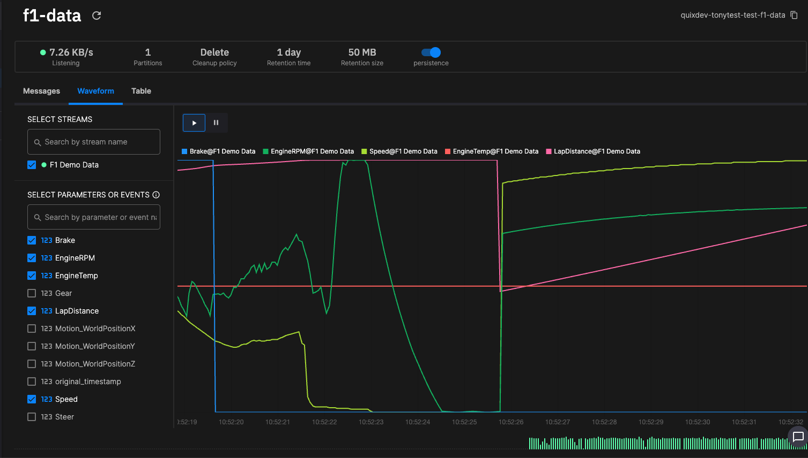

# Why use stream processing?

Stream processing has become increasingly popular in recent years due to its ability to handle real-time data with low latency and high throughput. 

There are several reasons why organizations choose stream processing:

* **Real-time analytics**: Stream processing enables organizations to analyze data as it is generated, enabling them to make decisions and take actions in real-time. This is crucial in various industries such as finance, e-commerce, and IoT, where timely insights can drive competitive advantage.

* **Scalability**: Stream processing frameworks, such as Quix, are designed to scale horizontally, meaning they can efficiently handle large volumes of data by distributing processing across multiple nodes. This scalability is essential for handling growing data volumes without sacrificing performance.

* **Low latency**: Traditional batch processing systems typically have higher latency since they process data in fixed-size batches. Stream processing, on the other hand, operates on data as it arrives, leading to lower latency and faster response times. This is critical for applications like fraud detection, where immediate action is necessary.

* **Event-driven architecture**: Stream processing aligns well with event-driven architectures, where systems react to events in real time. This approach enables loosely coupled, modular systems that can quickly adapt to changing requirements, and handle complex event-driven workflows.

* **Complex event processing**: Stream processing frameworks, such as Quix, often include capabilities for complex event processing (CEP), enabling organizations to detect patterns, correlations, and anomalies in real-time data streams. This is valuable for use cases such as monitoring, anomaly detection, and predictive maintenance.

* **Integration with modern data architectures**: Stream processing complements other components of modern data architectures such as data lakes, data warehouses, and real-time databases. By integrating stream processing into these architectures, organizations can build end-to-end data pipelines that support both real-time and batch processing needs. Read about Quix [connectors](../quix-connectors/templates/index.md) and [integrations](../integrations/overview.md).

* **Continuous computation**: Stream processing enables continuous computation, where computations are ongoing and incremental rather than being triggered by **batch jobs** at fixed intervals. This facilitates more responsive and agile applications that can adapt to changing conditions in real time.

Overall, stream processing provides organizations with the ability to harness the value of real-time data, enabling them to gain insights faster, respond to events more quickly, and build more responsive and scalable systems.

With Quix, you can perform stream processing much more easily, as all necessary infrastructure, such as Kafka, Docker, and Kubernetes can be provisioned for you, and you can develop your stream processing logic using Python and the [Quix Streams client library](https://quix.io/docs/quix-streams/introduction.html). 

As an alternative to having Quix host your stream processing infrastructure, you can easily [connect](../quix-connectors/templates/index.md) with third-party providers, or [integrate](../integrations/overview.md) Quix with your existing stream processing infrastructure.

The following sections review some common stream processing use cases. See also the [templates gallery](https://quix.io/templates){target=_blank} for more examples.

## Use Case: Real-time telemetry analysis for F1 racing

An F1 team wants to optimize their performance during races by leveraging real-time telemetry data analysis. They aim to monitor various parameters of the car's performance, analyze driver behavior, and make real-time decisions to improve lap times and race strategy.

There are three parts to implementing the use case:

1. Data collection
2. Stream processing pipeline
3. Actionable insights

### Data collection

Data collection consists of the following:

* **Car telemetry**: The F1 car is equipped with numerous sensors that capture real-time data on engine performance, tire temperatures, brake temperatures, fuel consumption, aerodynamics, and more.

* **Driver inputs**: Data on driver inputs such as throttle position, brake pressure, steering angle, and gear shifts are collected to understand driver behavior and technique.

* **Environmental data**: External factors such as track temperature, weather conditions, wind speed, and humidity are also monitored to assess their impact on performance.

### Stream processing pipeline

The stream processing pipeline can be implemented in Quix using Python and the [Quix Streams client library](https://quix.io/docs/quix-streams/introduction.html):

* **Data ingestion**: Telemetry data from the car's sensors is streamed in real time to the team's data processing infrastructure based on Quix. Read the [data integration](../develop/integrate-data/overview.md) documentation.

* **Real-time analytics**: Stream processing algorithms analyze incoming data streams to detect patterns, anomalies, and correlations between different parameters.

* **Performance optimization**: Machine learning models analyze historical and real-time telemetry data to identify optimal car setups, driving techniques, and race strategies.

* **Decision support**: Real-time insights are used to provide actionable recommendations to the team's engineers and strategists, such as adjusting car settings, altering pit stop strategies, or advising the driver on track tactics.

### Actionable insights

With the aid of the Quix standard connectors you can represent data graphically, store it in various databases, and use Python to perform number crunching. This results in actionable insights:

* **Dynamic car setup**: Real-time telemetry analysis enables the team to dynamically adjust the car's setup during pit stops or through radio communication with the driver, optimizing performance based on changing track conditions.

* **Race strategy optimization**: By analyzing real-time data on tire wear, fuel consumption, and competitor performance, the team can adapt their race strategy on-the-fly to maximize their chances of success, such as timing pit stops for optimal advantage.

* **Driver feedback and coaching**: Insights from real-time telemetry analysis help the team provide targeted feedback and coaching to the driver during the race, helping them optimize their driving technique and make strategic decisions on the track.

### Benefits

The main benefits of using stream processing in this scenario are:

* **Improved performance**: Real-time telemetry analysis enables the team to optimize car performance, driver behavior, and race strategy, leading to faster lap times and better race results.

* **Enhanced decision making**: Data-driven insights empower the team's engineers and strategists to make informed decisions in real-time, maximizing the team's competitive advantage during races.

* **Reduced risk**: By continuously monitoring key performance indicators and environmental factors, the team can proactively mitigate risks such as mechanical failures, tire degradation, or adverse weather conditions, minimizing the likelihood of race-ending incidents.

By leveraging real-time telemetry analysis in F1 racing, teams can gain a competitive edge by making data-driven decisions, optimizing performance, and maximizing their chances of success on the track.

See our F1 demo data in the Quix Code Samples library for an example.

## Use Case: Real-time personalized marketing and inventory management

The retail company wants to deliver personalized marketing messages to customers based on their behavior both online and in-store. They also aim to optimize inventory management by predicting demand and ensuring products are available when needed.

There are three parts to implementing the use case:

1. Data collection
2. Stream processing pipeline
3. Actionable insights

### Data collection

Data collection consists of the following:

* **Online**: The company collects data from its e-commerce website in real-time, including browsing behavior, past purchases, products viewed, and items added to cart.

* **In-store**: RFID tags or barcode scanners are used to track product movement in physical stores. Point of Sale (POS) systems capture transactional data such as purchases and returns.

### Stream processing pipeline

The stream processing pipeline can be implemented in Quix using Python and the [Quix Streams client library](https://quix.io/docs/quix-streams/introduction.html):

* **Ingestion**: Data from both online and in-store sources are ingested into a stream processing framework such as Quix.

* **Data enrichment**: Customer data is enriched with additional information such as demographics, purchase history, and preferences. Inventory data is enriched with product details and availability.

* **Real-time analysis**: Stream processing algorithms analyze incoming data streams to identify patterns, trends, and customer segments. For example, they may detect high-value customers, popular products, or seasonal trends.

* **Personalized marketing**: Based on real-time analysis, personalized marketing messages such as product recommendations, discounts, or promotions are generated and delivered to customers via email, SMS, or push notifications.

* **Inventory optimization**: Predictive models forecast demand for different products in various locations. Inventory levels are dynamically adjusted to ensure sufficient stock availability without overstocking.

### Actionable insights

With the aid of the Quix standard connectors you can represent data graphically, store it in various databases, and use Python to perform number crunching. This results in actionable insights:

* **Marketing campaigns**: The marketing team can monitor the effectiveness of personalized marketing campaigns in real-time and make adjustments as needed. They can also track customer engagement metrics such as click-through rates and conversion rates.

* **Inventory management**: Operations teams can optimize inventory levels, minimize stockouts, and reduce excess inventory based on real-time demand forecasts. They can also identify slow-moving or obsolete items for clearance sales or markdowns.

### Benefits

The main benefits of using stream processing in this scenario are:

* **Improved customer experience**: Customers receive personalized offers and recommendations tailored to their preferences and behaviors, enhancing their shopping experience and increasing loyalty.

* **Increased sales**: Targeted marketing messages drive higher conversion rates and encourage repeat purchases, leading to increased sales revenue.

* **Optimized operations**: Real-time inventory management reduces stockouts, minimizes excess inventory holding costs, and improves overall operational efficiency.

By implementing stream processing for real-time personalized marketing and inventory management, the retail company can gain a competitive edge in today's dynamic and fast-paced market environment.

See our [tutorials overview](../tutorials/overview.md) for step-by-step guides to building real-time data processing projects.

## Use Case: Real-time website performance monitoring and personalization

A company operates an e-commerce website and wants to leverage real-time web analytics to monitor website performance, understand user behavior, and personalize the user experience.

There are three parts to implementing the use case:

1. Data collection
2. Stream processing pipeline
3. Actionable insights

### Data collection

Data collection consists of the following:

* **Website events**: The website is instrumented to track user interactions such as page views, clicks, add-to-cart actions, purchases, and form submissions using JavaScript tags or server-side logging.

* **User attributes**: Additional data such as user demographics, device type, geographic location, and referral sources are collected to enrich user profiles.

* **External data integration**: External data sources such as CRM systems, marketing automation platforms, and third-party APIs are integrated to provide additional context and insights.

### Stream processing pipeline

The stream processing pipeline can be implemented in Quix using Python and the [Quix Streams client library](https://quix.io/docs/quix-streams/introduction.html):

* **Data ingestion**: Website events and user data are ingested into a real-time stream processing platform such as Quix. Read the [data integration](../develop/integrate-data/overview.md) documentation.

* **Real-time analytics**: Stream processing algorithms analyze incoming data streams to monitor website performance metrics such as page load times, bounce rates, and conversion rates in real-time.

* **User segmentation**: Machine learning models segment users based on their behavior, preferences, and characteristics to identify different user segments such as first-time visitors, returning customers, or high-value shoppers.

* **Personalization**: Personalized content recommendations, product suggestions, and promotional offers are generated in real-time based on user segments and individual user behavior.

### Actionable Insights

With the aid of the Quix standard connectors you can represent data graphically, store it in various databases, and use Python to perform number crunching. This results in actionable insights:

* **Performance optimization**: Real-time monitoring enables website administrators to identify and address performance issues such as slow-loading pages or broken links immediately, improving the overall user experience.

* **Conversion optimization**: Insights gained from real-time analytics help optimize conversion funnels by identifying bottlenecks, friction points, and opportunities for improvement.

* **Personalized marketing**: Personalized content and offers increase engagement and conversion rates by delivering relevant experiences tailored to each user's interests and preferences.

### Benefits

The main benefits of using stream processing in this scenario are:

* **Improved user experience**: Real-time monitoring and personalization enhance the user experience by delivering relevant content, recommendations, and offers tailored to each user's needs and preferences.

* **Increased conversions**: Optimization of conversion funnels and personalized marketing efforts lead to higher conversion rates and revenue generation.

* **Better decision making**: Real-time insights empower website administrators and marketers to make data-driven decisions and take timely actions to optimize website performance and user engagement.

By leveraging real-time web analytics for performance monitoring and personalization, the company can drive higher user engagement, increase conversions, and ultimately achieve its business objectives more effectively in the competitive online marketplace.

See our [tutorials overview](../tutorials/overview.md) for step-by-step guides to building real-time data processing projects.

## Use Case: Real-time fleet monitoring and optimization

A transportation company wants to monitor and optimize its fleet operations in real time to improve efficiency, ensure safety, and enhance customer satisfaction.

There are three parts to implementing the use case:

1. Data collection
2. Stream processing pipeline
3. Actionable insights

### Data collection

Data collection consists of the following:

* **Vehicle telemetry**: Each vehicle in the fleet is equipped with telematics devices that collect real-time data on its location, speed, fuel consumption, engine health, and other performance metrics.

* **Environmental sensors**: Additional sensors may be installed to monitor environmental conditions such as temperature, humidity, and air quality both inside the vehicles and in the surrounding areas.

* **External data sources**: External data sources such as traffic conditions, weather forecasts, and road closures are integrated into the system to provide contextual information.

### Stream processing pipeline

The stream processing pipeline can be implemented in Quix using Python and the [Quix Streams client library](https://quix.io/docs/quix-streams/introduction.html):

* **Data ingestion**: Telemetry data from vehicles and external sources are ingested into a stream processing platform, where they are processed in real-time. Read the [data integration](../develop/integrate-data/overview.md) documentation.

* **Real-time monitoring**: Stream processing algorithms analyze incoming data streams to monitor vehicle locations, track their movements, and detect any deviations from planned routes or schedules.

* **Predictive analytics**: Machine learning models analyze historical and real-time data to predict future events such as traffic congestion, adverse weather conditions, or potential maintenance issues.

* **Decision making**: Based on real-time insights, the system can automatically adjust routes, schedules, and assignments to optimize fleet operations and minimize delays.

### Actionable Insights

With the aid of the Quix standard connectors you can represent data graphically, store it in various databases, and use Python to perform number crunching. This results in actionable insights:

* **Route optimization**: Real-time monitoring enables dynamic route optimization to avoid traffic congestion, road closures, or other obstacles, reducing delivery times and fuel consumption.

* **Predictive maintenance**: By detecting potential equipment failures in advance, maintenance teams can proactively schedule maintenance activities, minimizing downtime and preventing costly breakdowns.

* **Environmental monitoring**: Environmental sensors provide real-time data on factors such as temperature and air quality, enabling fleet managers to ensure the safety and comfort of drivers and cargo.

### Benefits

The main benefits of using stream processing in this scenario are:

* **Improved efficiency**: Real-time monitoring and optimization of fleet operations lead to shorter delivery times, reduced fuel consumption, and lower operating costs.

* **Enhanced safety**: Proactive measures such as route optimization and predictive maintenance help ensure the safety of drivers and passengers by reducing the risk of accidents and equipment failures.

* **Better customer service**: Timely and reliable deliveries improve customer satisfaction and loyalty, leading to increased business opportunities and revenue.

By implementing real-time telemetry for fleet monitoring and optimization, the transportation company can gain a competitive advantage in the market by offering faster, more efficient, and safer transportation services to its customers.

See the [Predictive maintenance tutorial](../tutorials/predictive-maintenance/overview.md) for a related example of real-time ML.

## Use Case: Real-time process monitoring and anomaly detection

A manufacturing plant produces automotive parts using complex machinery and automated assembly lines. The company wants to ensure optimal performance, minimize downtime, and prevent defects by monitoring the production process in real-time.

There are three parts to implementing the use case:

1. Data collection
2. Stream processing pipeline
3. Actionable insights

### Data collection

Data collection consists of the following:

* **Sensor data**: Various sensors installed throughout the production line measure parameters such as temperature, pressure, vibration, speed, and quality characteristics of the produced parts.

* **Machine data**: Data from manufacturing equipment, including motor speeds, conveyor belt status, and machine operation logs, are collected in real-time.

### Stream processing pipeline

The stream processing pipeline can be implemented in Quix using Python and the [Quix Streams client library](https://quix.io/docs/quix-streams/introduction.html):

* **Data ingestion**: Sensor data and machine data are ingested into a stream processing platform such as Quix. Read the [data integration](../develop/integrate-data/overview.md) documentation.

* **Real-time analysis**: Stream processing algorithms continuously analyze incoming data streams to detect anomalies, deviations from normal operating conditions, and potential equipment failures.

* **Machine learning models**: Advanced machine learning models, such as anomaly detection algorithms or predictive maintenance models, are applied to identify patterns and predict equipment failures before they occur.

* **Alerting and visualization**: When anomalies or potential issues are detected, real-time alerts are generated and sent to operators or maintenance personnel via dashboards, emails, or SMS notifications. Visualization tools provide intuitive interfaces for monitoring the production process and identifying areas of concern.

### Actionable insights

With the aid of the Quix standard connectors you can represent data graphically, store it in various databases, and use Python to perform number crunching. This results in actionable insights:

* **Proactive maintenance**: Maintenance teams can proactively schedule maintenance activities based on predictive analytics, reducing unplanned downtime and minimizing production disruptions.

* **Quality control**: Real-time monitoring enables early detection of quality issues or deviations from specifications, enabling corrective actions to be taken immediately to prevent defective parts from being produced.

* **Process optimization**: Insights gained from real-time data analysis can be used to optimize process parameters, improve efficiency, and maximize throughput while maintaining product quality standards.

### Benefits

The main benefits of using stream processing in this scenario are:

* **Reduced downtime**: Proactive maintenance based on real-time insights minimizes unplanned downtime and increases overall equipment effectiveness (OEE).

* **Improved quality**: Early detection of anomalies and defects enables immediate corrective actions, ensuring that only high-quality parts are produced.

* **Cost savings**: Preventive maintenance and process optimization lead to cost savings by reducing maintenance costs, minimizing scrap and rework, and maximizing production efficiency.

By leveraging stream processing for real-time process monitoring and anomaly detection, the manufacturing plant can achieve higher levels of operational efficiency, reliability, and product quality, ultimately leading to increased competitiveness and customer satisfaction.

See the [Predictive maintenance tutorial](../tutorials/predictive-maintenance/overview.md) for a step-by-step guide to building a similar project.

## See also

See the [templates gallery](https://quix.io/templates){target=_blank} for more examples.
