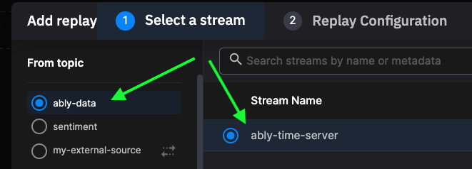
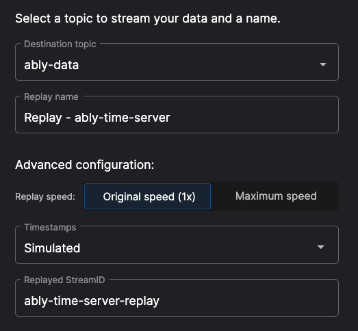

# How to replay data

!!! danger "Legacy feature"

	This feature is not available to new users. However, legacy users may still have access to this functionality.

Quix features a **replay service**. This service enables you to replay persisted data into a topic, as if it were live data. This is very useful for the following use cases:

* Testing and debugging connectors and transforms
* [Stream reprocessing](https://quix.io/blog/intro-stream-reprocessing-python/?x-craft-preview=VDVjwJTquq&token=7oGSdC9yxYk0zECNUz2RtzJLtGqG-aZB){target=_blank}
* Testing and retraining ML models

Once you have persisted data, it is possible to set up a replay service in your pipeline. Rather than using the live source of data, you can replay the persisted data into a topic in your pipeline, and monitor the processing. 

It is possible to configure the replay in various ways, for example:

* You can edit the destination topic. This means you can play back the same persisted data into different topics for testing and debugging.
* You can replay the data at the original speed or at maximum speed.
* You can replay the data with either the original timestamps, or simulated timestamps. The simulated timestamps are based on present time, rather than the original timestamps.

Once created, a replay service looks like any other service in your pipeline, and you can play or pause the streaming of data as required.

## To replay persisted data into a topic

You can only replay persisted data, so you need to persist a topic first. In your Quix environment, select `Topics` in the left-hand sidebar to list all your topics. Ensure the topic you want to persist has persistence switched on, as shown in the following screenshot:

Click `Pipeline` in your Quix environment, and then to create a new replay, click `Add new` in the top right corner:

Then select the `Replay` menu item. This displays the `Add replay` wizard. 

Select the topic with persisted data you want to replay from (only topics with persisted data will be shown), then select the stream whose data you want to replay:

Then click `Next`.

Now configure your replay according to your use case. For example, you can retain the data’s original timestamps, or select simulated timestamps for timestamps based on the present time. You also need to select the output topic (the topic the data is played into):

Once you have completed your configuration, click `Add replay`.

Switch to `Pipeline` view. The replay is created as a service in your pipeline. The service may take some time to load. You can then replay data into your pipeline using the play/pause control, as if it were live data:

