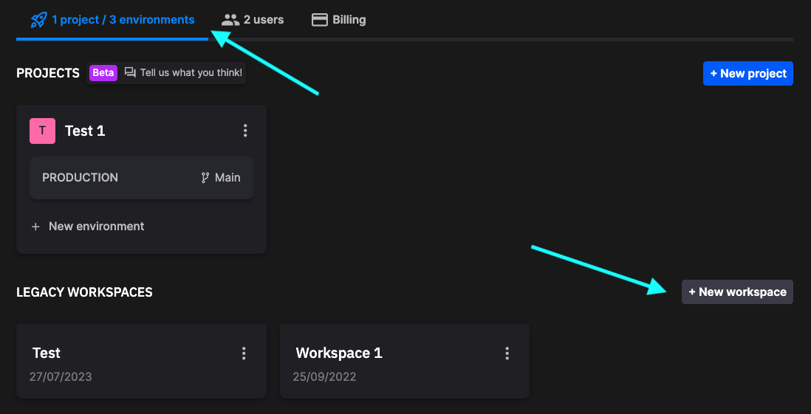

# Recent changes to Quix

The Quix Platform has recently undergone some substantial changes. These changes introduce some new terminology, and may also impact the way you currently work. This page provides an overview of the main changes. Other parts of this documentation will be updated in due course.

## Main features of the update

Quix now supports the ability to: 

* Host a complete project in one branch of your Git repository
* Build a complete project from a single YAML file
* Automatically synchronize changes in the Git repository with the pipeline view
* Easily manage multiple environments such as production, staging and development
* Host projects with Quix-hosted Git or using a third-party provider
* Enable environments to leverage Quix-hosted Kafka, self-hosted Kafka, or Confluent Cloud
* Customized resource variables, so you can allocate different resources to different environments - for example, automatically allocate more CPU cores to production

These new features introduced significant changes to the Quix UI and workflow. The rest of this documentation describes the new terminology, features, and workflow. 

## Watch a video

Watch a video demonstrating the new features, UI and workflow:

1. [Creating a project and the first environment](https://www.loom.com/share/b4488be244834333aec56e1a35faf4db?sid=a9aa124a-a2b0-45f1-a756-11b4395d0efc){target=_blank}
2. [Creating an additional environment](https://www.loom.com/share/877ae703f0cf458f8827341549adce6c?sid=5cacebef-659f-45cd-b4eb-c2e3f7104ccb){target=_blank}
3. [Creating an application](https://www.loom.com/share/dee01c5f7d0d4d338504c3c09dcd3181?sid=b902acbd-ef72-4450-80f3-6201764f48b9){target=_blank}
4. [Merging environments](https://www.loom.com/share/b2f2115fba014473aac072bb61609160?sid=22ddf07f-fa40-4ed8-a5ae-1a6eb0420465){target=_blank} **Note:** video is continued in the next video.
5. [Using YAML variables for deployment configuration](https://www.loom.com/share/c66029f67b8747bbb28c0605f5ea3fad?sid=4f30404e-f2dc-4564-b758-5935c405be3e){target=_blank}
6. [Third-party Git - Part 1](https://www.loom.com/share/b48b2b3aede5487e8591aa6aee6e1e9a?sid=79ca7ea8-4491-44f6-a675-f7d1075fa5ed){target=_blank}
7. [Third-party Git - Part 2](https://www.loom.com/share/71590a35421f4626a46a753d8a691cad?sid=0e1e269d-5e60-4be4-b861-a68557961749){target=_blank}
8. [Confluent Cloud](https://www.loom.com/share/fb5d9cd4ab6e4e0caf01e97f5000885c?sid=0512bb6c-2f1c-4e10-b085-05bd49aa15f5){target=_blank}

## Projects

With these changes, you now start by creating a Project. A project is an entity that corresponds to a Git repository. That Git repository can be hosted for you on Quix, or you can use another provider such as GitHub or Bitbucket. 

A project contains one or more environments, so typically you create an environment as part of the project creation workflow, and then create additional environments as required.

You can read more about the structure of a project in Git in the [project structure documentation](../platform/how-to/project-structure.md).

## Environments

An environment can be thought of as an entity that encapsulates a branch in your project, that contains the code for your applications. For example, you could have an environment called "production" that references a `main` branch. You could also have an environment called "develop" that references a `dev` branch.

While environments share a repository, they are logically isolated. Each environment can use Kafka hosted by Quix, self-hosted Kafka, or Confluent Cloud, independently of each other. For example, your "develop" environment could use Quix-hosted Kafka, and your "production" environment could use Confluent Cloud.

Let’s look at an example, Project Alpha, which has a Git repository hosted on Bitbucket:

| Environment | Branch | Kafka Hosting |
| ---|---|---|
| Production | main | Confluent Cloud |
| Staging | staging | Quix |
| Develop | dev | Quix |

You can see that while the project is hosted in Bitbucket, each environment can use a different Kafka hosting option as required for the use case.

!!! note

    In previous versions of Quix, the main entity most closely corresponding to an environment was the workspace. In some circumstances you may still see the term workspace used in some places, such as URLs. Simply bear in mind that workspaces are now environments, and very much enhanced in their capabilities.

## Protected environments

When you create a branch, it is possible to make it protected. This means that you can’t change the branch directly. You can’t commit changes directly into a protected branch. To modify a protected branch you would need to create a pull request, which would need to be reviewed, approved, and then merge in the usual way for the Git workflow. 

!!! tip

    Note that as all code and configuration for an environment is stored in its corresponding branch, you will not be able to directly change an environment that has a protected branch.

Consider a simple example where you have a protected `main` branch, and a `dev` branch. You would carry out normal development work in the `dev` branch, and then when satisfied that the changes are fully correct and tested, you could create a merge pull request to merge `dev` into `main`. The pull request would appear in your Git provider (Gitea if using the Quix-hosted Git solution), where it could be reviewed by other developers, approved, and then merged into `main`. 

If you then view the pipeline in the production environment, it is now marked as “out of sync”. This is because the view of the pipeline in the Quix environment is now different to what is in the `main` branch of the repository. If you then “sync” the environment, you can see the changes you merged from dev to main are reflected in the production pipeline.

If you make changes to an unprotected environment in the Quix "view", then the environment differs from the configuration and code in the corresponding repository branch. Quix will detect this and you will again be notified that the environment is now out of sync. You can simply click `Sync environment` to have the changes in the Quix view reflected in the corresponding branch.

[Watch a video on merging changes](https://www.loom.com/share/b2f2115fba014473aac072bb61609160?sid=22ddf07f-fa40-4ed8-a5ae-1a6eb0420465){target=_blank}

## Syncing an environment

You can think of your environment as consisting of two parts: the Quix view, and what's in the Git repository. Sometimes these become out of sync. For example, if you make changes in the Quix view, such as adding an application to your pipeline, those changes need to be synchronized to the repository. Mostly this is done automatically for you. 

Sometimes you will need to sync your environments manually. For example, if you have merged a pull request from dev to production, then the contents of the repository branch corresponding to the production environment  will now differ from the Quix view of the environment. This will be detected, and you are offered the option to synchronize between the corresponding branch in the Git repository, and the Quix view of the environment. 

You can always review the changes that will be made to your `quix.yaml` file, before you perform the synchronization.

The rules around manual and automatic synchronization are:

1. Operations performed in the Quix portal should not cause "out of sync", as those operations are automatically saved to the Git repository. This is the case for both Quix-managed and third-party hosted Git.
2. The exception to this is the case of YAML variables. When variables are created, if those are included in the `quix.yaml`, you will need to perform manual synchronization. You are prompted if this is required.
3. If you change the `quix.yaml` in the Git repository, then you may get "out of sync". The `quix.yaml` file currently only includes topics and deployments.

!!! important

    Quix always notifies you if manual synchronization is required. You can then click `Sync environment` and you are shown the changes that will be made on synchronization. If you are happy with the changes that are to be made, then you can proceed with the synchronization.

## Applications

With a branch you develop your Applications, typically in Python. Each application represents the implementation of a source, transform, or destination.

For example, you might create a new source component to retrieve data from an external service, a transform to process this data, and then perhaps a destination, which could store data in a Postgres database. You might have another destination to display the data on a Streamlit dashboard. 

These applications are connected together to form your pipeline. It is important to note the pipeline is contained within a branch.

For example, a pipeline on the develop branch of Project Alpha might be:

| Application name | Type | Notes |
|---|---|---|
| Inbound data | Source | Fetch data from REST API |
| IP to geo | Transform | Converts IP address to Geolocation |
| Archive data | Destination | Write to Postgres relational database |
| Dashboard | Destination | Streamlit dashboard |

## Pipeline

An entire Quix pipeline can be described by a `quix.yaml` file. This file is also used to configure resources used by the deployment.

This allows Quix to quickly replicate an entire pipeline and configuration. For example, a pipeline created and tested in one branch, can be quickly duplicated in another branch. 

It is also possible to use [YAML variables](../platform/how-to/yaml-variables.md) in the YAML file to configure resources differently depending on the environment.

## New and legacy terminology comparison

The key terminology changes are shown in the following table:

| New | Legacy | New meaning |
|---|---|---|
| Project | N/A | Git repository |
| Environment | Workspace | Git branch plus Kafka hosting option |
| Branch | N/A | Represents a Git branch, such as main or dev |
| Application | Project | The files for the implementation of a source, transform, or destination |

## Legacy workspaces

To protect your investment in Quix, legacy workspaces will be supported for some time to come. 

!!! important

    Quix **strongly** advises that your event streaming solutions use the new project-based approach, with environments aligned with your development processes. Simply click `+ New project` to build your first project and environment.

If you already have a legacy workspace, or you wish to create one for some reason, such as to follow some old content, then this is still supported. You can create a legacy workspace by clicking `+ New workspace`, as shown in the following screenshot:

!!! tip

    Legacy workspaces now map to [environments](#environments). In the dashboard you can see that your legacy workspaces are simply counted as environments.

## Next steps

* [What is Quix?](../platform/what-is-quix.md)
* [Check the Quix Glossary](../platform/glossary.md)
* [Dive into the Quickstart](../platform/quickstart.md)
* [Create a project](../platform/how-to/create-project.md)
* [Project structure](../platform/how-to/project-structure.md)
* [YAML variables](../platform/how-to/yaml-variables.md)
