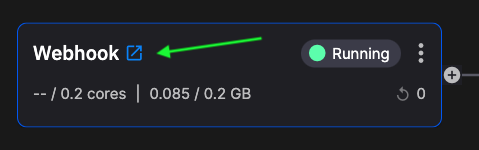

# How to connect to Quix

There are various ways to connect your data and services to Quix. The main methods are listed here:

1. Using a prebuilt connector
2. Polling
3. Inbound webhooks
4. HTTP API
5. Websockets
6. Push data into Quix Platform using Quix Streams
7. Read data from a CSV file

The particular method you use depends on the nature of the service you're trying to interface with Quix. Each of these methods is described briefly in the following sections.

## Using a prebuilt connector

This is the easiest method, as no code needs to be written, and there is usually only minor configuration required to get a Quix connector up and running. For example, Quix provides connectors for many common services such as Postgres, Twilio, Streamlit, and so on.

You can review the list of connectors in the [connector documentation](../platform/connectors/index.md). The code for our connectors can be found in the [Quix Code Samples GitHub repository](https://github.com/quixio/quix-samples){target=_blank}. 

Note there are two main types of connector:

1. *Sources*
2. *Destination*

A *source* enables you to get data into Quix, such as data coming from a database or IoT device, to be processed in real time. A source represents an input with respect to Quix. 

A *destination* enables you to get data out of Quix. For example, to store processed data in a relational database for archiving, or to write data to a Streamlit dashboard. A destination represents an output with respect to Quix.

Even if the exact connector you require does not currently exist, it is sometimes possible to adapt one of the existing connectors to suit your needs. For example, the Segment webhook connector could be adapted to suit many different webhook-based services. See the [webhooks section](#inbound-webhooks) for more information.

## Polling

If there's an existing REST API you want to pull data from, you can write a Quix connector that polls the REST API. By way of example, the following code demonstrates the idea:

``` python
import quixstreams as qx
import time
import os
import requests
import pandas as pd

client = qx.QuixStreamingClient()

topic_producer = client.get_topic_producer(topic_id_or_name = os.environ["output"])

stream = topic_producer.create_stream()
stream.properties.name = "Users Stream"

while True:
    response = requests.get("https://random-data-api.com/api/v2/users")
    json_response = response.json()
    df = pd.json_normalize(json_response)
    print(df)
    stream.timeseries.publish(df)
    time.sleep(4)
```

The code requests data from the REST API and then publishes it to a stream.

## Inbound webhooks

Many services generate webhooks when certain events occur, and you may want to get these webhooks and their data into Quix. As Quix services can be deployed as web services, they can receive inbound webhooks easily. You simply handle the webhook in the required way, perhaps using an existing connector as a guide. For example, the Segment connector handles webhooks from the Segment service in the following way:

``` python
import quixstreams as qx
from flask import Flask, request
from datetime import datetime
from waitress import serve
import os
import json
import hmac
import hashlib

# Quix injects credentials automatically to the client. 
# Alternatively, you can always pass an SDK token manually as an argument.
client = qx.QuixStreamingClient()

# Open the output topic where to write data out
producer_topic = client.get_topic_producer(os.environ["output"])

stream = producer_topic.create_stream()
stream.properties.name = "Segment Data"

app = Flask("Segment Webhook")

# this is unauthenticated, anyone could post anything to you!
@app.route("/webhook", methods=['POST'])
def webhook():
    
    # get the shared secret from environment variables
    secret = os.environ["shared_secret"]
    # convert to a byte array
    secret_bytes = bytearray(secret, "utf-8")

    # get the signature from the headers
    header_sig = request.headers['x-signature']

    # compute a hash-based message authentication code (HMAC)
    hex_digest = hmac.new(secret_bytes, request.get_data(), hashlib.sha1).hexdigest()

    # compare the HMAC to the header signature provided by Segment
    if(header_sig != hex_digest):
        # if they don't match its no bueno
        return "ERROR", 401
    
    # if they do then fly me to the moon
    stream.events.add_timestamp(datetime.now())\
        .add_value(request.json["type"], json.dumps(request.json))\
        .publish()

    return "OK", 200


print("CONNECTED!")

# you can use app.run for dev, but its not secure, stable or particularly efficient
# qx.App.run(debug=True, host="0.0.0.0", port=80)

# use waitress instead for production
serve(app, host='0.0.0.0', port = 80)
```

!!! note

    The Segment webhooks are signed, but for other services this is not always the case, and this will therefore simplify your webhook code.

When you deploy your service you can configure public access in the `Deploy` dialog. You can then obtain the public access URL needed to configure the inbound webhook from the `Deploy` dialog or from the service itself, as shown in the following screenshot:

{width=60%}

See also [How to deploy a public service](../platform/how-to/deploy-public-page.md) for more information.

## HTTP API

Quix provides two APIs with an HTTP API interface:

1. [Writer API](../apis/streaming-writer-api/intro.md)
2. [Reader API](../apis/streaming-reader-api/intro.md)

The Writer API is used to write data into the Quix Platform, that is, it is used by publishers. The Reader API is used to read data from the Quix Platform, and is therefore used by consumers. These are used typically by external services such as web browser client code, or perhaps IoT devices. The Reader and Writer APIs also provide a websockets interface, which is described in the [next section](#websockets).

The easiest way to try out these HTTP APIs is to use the prebuilt connectors called `External source` and `External destination`. This section looks at using the `External source` connector, but the process is similar for the `External destination` connector. To use the `External source` connector, step through the following procedure:

1. In the Quix Portal click on `Code Samples` in the left-hand sidebar. 

2. Search for `External source`. 

3. Click `Add external source`.

4. Select the output topic that you want to publish data to.

5. Give your source a name.

6. Click `Add external source`.

7. In the Pipeline view click the newly created source and the following is displayed:

    {width=80%}

8. For this example, select `HTTP API - JavaScript`. Code is generated for you that uses the Writer HTTP API.

9. Click the `Copy code` button to copy the code to your clipboard. 

You can now paste the code into your JavaScript code, for example, your web browser client code. The code writes data into the Quix topic that you configured.

As you can see there are other options such as generating Curl code that can be run in your shell to also write data into Quix. 

!!! note

    The code samples generated are meant to provide you with a starting point from which you can build your own solutions. They provide a convenient way to see how the API works.

Further information can be found in the [Writer API](../apis/streaming-writer-api/intro.md) and [Reader API](../apis/streaming-reader-api/intro.md) documentation.

## Websockets

The Writer and Reader APIs offer a websockets interface in addition to the HTTP interface described in the [previous section](#http-api). The websockets interface provides a continuous end-to-end connection suitable for higher speed, real-time data transfer. This is a higher performance alternative to the request-response mode of operation of the HTTP interface. The Writer and Reader APIs both use the [Microsoft SignalR](https://learn.microsoft.com/en-us/aspnet/core/signalr/javascript-client?view=aspnetcore-5.0&tabs=visual-studio) technology to implement the websockets interface.

Some example code that shows how to connect to Quix and write data into a Quix stream using the websockets interface is shown here:

``` html
<!DOCTYPE html>
<html lang="en">
  <head>
    <title>Hello Websockets</title>
    <link rel="stylesheet" href="/style.css" />
    <script src="https://cdnjs.cloudflare.com/ajax/libs/microsoft-signalr/6.0.1/signalr.js"></script>
  </head>
  <body>
    <hr />
    <canvas
      id="myCanvas"
      width="500"
      height="300"
      style="border: 5px solid #00ff00"
      onmousemove="getCursorPosition(event)"
    >
    </canvas>

    <hr />
    <div>Timestamp: <span id="timestamp"></span>.</div>
    <div>X Mouse position: <span id="c_p_x"></span>.</div>
    <div>Y Mouse position: <span id="c_p_y"></span>.</div>
    <button onclick="clearCanvas()">Clear canvas</button>
    <hr />

    <script>
      const token = "<your_pat_token>"; // Obtain your PAT token from the Quix portal
      const workspaceId = "<your_workspace>";
      const topic = "websocket-topic";
      const streamId = "mouse-pos";

      var mouseX;
      var mouseY;
      var timestamp;

      const canvas = document.getElementById("myCanvas");
      const ctx = canvas.getContext("2d");
      ctx.fillStyle = "#00FF00";

      const options = {
        accessTokenFactory: () => token,
      };

      const connection = new signalR.HubConnectionBuilder()
        .withUrl(
          "https://writer-" + workspaceId + ".platform.quix.ai/hub",
          options
        )
        .build();

      connection.start().then(async () => {
        console.log("Connected to Quix.");
      });

      async function getCursorPosition(event) {
        timestamp = new Date().getTime();
        mouseX = event.clientX;
        mouseY = event.clientY;

        document.getElementById("timestamp").textContent = timestamp;
        document.getElementById("c_p_x").textContent = mouseX;
        document.getElementById("c_p_y").textContent = mouseY;
        ctx.fillRect(mouseX, mouseY, 10, 10);

        let mousePos = JSON.stringify({ x: mouseX, y: mouseY });

        let mousePacket = [
          {
            timestamp: new Date().getTime(),
            tags: {
              mousestatus: "tracking",
            },
            id: "mouse position",
            value: mousePos,
          },
        ];

        console.log("Sending mouse data");
        await connection.invoke("SendEventData", topic, streamId, mousePacket);
        console.log("Sent mouse data");
      }

      function clearCanvas() {
        ctx.clearRect(0, 0, 500, 300);
      }
    </script>
  </body>
</html>
```

This simple example just sends mouse cursor position to a Quix stream when you draw on a canvas.

Code that could read mouse cursor position from a Quix stream is as follows:

``` html
<!DOCTYPE html>
<script
  src="https://cdnjs.cloudflare.com/ajax/libs/microsoft-signalr/6.0.1/signalr.js"
  crossorigin="anonymous"
  referrerpolicy="no-referrer"
></script>
<html>
  <body>
    <h2>Quix JavaScript Hello Websockets</h2>

    <canvas
      id="myCanvas"
      width="500"
      height="300"
      style="border: 5px solid #000000"
    >
    </canvas>
    <hr />
    <button onclick="clearCanvas()">Clear canvas</button>

    <script>
      const token = "<your_pat_token>"; // Obtain your PAT token from the Quix portal

      // Set the Workspace and Topic
      const workspaceId = "<your_workspace>";
      const topicName = "transform";
      const streamId = "mouse-pos";
      const canvas = document.getElementById("myCanvas");
      const ctx = canvas.getContext("2d");
      ctx.fillStyle = "#FF0000";

      const options = {
        accessTokenFactory: () => token,
      };

      const connection = new signalR.HubConnectionBuilder()
        .withUrl(`https://reader-${workspaceId}.platform.quix.ai/hub`, options)
        .build();

      connection.start().then(() => {
        console.log("Connected to Quix");

        connection.invoke("SubscribeToPackages", topicName);

        connection.on("PackageReceived", (data) => {
          let payload = JSON.parse(data.value);
          console.log("DATA (payload): ---->>>", payload);
          console.log(
            "DATA (payload - timestamp): ---->>>",
            payload[0].Timestamp
          );
          console.log("DATA (payload - value): ---->>>", payload[0].Value);
          let mousePos = JSON.parse(payload[0].Value);
          console.log("DATA (payload - value.x): ---->>>", mousePos.x);
          console.log("DATA (payload - value.y): ---->>>", mousePos.y);
          ctx.fillRect(mousePos.x, mousePos.y, 10, 10);
        });
      });

      function clearCanvas() {
        ctx.clearRect(0, 0, 500, 300);
      }
    </script>
  </body>
</html>
```

This code uses the Reader API to read data from a Quix stream.

The Quix documentation explains how to obtain your [Quix workspace ID](../platform/how-to/get-workspace-id.md), [PAT token](../apis/streaming-reader-api/authenticate.md) for authentication, and also how to [set up SignalR](../apis/streaming-reader-api/signalr.md). 

## Push data using Quix Streams

You can use Quix Streams to push data up from your laptop (for example) into Quix Platform. Some example code showing Quix Streams pushing data inot the platform is shown here:

```python
    import psutil
    import quixstreams as qx
    from dotenv import load_dotenv
    import time
    import datetime
    import os

    load_dotenv()
    token = os.getenv("STREAMING_TOKEN")

    def get_cpu_load():
        cpu_load = psutil.cpu_percent(interval=1)
        return cpu_load

    # Obtain client library token from portal
    client = qx.QuixStreamingClient(token)

    # Open a topic to publish data to
    topic_producer = client.get_topic_producer("cpu-load")

    stream = topic_producer.create_stream()
    stream.properties.name = "Quickstart CPU Load - Server 1"
    stream.timeseries.buffer.time_span_in_milliseconds = 100   # Send data in 100 ms chunks

    def main():
        try:
            while True:
                cpu_load = get_cpu_load()
                print(f"CPU Load: {cpu_load}%")
                stream.timeseries \
                    .buffer \ 
                    .add_timestamp(datetime.datetime.utcnow()) \
                    .add_value("CPU_Load_1", cpu_load) \
                    .publish()
        except KeyboardInterrupt:
            print("Closing stream")
            stream.close()

    if __name__ == '__main__':
        main()
```

You need to obtain a [streaming token](../platform/how-to/streaming-token.md) from within the platform.

## Read data from a CSV file

A common source of data is a CSV file. As well as prebuilt code samples that can be modified to suit your own purposes, it is possible to write you own code to load data in from CSV files. Read the [CSV file how-to](../platform/how-to/ingest-csv.md) for further detail on ingesting data from CSV files.

## Summary

There are various ways to connect to Quix, and how you do so depends on the nature of the service and data you are connecting. In many cases Quix has a [suitable connector](../platform/connectors/index.md) you can use with minor configuration. 

If you want some example code you can use as a starting point for connecting your own data, you can use the `External source` and `External destination` [samples](#http-api). Or use one of the [existing connectors](#using-a-prebuilt-connector) as a starting point.

Low-frequency data from REST APIs can be [polled](#polling) from Quix using a library such as `requests`. 

Quix also provides the [streaming writer](../apis/streaming-writer-api/intro.md) and [streaming reader](../apis/streaming-reader-api/intro.md) APIs with both HTTP and websockets interfaces. If a continous connection is not required you can use the HTTP interface. Faster data from web servers, browser clients, and IoT devices can interface [using websockets](#websockets), where a continuous connection is required.
