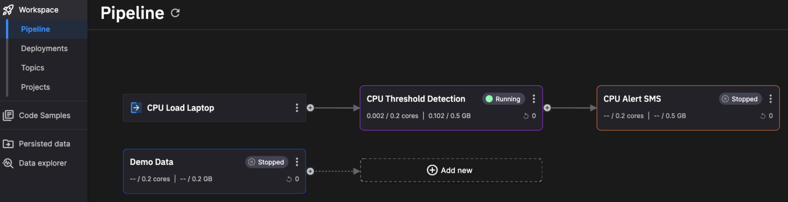

# Glossary

The following is a list of terms useful when working with Quix and streaming data.

## APIs

In addition to the Quix Streams client library, there are several APIs that you can use with Quix. See the [API landing page](../apis/index.md).

## Binary data

Quix also supports any binary blob data.

With this data you can stream, process and store any type of audio, image, video or lidar data, or anything that isn’t supported with time-series, event, or metadata types.

## Code Samples

Quix Platform contains a large number of [open source](https://github.com/quixio/quix-samples) Code Samples. You can use these to quickly build out your stream processing pipeline. Generally the code samples are divided into three main categories: source, transform, destination. You can access the Code Samples from within the Quix Portal by using the navigation menu as show here:

{height=50%}

## Connectors

There are [many ways](../platform/ingest-data.md) to get data into Quix Platform. One option is to use the many connectors already provided by Quix. These can be viewed in Quix Platform by clicking Code Samples and then selecting Source and Destination filters. Alternatively, you can see a useful page in our documentation, that lists the [available connectors](../platform/connectors/index.md).

## Data Catalogue API

An [HTTP API](../apis/data-catalogue-api/intro.md) used to query historical data in the Data Catalogue. Most commonly used for dashboards, analytics and training ML models. Also useful to call historical data when running an ML model, or to call historical data from an external application.

## Data Types

Quix supports time-series data, events, metadata, and blobs with the following data types: 

* Numeric (double precision)
* String (UTF-8)
* Binary data (blobs)

Read more about [data types](../client-library-intro.md#multiple-data-types).

## Deployment

An instance of a project running in the serverless environment. When you deploy your project, you can specify a number of parameters such as allocated RAM, CPU count, number of replicas, and public URL. You can also specify whether you want it to run as a [job](#job) or a [service](#service), depending on your use case. A job runs only once, and service runs continuously.

## Events

Events are a discrete occurrence of a thing that happens or takes place in time.

For example:

* Engine start, engine stop, warning light activated.
* Game started, match made, kill made, player won the race, lap completed, track limits exceeded, task completed.
* Takeoff, landing, missile launched, fuel low, autopilot engaged, pilot ejected.

Events are typically things that occur less frequently. They are streamed into the same topics as their related time-series data, and act to provide some context to what is happening. For example, start and stop events typically mark the beginning and end of a data stream.

Read more about [event data](../client-library/publish.md#eventdata-format).

## Job

Any application code that is run once. For example, use a job to run a batch import of data from an existing data store, such as a CSV file, database, or data lake.

## Metadata

Metadata describes additional information or context about a stream.

For example:

* License plate number, car manufacturer, car model, car engine type, driver ID.
* Game version, player name, game session type, game session settings, race car set-up.
* Flight number, destination, airport of origin, pilot ID, airplane type.

Metadata typically has no time context, rather it exists as a constant throughout one or more streams. For example, your metadata could be the configuration of a car that is sold from a dealership (such as engine size, transmission type, wheel size, tyre model etc); you could create a stream every time that car is driven by the owner, but the engine size and transmission type won’t change.

Metadata is key to data governance and becomes very useful in down-stream data processing and analytics.

Read more about [Metadata](../client-library/publish.md#parameter-definitions).

## Online IDE (Quix Platform)

Quix provides an online Integrated Development Environment (IDE) for Python and C# projects. When you open any project, you will see the **Run** button, and a console during runtime, in addition to the IntelliSense.

Sign up for a [free account](https://portal.platform.quix.ai/self-sign-up).

## Portal API

An [HTTP API](../apis/portal-api.md) used to interact with most portal-related features such as creation of [workspaces](#workspace), [users](#workspace), and [deployments](#deployment).

## Project

A set of code in Quix Platform that can be edited, compiled, run, and deployed as one Docker image. Projects in Quix Platform are fully version controlled. You can also tag your code as an easy way to manage releases of your project.

## Quix Streams

[Quix Streams](../client-library-intro.md) is the main **client library** used to send and receive real-time data in your streaming applications.

## Service

Any application code that runs continuously in the serverless environment. For example, a connector, a function, a backend operation, or an integration to a third-party service like Twilio.

## Stream

A stream is a collection of data (time-series data, events, binary blobs and metadata) that belong to a single session of a single source. For example:

* One journey for one car
* One game session for one player
* One flight for one aeroplane

Read more about [streams](../client-library/features/streaming-context.md).

## Time-series data

Tine-series data consists of values that change over time. Quix Streams supports numeric and string values.

For example:

* Crank revolution and oil temperature are two engine time-series variables that define the engine system.
* Player position in X, Y and Z are three time-series variables that define the player location in a game.
* Altitude, GPS LAT, GPS LONG and Speed are four time-series variables that define the location and velocity of a plane in the sky.

Referring back to topics as a grouping context: Quix recommends that each of these examples would be grouped into a single topic to maintain context.

Read more about [time-series data](../client-library/publish.md#timeseriesdata-format).

## Timestamp

A timestamp is the primary key for all data in a [stream](#stream).

Quix supports nanosecond precision. Nanosecond precision is at the leading edge of real-time computing, and is primarily driven by innovation with hardware and networking technology.

Read more about [timestamps](../client-library/publish.md#timestamps).

## Topic

A topic is a channel of real-time data. You can imagine a topic as the pipe used to interconnect the services that make up your stream processing pipeline.

It is highly recommended you organize the data of a topic with some kind of grouping context for the data coming from a single source. 

A topic can be thought of as analogous to a multi-lane highway, the [streams](#stream) are the lanes in that highway, and your data is comparable to the cars in the lanes.

Example topics might include:

* Car engine data
* Game data
* Telemetry from one ECU on a Boeing 737

Topics are key for scalability and good data governance. Use them to organize your data by:

* Grouping incoming data by type or source
* Maintaining separate topics for raw, clean, or processed data

Read more about [topics](../client-library/publish.md#create-a-topic-producer).

## Streaming Reader API

A [WebSockets API](../apis/streaming-reader-api/intro.md) used to stream any data directly from a topic to an external application. Most commonly used to read the results of a model or service to a real-time web application. Your application **reads** data from Quix Platform.

## Streaming Writer API

An [HTTP API](../apis/streaming-writer-api/intro.md) used to send telemetry data from any source to a topic in the Quix platform. It should be used when it is not possible to use [Quix Streams](../client-library-intro.md). Your application **writes** data into Quix Platform.

## Workspace

In Quix Platform, a workspace is an instance of a complete streaming infrastructure isolated from the rest of your Organization in terms of performance and security. It contains its own dedicated API instances and Quix internal services.

You can imagine a workspace as the streaming infrastructure of your company or your team. As each workspace has its own allocated infrastructure, development work in one workspace will not affect the performance and reliability of another workspace.

You can also have different workspaces to separate different stages of your development process like Development, Staging, and Production.

Part of a typical workspace is shown here:

Workspaces are collaborative. Multiple users, including developers, data scientitsts, and machine learning engineers, can all work together in the same workspace. You can invite other users into a workspace you created.
