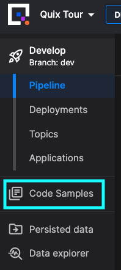

# Glossary

The following is a list of terms useful when working with Quix and streaming data.

## APIs

In addition to the Quix Streams client library, there are several APIs that you can use with Quix. See the [API landing page](../apis/intro.md).

## Application

A set of code in Quix Platform that can be edited, compiled, run, and deployed as one Docker image (configured using a `dockerfile`). 

Applications in Quix Platform exist inside the Git branch associated with an [environment](#environment), and are therefore fully version controlled. You can also tag your code as an easy way to manage deployments.

Read more about [applications](../platform/changes.md#applications).

## Binary data

Quix also supports any binary blob data.

With this data you can stream, process and store any type of audio, image, video or lidar data, or anything that isn’t supported with time series, event, or metadata types.

## Code Samples

Quix Platform contains a large number of [open source](https://github.com/quixio/quix-samples) Code Samples. You can use these to quickly build out your stream processing pipeline. Generally the code samples are divided into three main categories: source, transform, destination. You can access the Code Samples from within the Quix Portal by using the navigation menu as show here:

{height=30%}

## Connectors

There are [many ways](../platform/ingest-data.md) to get data into Quix Platform. One option is to use the many connectors already provided by Quix. These can be viewed in Quix Platform by clicking Code Samples and then selecting Source and Destination filters. Alternatively, you can see a useful page in our documentation, that lists the [available connectors](../platform/connectors/index.md).

## Consumer

Any project, container or application that [subscribes](https://quix.io/docs/client-library/subscribe.html) to data in a topic.

## Consumer group

Consumer [replicas](#replicas) can be grouped into a consumer group. When consumers are grouped into a consumer group, processing of a topic's messages is distributed over all consumers, providing horizontal scaling. 

If the consumers (replicas) are not in a consumer group, then all messages are processed by all replicas.

## Data ingestion

Data ingestion is the means by which you get your data into Quix.

Read more about [data ingestion](../platform/ingest-data.md).

## Data types

Quix supports time series data, events, metadata, and blobs with the following data types: 

* Numeric (double precision)
* String (UTF-8)
* Binary data (blobs)

Read more about [data types](../client-library-intro.md#multiple-data-types).

## Deployment

An instance of an application running in the serverless environment. When you deploy your application, you can specify a number of parameters such as allocated [RAM](#ram), [CPU count (cores)](#cpu-cores), number of [replicas](#replicas), and public URL. You can also specify whether you want it to run as a [job](#job) or a [service](#service), depending on your use case. A job runs only once, and service runs continuously.

The following screenshot shows the `New Deployment` dialog:

### CPU (cores)

The number of CPU cores allocated to a deployment. The range is 0.1 to 16 cores.

### RAM 

Random-Access Memory (RAM) allocated to a deployment. The RAM is specified in GB. The range is 0.1 to 32 GB.

### Replicas

The number of instances of the deployment (service). If the replicas are part of a [consumer group](#consumer-group), then each message in the topic is processed once by only one replica. If the replicas are not part of a consumer group, then all messages are processed by all replicas.

## Destination

A type of [connector](../platform/connectors/index.md) where data is consumed from a Quix topic by an output (destination) such as a database or dashboard.

## Environment

An environment is an entity that encapsulates a branch in your [project](#project), that contains the code for your [applications](#application). 

Each environment can use Kafka hosted by Quix, self-hosted Kafka, or on Confluent Cloud.

Read more about [environments](../platform/changes.md#environments).

## Events

Events are a discrete occurrence of a thing that happens or takes place in time.

For example:

* Engine start, engine stop, warning light activated.
* Game started, match made, kill made, player won the race, lap completed, track limits exceeded, task completed.
* Takeoff, landing, missile launched, fuel low, autopilot engaged, pilot ejected.

Events are typically things that occur less frequently. They are streamed into the same topics as their related time series data, and act to provide some context to what is happening. For example, start and stop events typically mark the beginning and end of a data stream.

Read more about [event data](../client-library/publish.md#eventdata-format).

## Job

Any application code that is run once. For example, use a job to run a batch import of data from an existing data store, such as a CSV file, database, or data lake.

## Metadata

Metadata describes additional information or context about a stream.

For example:

* License plate number, car manufacturer, car model, car engine type, driver ID.
* Game version, player name, game session type, game session settings, race car set-up.
* Flight number, destination, airport of origin, pilot ID, airplane type.

Metadata typically has no time context, rather it exists as a constant throughout one or more streams. For example, your metadata could be the configuration of a car that is sold from a dealership (such as engine size, transmission type, wheel size, tyre model etc); you could create a stream every time that car is driven by the owner, but the engine size and transmission type won’t change.

Metadata is key to data governance and becomes very useful in down-stream data processing and analytics.

Read more about [Metadata](../client-library/publish.md#parameter-definitions).

## Microservice

An instance of a Quix Application that has been deployed and is running. When applications are deployed in the processing pipeline, they are running as microservices, and often referred to simply as services.

## Model

A machine learning model "program" that comprises of both data and a procedure for using the data to make a prediction. In the case of neural networks, a model has typically been trained on a dataset. A standard program or script is not a model - if deployed, this is an application. For example, the sorted list output of a sorting algorithm is not really a model. Neither is an alert script that sends a message when the incoming data goes over a certain threshold. Note: during development a model can be deployed as a job. For example, when training the model.

## Monorepo

A monorepo is a single repository that contains all code and configuration for a complete pipeline. The monorepo contains all revision history and all branches for all services and their associated code and configurations. 

In Quix, the monorepo is known as a [project](#project).

## Online IDE (Quix Portal)

See [Quix Portal](#quix-portal).

## Partitions

When creating a new topic in Quix, you can specify the number of topic partitions. The default is two partitions. You can add more partitions later, but you can’t remove them. Each partition is an independent queue that preserves the order of messages.

[Quix Streams](#quix-streams) restricts all messages inside a stream to the same partition. This means that inside one stream, a consumer can rely on the order of messages.

With the Quix Kafka broker, partitions are spread across the Kafka cluster, and over different Kafka nodes, for improved scalability, performance and fault tolerance. 

The benefits of partitions in topics can be summarized as:

* *Scalability*: Kafka can handle large volumes of data by distributing it across multiple partitions, which can be hosted on different Kafka brokers or servers.
* *Parallelism*: Partitions allow multiple consumers to work in parallel, reading different partitions simultaneously, which improves the overall throughput and processing speed.
* *Durability*: Kafka ensures data durability by replicating each partition to multiple brokers, ensuring that data is not lost in case of broker failures.

## Pipeline

Applications implementing a source, transform, or destination, are connected together using [topics](#topic) into a pipeline. A pipeline provides the complete stream processing solution for your use case. The pipeline is visually represented in an environment.

## Portal API

An [HTTP API](../apis/portal-api/index.md) used to interact with most portal-related features such as creation of [environments](#environment), users, and [deployments](#deployment).

## Producer

Any project, container or application that [publishes](https://quix.io/docs/client-library/publish.html) data to a topic.

## Project

A project is an entity that corresponds to a Git repository. That Git repository can be hosted for you on Quix, or you can use another provider such as GitHub or Bitbucket to host the repository. 

A project contains one or more [environments](#environment), so typically you create an environment as part of the project creation workflow, and then create additional environments as required.

## Query API

The [Query API](../apis/query-api/index.md) is used to query persisted data. Most commonly used for dashboards, analytics and training ML models. Also useful to call historical data when running an ML model, or to call historical data from an external application. This API is primarily iused for testing and debugging purposes.

## Quix Portal

Quix provides an online Integrated Development Environment (IDE) for Python and C# projects. When you open any project, you will see the **Run** button, and a console during runtime, in addition to the IntelliSense.

Sign up for a [free account](https://portal.platform.quix.ai/self-sign-up).

## Quix Streams

[Quix Streams](../client-library-intro.md) is the main **client library** used to send and receive real-time data in your streaming applications.

## Service

Any application code that runs continuously in the serverless environment. For example, a connector, a function, a backend operation, or an integration to a third-party service like Twilio.

## Source

A type of [connector](../platform/connectors/index.md) where data is published to a Quix topic from an input (source), such as a web service or command line program.

## Stream

A stream is a collection of data (time series data, events, binary blobs and metadata) that belong to a single session of a single source. For example:

* One journey for one car
* One game session for one player
* One flight for one aeroplane

Read more about [streams](../client-library/features/streaming-context.md).

## Streaming Reader API

A [WebSockets API](../apis/streaming-reader-api/index.md) used to stream any data directly from a topic to an external application. Most commonly used to read the results of a model or service to a real-time web application. Your application **reads** data from Quix Platform.

## Streaming Writer API

An [HTTP API](../apis/streaming-writer-api/index.md) used to send telemetry data from any source to a topic in the Quix platform. It should be used when it is not possible to use [Quix Streams](../client-library-intro.md). Your application **writes** data into Quix Platform.

## Time series data

Tine-series data consists of values that change over time. Quix Streams supports numeric and string values.

For example:

* Crank revolution and oil temperature are two engine time series variables that define the engine system.
* Player position in X, Y and Z are three time series variables that define the player location in a game.
* Altitude, GPS LAT, GPS LONG and Speed are four time series variables that define the location and velocity of a plane in the sky.

Referring back to topics as a grouping context: Quix recommends that each of these examples would be grouped into a single topic to maintain context.

Read more about [time series data](../client-library/publish.md#timeseriesdata-format).

## Timestamp

A timestamp is the primary key for all data in a [stream](#stream).

Quix supports nanosecond precision. Nanosecond precision is at the leading edge of real-time computing, and is primarily driven by innovation with hardware and networking technology.

Read more about [timestamps](../client-library/publish.md#timestamps).

## Topic

A topic is a channel of real-time data. You can imagine a topic as the pipe used to interconnect the services that make up your stream processing pipeline.

It is highly recommended you organize the data of a topic with some kind of grouping context for the data coming from a single source. 

A topic can be thought of as analogous to a multi-lane highway, the [streams](#stream) are the lanes in that highway, and your data is comparable to the cars in the lanes.

Example topics might include:

* Car engine data
* Game data
* Telemetry from one ECU on a Boeing 737

Topics are key for scalability and good data governance. Use them to organize your data by:

* Grouping incoming data by type or source
* Maintaining separate topics for raw, clean, or processed data

Read more about [topics](../client-library/publish.md#create-a-topic-producer).
