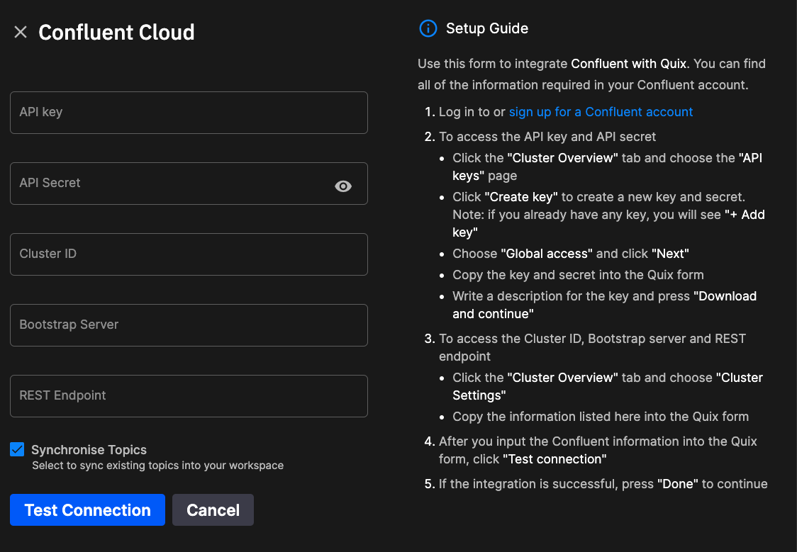

# Connect to Confluent Cloud

Quix requires Kafka to provide log functionality for your Quix workspace. 

When you create a new Quix workspace, there are three hosting options:

1. **Quix Broker** - Quix hosts Kafka for you. This is the simplest option as Quix provides hosting and configuration.
2. **Self-Hosted Kafka** - This is where you already have existing Kafka infrastructure that you use, and you want to enable Quix to provide the stream processing platform on top of it. You can configure Quix to work with your existing Kafka infrastructure using this option.
3. **Confluent Cloud** - if you use Confluent Cloud for your Kafka infrastructure, then you can configure Quix to connect to your existing Confluent Cloud account.

This documentation covers the third hosting option, Confluent Cloud. 

## Sign up for a Confluent Cloud account

If you do not already have Confluent Cloud account, you can [sign up for a free trial](https://www.confluent.io/confluent-cloud/tryfree/).

## Selecting Confluent Cloud to host Quix

When you create a new Quix workspace, you can select your hosting option in the `Broker settings` dialog, as shown in the following screenshot:

Select the option `Connect to your Confluent Cloud`. 

## Confluent Cloud setup guide

When you choose the `Connect to your Confluent Cloud` broker setting, the `Confluent Cloud Setup Guide` is displayed, as shown in the following screenshot:

All the required configuration information can be found in your Confluent Cloud account. 

!!! note

    If you already have topics created in your Confluent Cloud, you can synchronize these with your Quix workspace. The `Synchronize Topics` checkbox is enabled by default.
