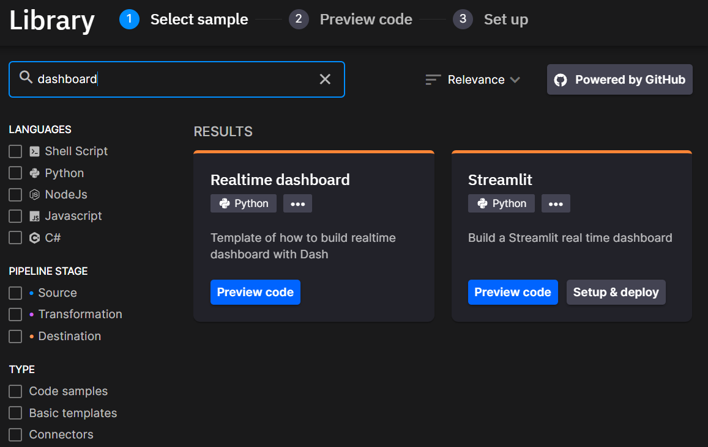
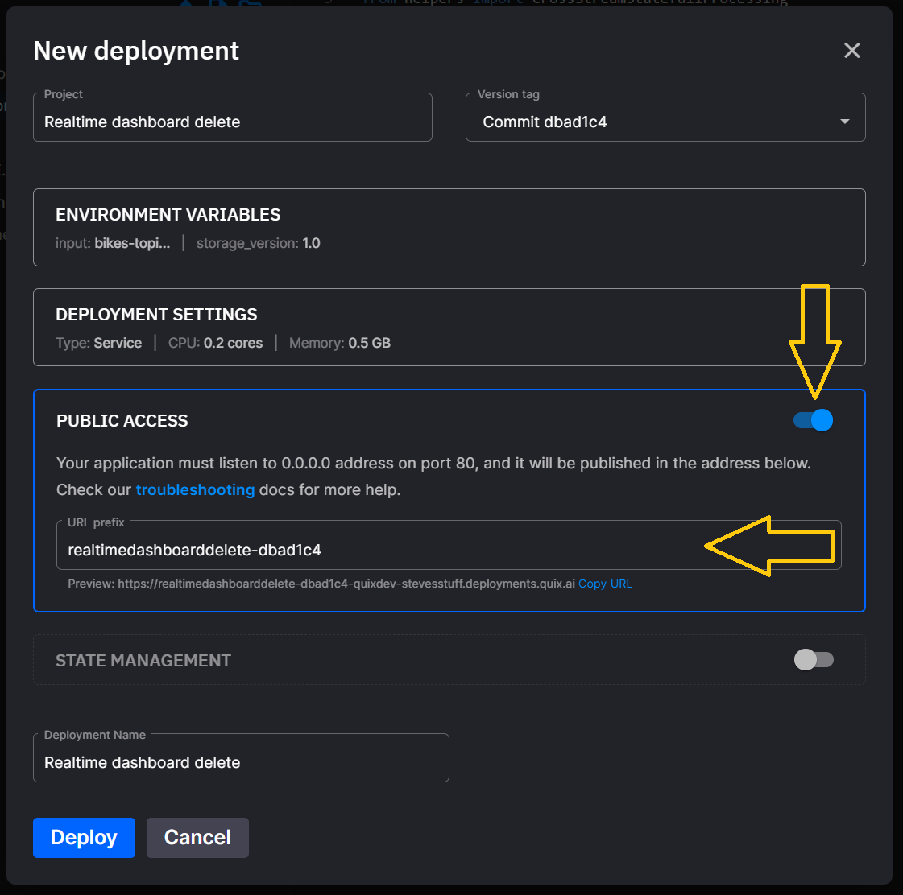

# How to deploy a public service

The Quix SaaS platform allows you to deploy public-facing web pages and APIs.

This how-to will help to explain the features and options and ensure projects containing public facing web pages and APIs are successful.

## Code Samples

In our Code Samples you can find our `Web API Template` which demonstrates how to create a API using `Node`.

There are also examples dashboard and web/UI examples using `Dash`, `Streamlit` and `Angular`.

{width=500px}

## The code

When running locally it is usual to see local addresses like `127.0.0.1` and `localhost`, however, these cannot be used and will result in routing errors.

Please ensure your service is hosted on `0.0.0.0` and uses port `80`.

Examples of this for various languages are:

 - Node.js which can be used to host [Dash/Plotly](https://plotly.com/dash/){target="_blank"} apps and any JavaScript-based websites:
    ```js
    app.run_server(debug=False, host="0.0.0.0", port=80)
    ```

 - For Streamlit (just set the port in `main.py`)
    ```sh
    sys.argv = ["streamlit", "run", "streamlit_file.py", "--server.port=80"]
    ```

## Deploy a public service

To access your public facing service or web site you must enable `Public Access` at deployment time.

1. Switch on `Public Access`.

2. If needed adjust the `URL prefix` to suit your needs.

{width=450px}

## Security

Please note that the basic examples, included in our Code Samples, do not include any security features and come with no warranty.

Quix advises you to build in a security layer to ensure your data is secure and only the intended recipients have access to it.

Read more about Python API security [here](https://betterprogramming.pub/secure-your-python-api-7e52c475665e){target="_blank"} and [here](https://curity.io/resources/guides/api/python/){target="_blank"}

Find out more [here](https://auth0.com/blog/complete-guide-to-angular-user-authentication/){target="_blank"}, if you're interested in securing an Angular application.