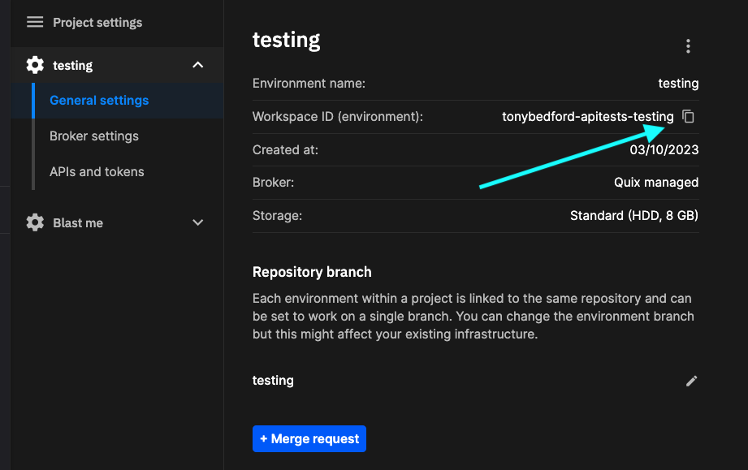

# Get environment ID

Occasionally, you’ll need to obtain an ID based on a specific environment. For example, endpoints for the [Query API](../../apis/query-api/index.md) use a domain with the following pattern:

    https://telemetry-query-${environment-id}.platform.quix.ai/

The environment ID is a combination of your organization and environment names, converted to URL friendly values. 

## Obtain your environment ID from the URL

1.  Go to the [Portal home](https://portal.platform.quix.ai/){target=_blank}.

2.  Locate the environment you’re interested in and open it.

3.  At this point, take note of the URL. It will be in the form:

    https://portal.platform.quix.ai/home?workspace={environment-id}

## Obtain environment ID from settings

You can also get the environment ID from Settings. Click `Settings` in the bottom-left corner of the portal, select the environment of interest. You can then copy the environment ID (previously known as the workspace ID) from the settings panel, as shown in the following screenshot:

{width=80%}

## Example environment ID

Given the following URL for the environment:

```
https://portal.platform.quix.ai/pipeline?workspace=joeengland-apitests-testing
```

The environment ID is:

```
joeengland-apitests-testing
```

The components of the environment ID are as follows:

| joeengland | The name of the Quix account, known as the organization, in this case the personal account of Joe England |
| apitests | The name of the [project](../glossary.md#project) |
| testing | The name of the [environment](../glossary.md#environment) | 

Copy the value for `environment-id` and use it wherever you need an environment ID.

!!! note

    The `workspace=` parameter in the URL `https://portal.platform.quix.ai/home?workspace={environment-id}` is there for legacy reasons, and does in fact indicate an environment.