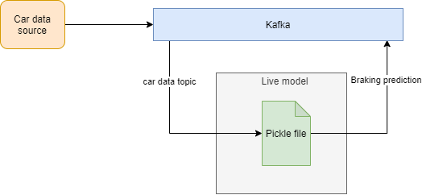
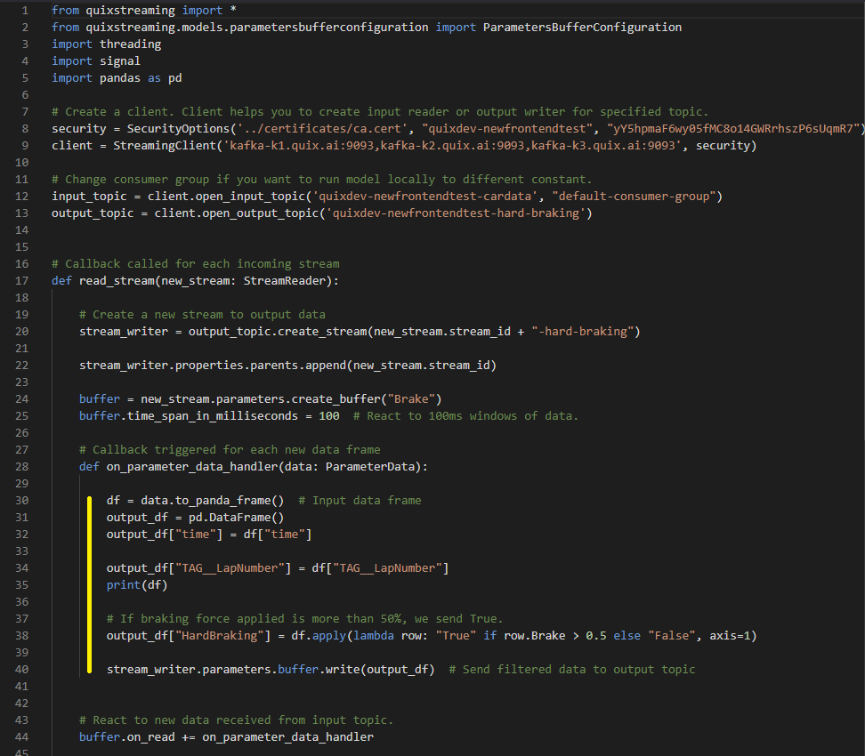

# Run ML model in realtime environment

In this article, you will learn how to use pickle file trained on
historic data in a realtime environment.

## Why this is important

With the Quix platform, you can run and deploy ML models to the leading
edge reacting to data coming from the source with milliseconds latency.

## End result

At the end of this article, we will end up with a **live model** using
**pickle file** from [How to train ML
model](train-ml-model.md) to process live
data on the edge.



## Preparation

You’ll need to complete [How to train ML
model](train-ml-model.md) article to get
pickle file with trained model logic.

### Set up topics

You should already have a topic containing car engine data. You’ll use
this as an input topic for the model. The model also needs an output
topic, to send the processed data.

1.  Click the Topics icon  in the
    left-hand menu.

2.  Click the **CREATE TOPIC** button, give your new topic a name —
    *brake-prediction* — and click **CREATE**.

3.  Change the Persistence toggle to “ON”, to ensure data in the topic
    is persisted to the [Data
    Catalogue](../../intro.md#_data_catalogue).

!!! note

	At this point, you should have at least two topics: *cars* and *brake-prediction*.

### Creating Git project in workspace

You can use our sample model project as a template. You’ll get code
assets for a basic model, customised to your specific environment. This
includes certificates for remote sdk access, and details of the two
topics you’ve set up.

1.  Click the Topics icon  in the
    left-hand menu.

2.  Hover over the *cars* topic and click the Connect icon
    . You’ll see the
    *connect*" button which will launch the *Easy connect wizard* which
    allows you to quickly create a project based on our sample code.

3.  Select *PYTHON* as your code language, then click **NEXT**.

4.  Select *MODEL* as your Template type, then click **NEXT**.

5.  Select *cars* as your input topic, then click **NEXT**.

6.  Select *brake-prediction* as your output topic, then click
    **FINISH**.

At this point, you’ll be taken to the Model tab within the Library
section. You should see the Data filtering project, with custom values
for your username, workspace, topics, etc.



!!! tip

	In the code screenshot above, lines 30-40 (highlighted) contain code that drives the model. We will call trained model in this section.

1.  Click **SAVE AS PROJECT** and name your project *brake-model*,
    then click **CREATE**.

You’ll now be taken to the Develop section, where you should see a full
file view of your project, alongside the Quix web IDE.

!!! tip

	In your new project you get security constants filled to work with your workspace.

### Clone Git project locally

To get information how to clone Git project, go to your project and
click **CLONE**.

You’ll also need to [setup Python environment](../../../sdk/python-setup.md)
to use Quix SDK.

We are going to use library `sklearn`.

Install it in your local environment by:

``` Python
python3 -m pip install sklearn
```

and add it to `requirements.txt` file in your project to run this code
in Quix serverless environment.

quixstreaming==0.2.2a202101281720 sklearn\</programlisting\>

## Using Pickle file in realtime model

We have pickle file from [How to train ML
model](train-ml-model.md). Create a
`model` folder in root of the project and copy the
`decision_tree_5_depth.sav` file into it. Then push to git.

Than we load it to memory in code:

``` Python
import pickle

## Import ML model from file
model = pickle.load(open('../model/decision_tree_5_depth.sav', 'rb'))
```

## Full code example

Here is a full example. We will explain sections of code in more details
bellow.

``` python
from quixstreaming import *
from quixstreaming.app import App
from quixstreaming.models.parametersbufferconfiguration import ParametersBufferConfiguration
import threading
import signal
import pandas as pd
import traceback
import math
import pickle

## Quix injects credentials automatically to the client. Alternatively, you can always pass an SDK token manually as an argument.
client = QuixStreamingClient()

input_topic = client.open_input_topic('INPUT_TOPIC', 'brake-prediction')
output_topic = client.open_output_topic('OUTPUT_TOPIC')


## Import ML model from file
model = pickle.load(open('../model/decision_tree_5_depth.sav', 'rb'))

## To get the correct output, we preprocess data before we feed them to the trained model
def preprocess(df):
    signal_limits = {
        "Throttle": (0, 1),
        "Steer": (-1, 1),
        "Motion_Yaw": (-math.pi, math.pi),
        "Motion_Roll": (-math.pi, math.pi),
        "Motion_Pitch": (-math.pi, math.pi),
        "Brake": (0, 1),
    }

    def clamp(n, minn, maxn):
        return max(min(maxn, n), minn)

    for signal, limits in signal_limits.items():
        df[signal] = df[signal].map(lambda x: clamp(x, limits[0], limits[1]))

    df["Motion_Yaw_sin"] = df["Motion_Yaw"].map(lambda x: math.sin(x))
    df["Motion_Yaw_cos"] = df["Motion_Yaw"].map(lambda x: math.cos(x))

    return df

## Callback called for each incoming stream
def read_stream(new_stream: StreamReader):
    print("New stream read:" + new_stream.stream_id)

    # Create a new stream to output data
    stream_writer = output_topic.create_stream(new_stream.stream_id + "-brake-prediction")

    # Reference output stream as child model of input stream.
    stream_writer.properties.parents.append(new_stream.stream_id)

    # Publish metedata about new parameter created by this model.
    stream_writer.parameters \
        .add_definition("brake-prediction", "Brake prediction", "Probability of braking 5 seconds from now.") \
        .set_range(0.0, 1.0)

    buffer_options = ParametersBufferConfiguration()
    buffer_options.time_span_in_milliseconds = 100  # React to incoming data in 100ms windows.

    buffer = new_stream.parameters.create_buffer(buffer_options)

    # Each 100ms window of data callback.
    def on_parameter_data_handler(data: ParameterData):
        try:
            brake_predictions = pd.DataFrame()  # Output data frame.
            df = data.to_panda_frame()  # Input data frame

            # Preprocessing
            df = preprocess(df)
            features = ["Motion_Yaw_cos", "Motion_Yaw_sin", "Steer", "Speed", "Gear"]
            X = df[features]

            # Lets shift data into the feature by 5 seconds. (Note that time column is in nanoseconds).
            brake_predictions["time"] = df["time"].apply(lambda x: int(x) + int((5 * 1000 * 1000 * 1000)))
            brake_predictions["brake-prediction"] = model.predict(X)

            # Send data frame to output topic
            stream_writer.parameters.write(brake_predictions)
        except Exception:
            traceback.print_exc()

    buffer.on_read += on_parameter_data_handler  # React to new 100ms window received from input topic.

    def on_stream_close(end_type: StreamEndType):
        stream_writer.close(end_type)
        print("Stream closed:" + stream_writer.stream_id)

    new_stream.on_stream_closed += on_stream_close  # React to input stream closed event and close output as well.

    def stream_properties_changed():
        # When stream name property is sent, we pass that to output stream with suffix.
        stream_writer.properties.name = new_stream.properties.name + " braking prediction"

    new_stream.properties.on_changed += stream_properties_changed


## Hook up events before initiating read to avoid losing out on any data
input_topic.on_stream_received += read_stream

## Hook up to termination signal (for docker image) and CTRL-C
print("Listening to streams. Press CTRL-C to exit.")

## Handle graceful exit of the model.
App.run()
```

## Pub & Sub

We will use the same approach as any other Transformation model
available in Quix Library. We will read from input topic, call trained
model and write the result to output topic.

``` Python
from quixstreaming import *
from quixstreaming.app import App
from quixstreaming.models.parametersbufferconfiguration import ParametersBufferConfiguration
from preprocessing import preprocess
import threading
import signal
import pandas as pd
import traceback
import pickle

## Quix injects credentials automatically to the client. Alternatively, you can always pass an SDK token manually as an argument.
client = QuixStreamingClient()

input_topic = client.open_input_topic('INPUT_TOPIC', 'brake-prediction')
output_topic = client.open_output_topic('OUTPUT_TOPIC')
```

### Listen to new streams

We will register a callback to handle each incoming stream from input
topic:

``` python
## Callback called for each incoming stream
def read_stream(new_stream: StreamReader):
    # Here implement stream processing.
    ...


## Hook up events before initiating read to avoid losing out on any data
input_topic.on_stream_received += read_stream
input_topic.start_reading()  # initiate read

## Hook up to termination signal (for docker image) and CTRL-C
print("Listening to streams. Press CTRL-C to exit.")

event = threading.Event()

def signal_handler(sig, frame):
    print('Exiting...')
    event.set()


signal.signal(signal.SIGINT, signal_handler)
signal.signal(signal.SIGTERM, signal_handler)
event.wait()
```

### Stream processing

In each individual stream, we will subscribe for parameter data.

``` python
## Callback called for each incoming stream
def read_stream(new_stream: StreamReader):
    print("New stream read:" + new_stream.stream_id)

    # Create a new stream to output data
    stream_writer = output_topic.create_stream(new_stream.stream_id + "-brake-prediction")

    # Reference output stream as child model of input stream.
    stream_writer.properties.parents.append(new_stream.stream_id)

    buffer_options = ParametersBufferConfiguration()
    buffer = new_stream.parameters.create_buffer(buffer_options)

    # Each 100ms window of data callback.
    def on_parameter_data_handler(data: ParameterData):
        # Implement data processing here.
        ....
```

### Parameter data processing

Now we get to the most important part of the model. We will feed
incoming data to the trained model to get a result that we send to the
output topic.

``` python
## Each 100ms window of data callback.
def on_parameter_data_handler(data: ParameterData):
    brake_predictions = pd.DataFrame()  # Output data frame.
    df = data.to_panda_frame()  # Input data frame

    # Preprocessing
    df = preprocess(df)
    features = ["Motion_Yaw_cos", "Motion_Yaw_sin", "Steer", "Speed", "Gear"]
    X = df[features]

    # Lets shift data into the feature by 5 seconds. (Note that time column is in nanoseconds).
    brake_predictions["time"] = df["time"].apply(lambda x: int(x) + int((5 * 1000 * 1000 * 1000)))
    brake_predictions["brake-prediction"] = model.predict(X)

    # Send data frame to output topic
    stream_writer.parameters.write(brake_predictions)
```

#### Preprocessing

To get the correct output, we preprocess data before we feed them to the
trained model:

``` python
def preprocess(df):
    signal_limits = {
        "Throttle": (0, 1),
        "Steer": (-1, 1),
        "Motion_Yaw": (-math.pi, math.pi),
        "Motion_Roll": (-math.pi, math.pi),
        "Motion_Pitch": (-math.pi, math.pi),
        "Brake": (0, 1),
    }

    def clamp(n, minn, maxn):
        return max(min(maxn, n), minn)

    for signal, limits in signal_limits.items():
        df[signal] = df[signal].map(lambda x: clamp(x, limits[0], limits[1]))

    df["Motion_Yaw_sin"] = df["Motion_Yaw"].map(lambda x: math.sin(x))
    df["Motion_Yaw_cos"] = df["Motion_Yaw"].map(lambda x: math.cos(x))

    return df
```

## Deployment

And that’s it\! Now is time to run the model, run the data generator and
see it in action\!
