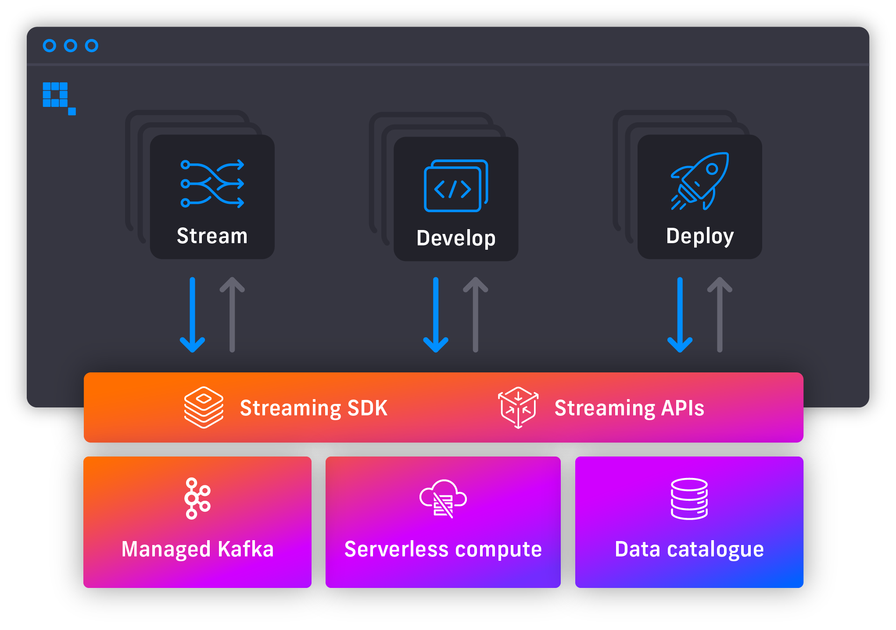
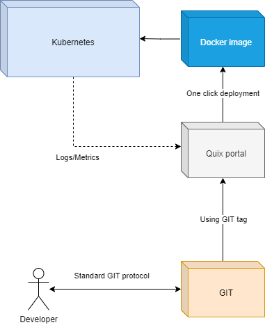

# What is Quix?

Quix is a platform for developing and deploying applications with
streaming data.

We architected Quix natively around a message broker (specifically
[Kafka](../sdk/kafka.md)) because we know databases are in the way of
building low-latency applications that scale cost-effectively. Instead
of working with data on a disk, developers could work with live data
in-memory, if broker technologies were easier to use.

But they are not easy to use, especially for Python developers who are
at the forefront of data science but cannot easily work with streaming
data.

Quix provides everything a developer needs to build applications with
streaming data. By using Quix you can build new products faster whilst
keeping your data in-memory, helping to achieve lower latencies and
lower operating costs.

From the top-down, our stack provides a Web UI,
[API’s](../apis/index.md) and [SDK](../sdk/introduction.md) that abstract
developers off our underlying infrastructure, including fully-managed
Kafka topics, serverless compute environment and a metadata-driven data
catalogue (time-series database with steroids).

## Web UI

With the **Quix Portal** we are striving to make a beautiful software
experience that facilitates DevOps/MLOps best-practices for
less-experienced development teams. Our goals are to:

1.  Help less expert people access live data

2.  Help them create and manage complex infrastructure and write
    application code without support from expert engineering teams, and

3.  Help to accelerate the development lifecycle by enabling developers
    to test and iterate code in an always-live environment.

To achieve these goals Quix Portal includes the following features:

  - **Online IDE**: Develop and Run your streaming applications directly
    on the browser without setting up a local environment.

  - **Library**: Choose between hundreds of autogenerated code examples
    ready to run and deploy from our Online IDE.

  - **One click deployments**: Deploy and manage your streaming
    applications on production with a simple user interface.

  - **Monitoring tools**: Monitor in real-time the status and the data
    flow of your streaming applications.

  - **Broker management**: Create, Delete, Explore or Configure your
    message broker infrastructure with just a click of a button.

  - **Pipeline view**: Visualize your pipeline architecture with the
    information provided from the deployment variables.

  - **Data Explorer**: Explore Live and Historical data of your
    applications to test that your code is working as expected.

## API’s

We have provided four API’s to help you work with streaming data. These
include:

[**Stream Writer API**](../apis/streaming-writer-api/intro.md): helps
you send any data to a Kafka topic in Quix using HTTP. This API handles
encryption, serialization and conversion to the Quix SDK format ensuring
efficiency and performance of down-stream processing regardless of the
data source.

[**Stream Reader API**](../apis/streaming-reader-api/intro.md): helps
you push live data from a Quix topic to your application ensuring super
low latency by avoiding any disk operations.

[**Data Catalogue API**](../apis/data-catalogue-api/intro.md): lets you
query historic data streams in the data catalogue to train ML models,
build dashboards and export data to other systems.

[**Portal API**](../apis/portal-api.md): lets you automate Portal tasks
like creating workspaces, topics and deployments.

## SDK

Python is the dominant language for data science and machine learning,
but it is quite incompatible with streaming technologies (like
[Kafka](../sdk/kafka.md)) which are predominantly written in Java and
Scala.

Our [Quix streaming SDK](../sdk/introduction.md) is a client library that
abstracts Python developers off streaming-centric complexities like
learning Java or dealing with buffering, serialization and encryption.

Instead, SDK serves you streaming data in a data frame so you can write
any simple or complex data processing logic and connect it directly to
the broker. There are just a few key streaming concepts that you must
learn. You can read about them [here](../sdk/introduction.md).

## Serverless compute

Quix provides an easy way to run code in an elastic serverless compute
environment. It automatically builds code in GIT into a docker image and
deploys containers to Kubernetes. This otherwise very complicated
procedure is done by a couple of clicks in the Quix web portal.

### Architecture

### Git integration

Source code for workspace projects (models, connectors and services) is
hosted in GIT repositories. Developers can check out repositories and
develop locally and collaborate using GIT protocol. Code is deployed to
the Quix serverless environment using tags in GIT. Quix builds service
will build selected GIT commit into a docker image.

### Docker integration

Each code example generated using the **Quix library** is shipped with a
`Dockerfile` that is designed to work in the **Quix serverless compute
environment** powered by **Kubernetes**. You can alter this file if
necessary. When you deploy a service with Quix, a code reference to GIT
with a build request is sent to the build queue. The build service will
build a docker image and save it in the docker registry. In the next
step, this image is deployed to Kubernetes.

!!! tip

	If there is any problem with the docker build process, you can check the **build logs**.

!!! tip

	Hover over the deployment in the **deployments page** to download the docker image of the deployed service for local testing or custom deployment.

### Kubernetes integration

Quix manages an elastic compute environment so you don’t need to worry
about servers, nodes, memory, CPU, etc. Quix will make sure that your
container is deployed to the right server in the cluster.

We provide the following integrations with Kubernetes:

  - **Logs** from container accessible in the portal or via portal API.

  - **Environment variables** allows passing variables into the docker
    image deployment. So code can be parameterized.

  - **Replica** number for horizontal scale.

  - **CPU** limit.

  - **Memory** limit.

  - **Deployment type** - Options of one-time job or continuously
    running service,

  - **Ingress** - Optional ingress mapped to port 80.

!!! tip

	If a deployment reference is already built and deployed to a service, the build process is skipped and the docker image from the container registry is used instead.

### DNS integration

The Quix serverless environment offers DNS routing for services on port
80. That means that any API or frontend can be hosted in Quix with no
extra complexity. Load balancing is provided out of the box, just
increase the replica count to provide resiliency to your deployed API or
frontend.

!!! warning

	A newly deployed service with DNS routing takes up to 10 minutes to propagate to all DNS servers in the network.

## Managed Kafka topics

Quix provides fully managed Kafka topics which are used to stream data
and build data processing pipelines by daisy-chaining models together.

Our topics are multi-tenant which means you don’t have to build and
maintain an entire cluster to stream a few bytes of data. Instead, you
can start quickly and cheaply by creating one topic for your application
and only pay for the resources consumed when streaming that data. When
your solution grows in data volume or complexity you can just add more
topics without concern for the underlying infrastructure which is
handled by us.

Together with our [SDK](../sdk/introduction.md) and serverless compute, you
can connect your models directly to our topics to read and write data
using the pub/sub pattern. This keeps the data in-memory to deliver
low-latency and cost effective stream processing capabilities.

!!! note

	Quix also provides the ability to connect external infrastructure components like your own message broker infrastructure.

## Data Catalogue

We provide a data catalogue for long-term storage, analytics and data
science activities.

We have combined what we know to be the best database technologies for
each data type into a unified catalogue. There’s a timeseries database
for recording your events and parameter values, blob storage for your
binary data, and a NoSQL DB for recording your metadata.

Our data catalogue technology has two advantages:

1.  It allocates each data type to the optimal database technology for
    that type. This increases read/write and query performance which
    reduces operating costs.

2.  It uses your metadata to record your context. This makes your data
    more usable for more people across your organization who only need
    to know your business context to navigate vast quantities of data.
