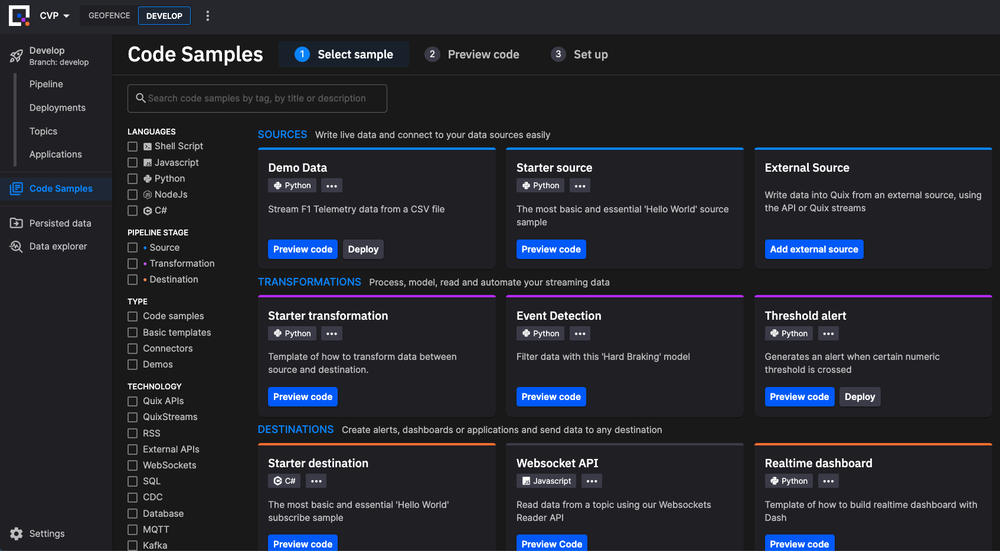

# Code Samples

The Quix Portal includes Quix Code Samples, a collection of templates and sample projects that you can use to start working with the platform.

Quix enables you to explore the Code Samples and save them as a new application and immediately run or deploy them. 

If you don't have a Quix account yet, go [sign-up to Quix](https://portal.platform.quix.ai/self-sign-up?xlink=docs){target=_blank} and create one.

The backend of the Code Samples is handled by a public [Open source repository](https://github.com/quixio/quix-samples){target=_blank} on GitHub. You can become a contributor of our Code Samples by generating new samples or updating existing ones.

!!! important

    Note that when you use a public code sample in the Quix Portal, it is added to your private repository, so any changes you make can be kept private if you so wish. Of course, if you are working in a public repository, then any code samples you add or modify will also be public.

