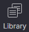
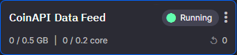
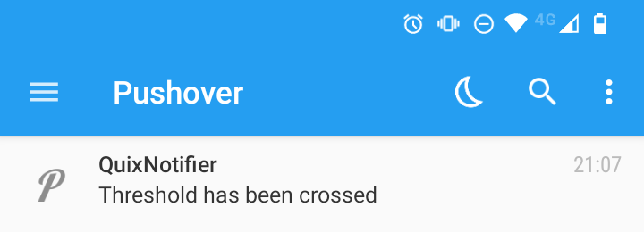

# Currency Alerting

## Goal

Build a real time streaming pipeline that sends push notifications to your phone when the Bitcoin price reaches a certain threshold.

We’ll be using [CoinAPI](http://coinapi.io) to access a stream of the constantly updating BTC/USD exchange rate and the [Pushover App](https://pushover.net/) to send notifications to your phone.

By the end you will have learned how to:

1. **Ingest external data into Quix** 
 Use an input connector that receives a stream of trading data from CoinAPI.
 

1. **Analyze and Transform the data**
 Use a simple algorithm that checks to see if a value has crossed a threshold in either direction.
 

1. **Output the data to an external source**
 Use an output connector that sends push notifications to a simple test app on your mobile phone.

## Prerequisites

To complete this tutorial, you’ll need to sign up for a couple of different services which hopefully shouldn’t take too long. Each service has a simple signup process. 

* **A Quix account**
    * Hopefully you have this already; otherwise, you can visit the [Quix sign-up page](https://portal.platform.quix.ai/self-sign-up) and sign up with an existing Google, Github, or Microsoft account.
     

* **A CoinAPI API Key**
    * To get a free API key, open the [CoinAPI key application form](https://www.coinapi.io/pricing?apikey), enter your email, name, job title, and company size—you’ll get a key sent to your email address.
     
    
* **A Pushover User key, API token, and Mobile App Installation**
    * To get a user token and API token; open the [Pushover sign-up page](https://pushover.net/signup), enter your email, define a password, then verify your email address.
    * Install the Pushover mobile app from the [Apple App store](https://apps.apple.com/us/app/pushover-notifications/id506088175) or [Google Play](https://play.google.com/store/apps/details?id=net.superblock.pushover&hl=en).

## How the Final Pipeline Will Look
The goal of this tutorial is to end up with a simple pipeline that resembles the following example:

What do those colors mean? They describe the role of the function that is being deployed. The possible roles are as follows:

* :blue_square: **Input function** (AKA source function)—these are responsible for ingesting data into Quix from any outside source, such as an API or websocket.
* :purple_square: **Transformation function**—these are responsible for processing data in some way.
* :orange_square: **Output function** (AKA destination function)—these are responsible for outputting some kind of processed data to an outside destination, such as a database.

## Setting Up The Functions
Now let’s deploy the functions we need to build the pipeline.  Luckily, we don’t have to write any of these functions from scratch. We can import them from the Quix library and adapt a few variables for this tutorial.

!!! note "What is the Quix Library?"

	The Quix library is a repository of useful functions in Python (and other supported languages) categorized by each of the three roles. The library includes connector functions that ingest data or output data. It also includes transformation functions that can process and transform the data in different ways.

Let’s set up each function one by one, starting with our input function.

### Setting Up The CoinAPI Input Function

**Purpose:**  _Ingest BTC/USD Exchange Rate Data_

This function connects reads a live stream of updates for the currency pair: `BTC/USD`. We get this data by connecting to the [CoinAPI](https://www.coinapi.io/) [Websocket](https://en.wikipedia.org/wiki/WebSocket) (the free [sandbox version](https://docs.coinapi.io/#endpoints-2)). 

* The function streams the exchange rate data to a topic called `currency-exchange-rates`. 
* Downstream functions can then read fom this topic and process it in different ways. 
* In this case, we're going to check the price against a threshold.

**To set up the CoinAPI input function, follow these steps:**

1. In the [Quix Portal](https://portal.platform.quix.ai/), open the Quix Library 
     
2. In the search box on the library page, search for "_CoinAPI—Exchange Rate Feed_". 
   You should see a result that resembles the following example: 
     

3. Click **Preview Code**, and on the page that appears, click **Edit Code**.
    * Optionally, you can also jump straight to **Setup & Deploy** but we want to take a quick look at what the code is doing first, and perhaps change a few things.
    * When you choose to edit a library item, Quix prompts you to create a copy of it as a Project (this is because library items are read-only).
     

4. On the 'Project Creation' page, set the following fields and environment variables:

    | Field      | Value                          |
    | ----------- | ------------------------------------ |
    | **Name:**      | Enter a project name or keep the default suggestion. |
    | **Output:**      | Select the output topic—in this case, select `currency exchange rates` from the list|
    | **coin_api_key:**    | The key that you use to access CoinAPI |
    | **asset_id_base:**   | The short code for the _base_ currency that you want to track (e.g. BTC). |
    | **asset_id_quote:**    | The short code for the _target_ currency in which prices will be quoted (e.g. USD). |

5. Click **Save as Project**. 
   You now have a copy of the boilerplate CoinAPI function in your workspace
     

6. Double check that the environment variables are correct, then click **Deploy**. 
   The function will now be deployed as a service and automatically started.

**Checking to see if it worked**

Once the function has deployed, you’ll be redirected to the workspace home page where you can see the service in the pipeline context that we illustrated previously.

* Click the CoinAPI service card to inspect the logs.

* A sucessful deployment should resemble the following example:

If is there is an issue with the service, you can also inspect the **build logs** to check for any traces of a syntax error or other build issues.

### Setting Up The Threshold Checking Function

**Purpose:** _Monitor the BTC/USD exchange rate against a specific price threshold_

This function contains a simple algorithm that checks to see if a value has crossed a threshold in either direction.

What's being transformed here? In this case, we're filtering signals from the noise. The raw data is being transformed into 'insights' (in the form of price movement alerts). 

* When the threshold criteria are met, the function writes an alert message to a topic called `currency-rate-alerts`. 
* Downstream functions can then read fom this topic and send alerts and notifications whevever they detect a new message.

**To set up the Threshold Checking function, follow these steps:**

1. Open the Quix Library again.
     
2. In the search box on the library page, search for "_Threshold Alerts_". 
   You should see a result that resembles the following example: 

3. Click **Preview Code**, and on the page that appears, click **Edit Code**.
     

4. On the 'Project Creation' page, set the following fields and environment variables:
      
    | Field      | Value                          |
    | ----------- | ------------------------------------ |
    | **Name:**      | As usual, enter a project name or keep the default suggestion. |
    | **Input:**      | Select the input topic—in this case, select `currency-exchange-rates` from the list. |
    | **Output:**      | Select the output topic—in this case, select `currency-rate-alerts` from the list.|
    | **parameterName:**    | Leave the default value, `https://api.pushover.net/1/messages.json?'` (if you decide to use another push notification app, your can always update this value). |
    | **thresholdValue:**   | The price in (in USD) that you'd like to get alerted about. For example, on the day that this tutorial was written, BTC was hovering around $16,300 so we entered `$16,300`. This increased the likelhood that we'd get some alerts soon after deploying (otherwise it's hard to tell if it's working). |
    | **msecs_before_recheck:**    | Enter the minimum delay in milliseconds between alerts—we've set the default to 300 milliseconds (5 minutes) because otherwise, our phones were constantly buzzing with alerts when the price was hovering exactlty around the threshold. |

5. Click **Save as Project**. 
   You now have a copy of the boilerplate Threshold Checking function in your workspace
     
6. Again, double check that the environment variables are correct, then click **Deploy**. 
   The function will again be deployed as a service and automatically started.
     

**Checking to see if it worked**

Once the function has deployed, you’ll again be redirected to pipeline view. 

Let's make sure that the theshold service is also working correctly.

* Click the Threshold service card to inspect the logs.

* A successful deployment should resemble the following example:

  * In the **Lineage** section, you might notice that the two services are connected by a line which indicates that they're both using the same topic: `currency-exchange-rates` (the CoinAPI service is _writing_ to it, and the Threshold service is _reading_ from it).

  * Again, if is there is an issue with the service, you can also inspect the **build logs** to check for any traces of a syntax error or other build issues.

### Setting Up The Pushover Output Function

**Purpose:** _Send a push notification when certain conditions are met_

This function reads from the `currency-rate-alerts` topic and whenever a new message arrives, it sends a push notification to the Pushover app on your mobile phone.

It also reads the contents of the message and enriches the notification with details on how the threshold was crossed (specifically, if the price is moving up or down).

**To set up the push nofication function, follow these steps:**

1. Open the Quix Library one last time.
     
2. In the search box on the library page, search for "_Pushover_". 
   You should see a result that resembles the following example: 
     
3. Click **Preview Code**, and on the page that appears, click **Edit Code**.
     

4. On the 'Project Creation' page, fill out the following fields:
   
    | Field      | Value                          |
    | ----------- | ------------------------------------ |
    | **Name:**      | As usual, enter a project name or keep the default suggestion. |
    | **Input:**      | Select the input topic—in this case, select `currency-rate-alerts` from the list. We're going to be reading every message from this topic and turning it into a push notification. |
    | **base_url:**    | Leave the default value, `https://api.pushover.net/1/messages.json?` (if you decide to use another push notification app, your can always update this value). |
    | **api_token:**    | Enter the API token that you received when you signed up with Pushover (for example: `azovmnbxxdxkj7j4g4wxxxdwf12xx4`) |
    | **user_key:**    | Enter the user key that you received when you signed up with Pushover (for example: `u721txxxgmvuy5dxaxxxpzx5xxxx9e`) |

5. Click **Save as Project**. 
   You now have a copy of the boilerplate Pushover notification function in your workspace
     
6. For the last time, double check that the environment variables are correct, then click **Deploy**.

**Checking to see if it worked**

One obvious sign that it work is that you'll start getting Pushover notifications on your phone that resemble the following example:

Depending on your threshold value and the price fluctuations, it might take a few minutes for you to get a notification. In the meantime, you can inspect the logs as we've been doing previously.

* Don't worry if the logs only show "_Listening to Stream_" initially—remember that the Threshold service only writes a message to the `currency-rate-alerts` topic when the threshold has been crossed.
* This means that the `currency-rate-alerts` stream might be empty for a short while.
* Depending on your threshold, it might take a couple of minutes for messages to start coming through (depending on you threshold)

And thats it! Congratulations for making it this far. 

!!! Success "Recap - What did you just do?"

    Here's what you accomplished in this tutorial:

	✅ You created a real time, always on solution on the Quix serverless compute environment.

    ✅ You deployed three serverless functions. One to read data from another platform, one to make decisions based on that data, and one to send push notifications to your phone. In real time.

    ✅ You gained some experience in navigating the Quix platform and how to deploy functions—all without writing any code.

## What’s Next

What else can you use Quix for?

You can stream any kind of data into the Quix platform, from other apps, websites and services. From hardware, machinery or wearables or from anything you can think of that outputs data. You can then process that data in any imaginable way.

To learn more, try one of these other tutorials:

* [Build a live video processing pipeline using the Transport for London (TfL) traffic cameras and the YOLO ML model for object detection](ImageProcessing.md)
* [Perform sentiment analysis on a stream of Tweets about a given subject](sentimentAnalysis.md)
* [Gather and processes data from an RSS feed and get an alert when specific criteria are met](RSSProcessingPipeline.md)
* [Stream and visualize real-time telemetry data with an Android app and Streamlit](telemetry-data.md)

!!! tip "Getting Help"

	If you run into trouble please reach out to us. We’ll be more than happy to help. We hang out at [The Stream](https://quix.ai/slack-invite). Come and say hi.

