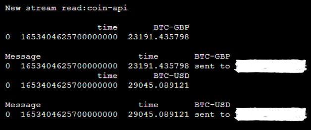

# Currency Alerting

## Aim

Quix allows you to create complex and efficient infrastructure in a
quick and simple way. To show you how, this tutorial will guide you
through the steps to build a real time streaming pipeline that sends
alerts to your phone when the Bitcoin price reaches certain threshold.

!!! note

	This guide will take you through the steps to start working with Twilio (developer platform for communications) and the coinAPI (platform that provides data APIs to cryptocurrency) using Quix.

By the end you will have:

  - Deployed a currency exchange rate capture connector

  - Deployed Twilio connector to send alerts to your mobile phone

## Prerequisites

We assume that all you have is a Quix account that you haven’t started
using yet.

!!! tip

	If you don’t have a Quix account yet, go [here](https://quix.io/signup/){target=_blank} and create one.

## Overview

This walkthrough covers the following steps:

1.  Create third party accounts: Twilio and CoinApi

2.  Deploy connectors from the Quix Library for:
    
    1.  the Coin API data source
    
    2.  the Twilio sink or output

## Create free third party accounts

### Create a free CoinApi account

!!! note

	CoinAPI is a platform that provides data APIs for many financial instruments including cryptocurrency. We will be using it to get live Bitcoin (BTC) data.

Let’s create a free coinAPI account:

1.  Go to [https://www.coinapi.io/](https://www.coinapi.io/){target=_blank}.

2.  Click the "Get a free API key" button and complete the dialog to
    create a free account.

3.  You will receive your API key on your provided email. **Keep it safe
    for later**.

### Create a free Twilio account

!!! note

	Twilio is a developer platform for communications. We can use Twilio, for instance, to send SMS messages.

Let’s create a free Twilio account:

1.  Go to [https://www.twilio.com/](https://www.twilio.com/){target=_blank}.

2.  Click the "Sign Up" button and complete the dialog. Do the email and
    text message verifications.

3.  Then, we will need to setup the Twilio account and create a
    messaging service. It’s not too hard but there are a couple of
    sticky points, so we’ll take you through it.

  - Step 3 video-instructions
    
    !!! tip
    
		Complete step 3 following our short 2 min video [here](https://youtu.be/VY8cR19dF5s){target=_blank}.
    
    Remember to gather your IDS and keep them safe for later: the
    Messaging Service SID in the Properties section and the Account SID
    and Auth Token in the Dashboard.

  - Step 3 written-instructions
    
    1.  On your first login, tell Twilio:
        
          - Which product to use: SMS
        
          - What to build: Alerts & Notifications
        
          - How to build it: With no code at all
        
          - What is your goal: Build something myself
    
    2.  Click "Get Started with Twilio".
    
    3.  Once in the Dashboard menu, get a phone number for sending
        messages:
        
          - Click "Get Trial Number"
        
          - You will be assigned a unique phone number
        
          - That’s the number Twilio is going to be sending SMSs from
            (and you can receive SMSs there too)
    
    4.  In the menu on the left hand side expand "Messaging".
        
          - Click Services section
        
          - Click the "Create Messaging Service" button
            
              - Name: Something like "QuixAlerting"
            
              - Use Case: Notify my users
            
              - Click "Create Messaging Service"
        
          - On the next page you’ll assign the "Sender", i.e. your new
            phone number:
            
              - Click "Add Senders" button
            
              - In the dialog: check that Sender Type is on "Phone
                Number" and click "Continue"
            
              - Select or Tick the phone number (it is the one created
                for you earlier)
            
              - Click "Add Phone Numbers"

!!! note

	If you are in the Twilio wizard the next step is to "Setup Integration". You don’t need to do this so just click the "Skip" button towards the bottom of the screen. You’ll do the integration in Quix.

1.  Finally, gather your ID’s and **keep them safe for later**:
    
      - Find the Messaging Service SID in the "Messaging" then
        "Services" menus on the left hand side. The SID is listed next
        to the "QuixAlerting" messaging service
    
      - Find the Account SID and Auth Token in the "Account" menu under
        "API keys & tokens"

## Quix Library

Now let’s find and deploy the 2 connectors needed to make this project
work.

### Coin API

We’ll start with the Coin API. So head over to the Quix Library and
search for "Coin API" and click "Setup and Deploy" on the Coin API tile.

The connector needs some values for it to work, some of these have
default values which you can change now or later if you want to. The
only thing you have to provide is the API key you got when you signed up
to Coin API.

Once you have entered your Coin API key just click Deploy.

!!! note

	This version of the Coin API connector is rate limited so that your free trial account doesn’t exceed the quotas imposed by Coin API. It will fetch data every 15 minutes. You can unlock this limit by saving the code to your workspace and removing the limit. (Let us know if you want help with this)

#### Logs

Once the connector has deployed it will start automatically and you’ll
be redirected to the workspace home page.

You can click on the Coin API card where you will see the logs.

If you see an error you might have to wait a few minutes for your API
key to propagate to all of the Coin API servers.

### Twilio

Head back to the Quix Library and search for "Twilio" and click "Setup
and Deploy" on the Twilio Sink tile.

Just like the Coin API connector, this one also needs some values for it
to work. Use the guidance in the connectors setup guide to fill in the
required details.

1.  Ensure the input topic is "coin-data".

2.  "Numbers" should be the command separated list of phone numbers to
    send SMS alerts to.

3.  The account\_sid, auth\_token and messaging\_service\_sid can be
    populated using the values you saved while setting up your Twilio
    account.

4.  message\_limit can be left at 2 or changed to suit your needs.

Click Deploy and wait for the pre-built connector to be depolyed to your
workspace.

#### Logs

Once deployed you will again be redirected to the workspace home page.
You can click on the Twilio Sink tile and view the logs if you wish.

!!! note

	The logs may display a message similar to "skipped due to message limit reached". It’s just an informational display. Not an error and is due to the per minute message limit we configured for the Twilio connector in the previous stage.

## Congratulations

At this point you should be receiving messages to your mobile phone.
Congratulations you’ve done it\!

## Recap - What did you just do\!

  - \[x\] You created a realtime, always on solution on the Quix
    serverless compute environment. All for Free\!

  - \[x\] You deployed two connectors. One to read data from another
    platform and one to make decisions based on that data and send
    notifications via SMS. In real time.

  - \[x\] You gained some experience of navigating the Quix portal and
    how to deploy connectors. All without doing any coding\!

## What’s Next

What else can you use Quix for?

You can stream any kind of data into the Quix platform, from other apps,
websites and services. From hardware, machinery or wearables or from
anything you can think of that outputs data. You can then process that
data in any imaginable way.

See what you can do with it and please share your experiences with us.
In fact, share it with your colleagues, friends and family. Blog, tweet
and post about it and tell anyone who will listen about the
possibilities.

!!! tip

If you run into trouble please reach out to us. We’ll be more than happy to help. We hang out at [The Stream](https://quix.ai/slack-invite){target=_blank}. Come and say hi.
