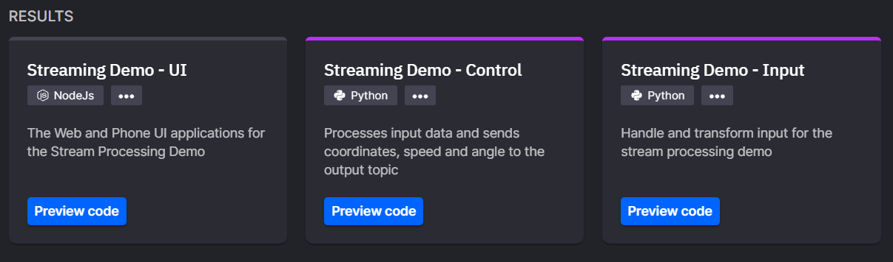
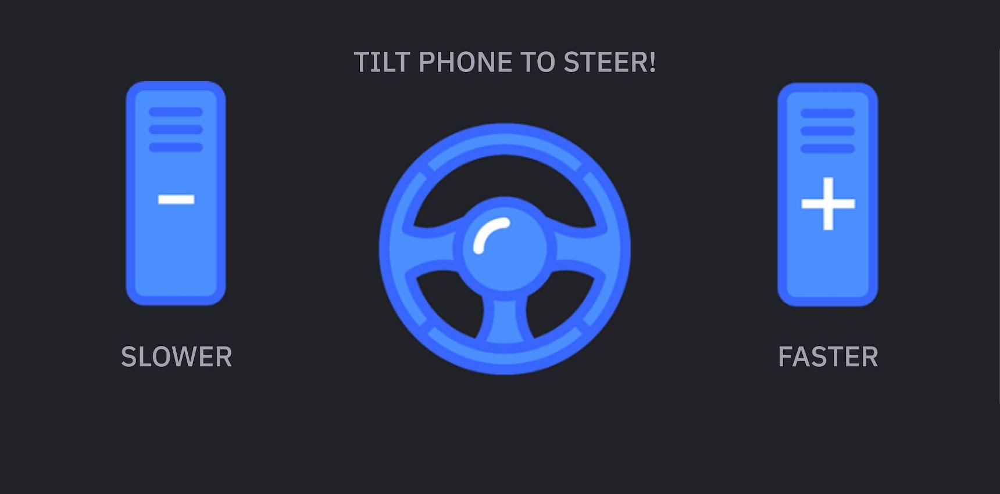

# Build an Interactive, Realtime Experience

## Aim

This Data Streaming and Processing tutorial will help you build your own realtime interactive creation.

The multiple elements, tools and techniques used in this tutorial will allow you to experience much of what Quix has to offer.

By the end you will have:

 - Created services to process data in realtime

 - Deployed a public facing website with desktop and mobile elements

 - Created an experience you can share with friends and colleagues


!!! tip 
    If you need any help, get into difficulties or just want to say hi then please join our [Slack community](https://quix.io/slack-invite?_ga=2.132866574.1283274496.1668680959-1575601866.1664365365){target=_blank}. We're eager to hear from anyone working with real-time data and that includes people following our tutorials.

## Project Architecture


The solution has 3 main elements:

 - Two services to process data

 - A NodeJS UI to display a race track and send data from your mobile device

However, this is all running with the Quix Serverless environment.

You have to create and deploy 3 projects, we have: . Created an always on high performance back-end . Created APIs and Services focused on performance . Opened firewall ports and optimized DNS propagation

## Prerequisites

- A Quix account

- A mobile device

!!! tip 
    If you don’t have a Quix account yet, go [here](https://quix.io/signup){target=_blank} to create one.

## Overview

This walk through covers the following:

1. Creating the python services and NodeJS UI’s

2. Deployment of the above

3. Some fun!

## Getting Started

Login to Quix and open your Workspace, you get one workspace on the free tier, more on higher tiers. A Quix Workspace is a container to help you manage all the data, topics, models and services related to a single solution so we advise using a new, clean one for this tutorial.

### Quix Library

The code you will need for this tutorial is located in the Quix Library. 

Open the library and search for `Streaming Demo`. You will see 3 results.



You will save the code for each of these to your workspace and deploy the two services and the UI.

### Input

First you will select, build and deploy the input project, this project handles and transforms data from your phone.

Don't worry, all the code you'll need is in the `Streaming Demo - Input` project.

#### Save the code

Follow these steps to get the code and deploy the project as a microservice.

1. Click the tile
2. Click `Edit code`
    
    !!! note 

        Leave the name, input and output as they are.

        The input and output values are [Topics](../../definitions.md#topics). These have been pre-configured in this and the other projects in this tutorial to allow the services to communicate with each other.

3. Click `Save as project`

    This will save a copy of this code to your workspace.

    ???- info "About the code"
        The code's main purpose is to listen for and respond in real-time to data and events being streamed to it via the `gamedata` topic.

        The data is streamed *into* the `gamedata` topic from your phone.

        When data is received, the `on_parameter_data_handler` callback is immediately triggered and the code within the callback processes the data.

        It extracts numeric values for `throttle`, `brake` and the phones `Y` axis aka steering.

        These are combined with some additional synchronization data, into a new ParameterData object and published to the output topic (`car-game-input`)

4. Tag this version of the code by clicking the small tag icon at the top of the code window.

    -  Type `v1.0` into the input box
    -  Hit enter

Next you will deploy the code as a microservice.

#### Deploy

To deploy a microservice in Quix is a very simple three step process and step one isn't read the Kubernetes manual!

1. Click `Deploy` near the top right hand corner of the screen.

2. Select the `v1.0` tag you created earlier

3. Click `Deploy`

    You will be redirected to the homepage and the code will be built, deployed and your microservice will be started.

!!! success 

    🚀 You've deployed the first microservice! Congrats!

???- info "What's actually happening"

    We built the code, created any missing topics and then deployed the compiled code into a Kubernetes pod running in our shared cluster.

    Once started, the microservice is ready to handle any data streamed to the input topic.

### Control

Now that you have the first service up and running it's time for the next one.

Follow the same process as above and deploy the `Streaming Demo - Control` project.

Remember the steps are:

1. Search the library for `Streaming Demo`

2. Select the `Streaming Demo - Control` project

3. Save it to your workspace

4. Tag it

5. Deploy it

!!! success

    🚀 You deployed another service and should now have two services in your data processing pipeline.

???- info "About the code"
    The code's main purpose is to listen for and respond in real-time to data and events being streamed to it via the `car-game-input` topic.

    When data is received, the `on_parameter_data_handler` callback is immediately triggered and the code within the callback processes the data.

    It extracts numeric values for `throttle`, `brake` and `steering` and uses these to determine the cars position on the track, it also slows the car if it goes off the track.

    The cars updated x and y coordinates, speed and angle are then published to the output topic called `car-game-control`. The UI subscribes to this topic and keeps the car in the correct position.

### UI

Now we can get to the user interface (UI). This will allow you to see the game board on your computer and see the controls on your phone. It's all linked together with Quix and a QR code.

You should be familiar with the process by now.

1. Search the library for `Streaming Demo`

2. Select the `Streaming Demo - UI` tile.

3. Save it to your workspace

4. Tag it

    !!! note "Make it public"
        This time before you click `Deploy`, you'll need to make the deployment publicly accessible.

        This means making it available to the internet so your computer and phone can access it.

        It's simple, just follow these steps:

        1. Click `PUBLIC ACCESS`
        2. Click the toggle switch to turn on public access
        3. Change the `URL prefix` to `game-demo`

5. Deploy it by clicking `Deploy`

!!! note "Build Time"

    It'll take a few minutes to build the UI for the demo. The build will download all the necessary packages, build and deploy the UI as well as opening up the firewall to allow your devices access.

!!! success

    🚀 You deployed the UI to your workspace and can now proceed to the fun part of the tutorial


???- info "About the code"
    This UI code is Javascript and HTML, it displays the track and car and subscribes to data coming from the topics to keep the car where it's supposed to be or at least where you drive it!

    The most relevant part of the code is where websockets are used via Microsoft's [SignalR](https://dotnet.microsoft.com/en-us/apps/aspnet/signalr){target=_blank}.

    For example these lines subscribe to various parameter values on the `car-game-control` topic.

    ```js
        connection.invoke("SubscribeToParameter", "car-game-control", stream_id + "-car-game-input-control", "x");
        connection.invoke("SubscribeToParameter", "car-game-control", stream_id + "-car-game-input-control", "y");
        connection.invoke("SubscribeToParameter", "car-game-control", stream_id + "-car-game-input-control", "angle");
        connection.invoke("SubscribeToParameter", "car-game-control", stream_id + "-car-game-input-control", "speed");
    ```

    And then when data is published for those parameters this code will handle it

    ```js
        connection.on("ParameterDataReceived", data => {
            if (data.streamId.endsWith("-car-game-input-control")) { ... }
        }
    ```

    Look for those lines in the `create-page.js` file and explore what they do.

    For more about WebSockets see [this page](../../../apis/streaming-reader-api/intro.md).

## Fun

With the microservices for control and input processing deployed along with the UI we can move on to trying the game.

1. Click the `Streaming Demo - UI` tile on the home page

2. Click the `Public URL` in the `Details` panel on the left

    A new tab will open and load the games first page.

3. Scan the QR code with your phone and follow the link

4. Ensure your phone is rotated either left or right depending on your device

5. Click the `START` button on your phones screen
    
    !!! note 
        You might need to allow notifications (this is just for the buzzer/vibrate to work)

    !!! note
        Notice that the page on your computer has also changed to the racing track. 
        
        You can now use your phone as a steering wheel to drive the car around the track.


6. DRIVE! 🏎️🏁

### Phone screen
{width=400px}

### Game screen

{width=400px}

## Thanks

Thanks for following the tutorial, hopefully you learnt something about Quix and had some fun doing it!

If you need any help, got into difficulties or just want to say hi then please join our [Slack community](https://quix.io/slack-invite?_ga=2.132866574.1283274496.1668680959-1575601866.1664365365){target=_blank}.