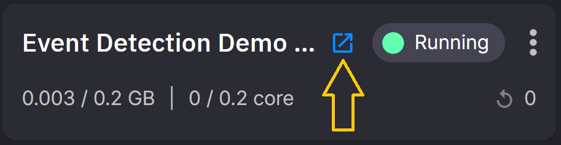

# 3. Demo UI

This is the UI for this tutorial, it enables the user to see where a device is located, the path it has taken and indicates where a crash has occurred.

The UI you will deploy is shown in the following screenshot:

{width=600px}

## Deploying the UI

The following steps demonstrate how to select the UI from the Code Samples and deploy it to your Quix environment.

Follow these steps to deploy the prebuilt UI:

1. Navigate to `Code Samples` and search for `Event Detection Demo UI`.

2. Click the `Setup & deploy` button.

3. Ensure that the `topic` input box contains `phone-data`.

	This topic will be subscribed to and will contain the sensor data from the data source you deployed earlier.

4. Ensure that the `eventTopic` input contains `phone-out`.

	This topic will be subscribed to and will contain any events generated by the crash event detection service you deployed earlier.

5. Click `Deploy` and wait while the UI is deployed and started.
	You will be redirected to your environment homepage once it's completed.

!!! success

	You have deployed the UI for this demo!

6. Click the "open in new window" button on the `Crash Detection Demo UI` tile.

	{width=300px}

7. Observe the various elements of the UI:

	!!! note 

		You will need some data streaming into the `phone-data` topic for the UI to activate. 
		
		Ensure the services you deployed in the previous stages of this tutorial are up and running. Have your phone to hand or make sure the [CSV data source](./data-acquisition.md#csv-data) is running

	a. The map showing the location reported by your phone or from the prerecorded data.

	b. Telemetry data from your phone.

	c. The timestamp of any crash events.

		You can click a crash event to see where it ocurred on the map.

[Conclusion, next steps and getting help :material-arrow-right-circle:{ align=right }](conclusion.md)
