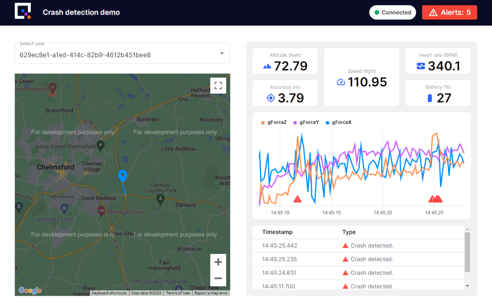

# 3. Demo UI

This is the UI for this tutorial, it enables the user to see where a device is located, the path it has taken and indicates where a crash has occurred.

The UI you will deploy is shown in the following screenshot:

{width=600px}

## Deploying the UI

The following steps demonstrate how to select the UI from the Samples Library and deploy it to your Quix workspace.

Follow these steps to deploy the prebuilt UI:

1. Navigate to the Library and search for `Event Detection Demo UI`.

2. Click the `Setup & deploy` button.

3. Ensure that the `topic` input box contains `phone-data`.

	This topic will be subscribed to and will contain the sensor data from the data source you deployed earlier

4. Ensure that the `eventTopic` input contains `phone-out`

	This topic will be subscribed to and will contain any events generated by the crash event detection service you deployed earlier

5. Click Deploy.

!!! success

	You have deployed the UI for this demo!

6. Click the "open in new window" button on the `Crash Detection Demo UI` tile

	{width=300px}

7. Observe the various elements of the UI:

	a. The map showing the location reported by your phone or from the prerecorded data

	b. Telemetry data from your phone

	c. The timestamp of any crash events

		You can click a crash event to see where it ocurred on the map

[Conclusion and next steps](conclusion.md)
