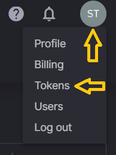
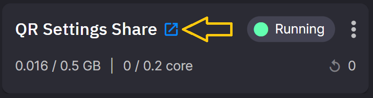
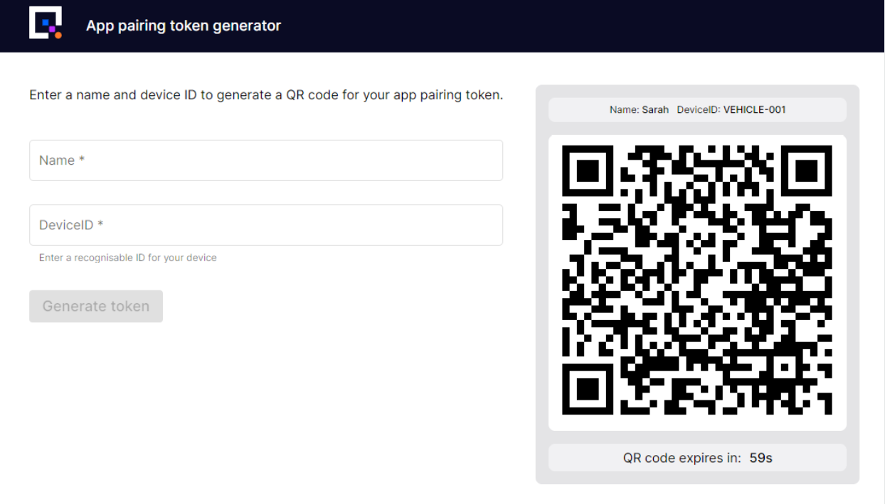

# 1. Data acquisition

You’ll start this tutorial by streaming data into a topic. Starting with the data feed allows you to verify that the code and services you’ll build and deploy are working properly.

You have two options for this stage:

1. Stream data from your Android phone with the [Quix Companion app](#quix-companion-app).

2. Stream prerecorded [CSV data](#csv-data).

You will only need to set up one of these data sources but if you want to do both you can do that too!

## Quix companion app

### External source

To get started with these steps you first need to add a Topic and pipeline placeholder called an external source.

An external source is a representation of a data source that is external to Quix, for example an IoT device or a service that is pushing data to a Quix topic using one of our API's.

To add an external source:

1. Navigate to the code samples.

2. Under `Pipeline Stage` click `Source`.

3. Locate the `External Source` sample and click `Add external source`.

4. Enter `phone-data` in the `Output` field and click `Add new topic` in the drop-down.

5. Enter `Quix companion web gateway` in the `Name` field.

6. Click `Add external Source`.

### Install and configure the apps

To stream data from your phone you’ll need to install the `Quix Companion App` on your Android phone and deploy the QR Settings Share app to your Quix workspace.

Follow these steps:

1. Install the `Quix Companion App` from the Google Play Store. 

	[{width=200px}](https://play.google.com/store/apps/details?id=com.quix.quixtracker&gl=GB){target=_blank}

2. Open the app and navigate to the `Settings` page via the menu.

3. Click the `SCAN QR CODE` button at the top of the settings page. Now continue to follow these steps. When directed, in step #17, you will scan the QR code using the Quix Companion app.

4. In the Quix Portal, click the user icon in the top right of the browser.

	{width=150px}

5. Click `Tokens`.

6. Generate a token with any name and allow at least a few days before it expires.

7. Copy the token to your clipboard or somewhere safe.

8. In the code samples, search for `QR Settings Share`.

9. Click `Setup & deploy`.

10. Paste the token into the `token` field.

11. Click `Deploy`.

12. Open the QR Settings Share by clicking the "open in new window" icon.

	{width=300px}

13. Enter a name and a device identifier into the input fields.

14. These can be any value such as your name and CAR-001.

15. Click `Generate Token`.

16. A QR code will be generated and presented to you in the UI.

	{width=600px}

17. Scan the QR code using the Quix Companion App.

	The app has now been configured with the access token, allowing it to communicate with Quix.

18. Ensure the rest of the fields are configured as follows:

	a. Topic field is set to `phone-data`.
	
	b. `Notifications Topic` field is set to `phone-out`.

	c. `DeviceId` field is set to your chosen device identifier.

	d. `Rider` is set to your name.

	e. `Team` has a value. For example `Quix`.

19. Select `Dashboard` from the menu.

20. Click the `START` button.

	This will open a connection to your Quix workspace and start streaming data from your phone.

### Verify the live data

Follow these steps to ensure that everything is working as expected:

1. In the Quix Portal, navigate to `Data Explorer`.

2. Ensure you are on the `Live data` tab.

3. Under `Select a topic` select `phone-data`.

4. Under `select streams` select the active stream. This should be the only stream that exists.

5. Under `select parameters or events` select `gForceX`, `gForceY` and `gForceZ`.

6. The waveform view should display the live g-force data from your phone.

7. Move or gently shake your phone and notice that the waveform reflects whatever movement your phone is experiencing.

!!! success
	You have connected the Quix Companion App to your workspace and verified the connection using the Live Data Explorer.

## CSV data

If you don’t have an Android device, or you’d rather stream some data provided for you, then use this data source.

Follow these instructions to deploy the data source:

1. In the code samples, select `Python` under languages and `Source` under pipeline stage.

2. In the search box enter `Empty template`.

3. On `Empty template`, click `Preview code` then `Edit code`.

4. Change the `Name` field to `CSV data source`.

5. Change the `output` field to `phone-data`.

6. Click `Save as project`.

7. Open the `requirements.txt` file and add `urllib3` to a new line.

8. Open the `main.py` file and replace the code with the following code:

	```py
	from quixstreaming import QuixStreamingClient
	from quixstreaming.app import App
	import time
	import pandas as pd
	import os
	from urllib import request


	# download data.csv
	# if you want to use your own data file just comment these lines
	# and place your data.csv file in the same folder as main.py
	f = request.urlopen("https://quixtutorials.blob.core.windows.net/tutorials/event-detection/data.csv")
	with open("data.csv", "wb") as data_file:
		data_file.write(f.read())

	# Quix injects credentials automatically to the client. Alternatively, you can always pass an SDK token manually as an argument.
	client = QuixStreamingClient()

	# Open the output topic
	print("Opening output topic")
	output_topic = client.open_output_topic(os.environ["output"])

	output_stream = output_topic.create_stream()

	df = pd.read_csv("data.csv")

	for col_i in ['device_id','rider','streamId','team','version']:
		df = df.rename(columns={col_i: "TAG__" + col_i})
		
	print("Writing data")
	seconds_to_wait = 0.5

	while True:
		for i in range(len(df)):
			start_loop = time.time()

			df_i = df.iloc[[i]]

			output_stream.parameters.write(df_i)
			print("Sending " + str(i) + "/" + str(len(df)))
			end_loop = time.time()
			time.sleep(max(0.0, seconds_to_wait - (end_loop - start_loop)))

	App.run()

	```

	!!! info 
		The code:

		- Connects to Quix.

		- Opens the CSV file using Pandas.

		- Renames some columns so Quix Streams teams them as tags.

		- Then streams each row to the `phone-data` topic.

		- It does this continuously so stop the service when you have completed the tutorial.

7. Test the code by clicking `run` near the top right corner of the code window.

	With the code running you will see messages in the `Console` tab

	```sh
	[xx-xx-xx xx:xx:xx.xxx (8) INF] Topic phone-data is still creating
	Opening output topic
	Writing data
	Sending 0/18188
	Sending 1/18188
	Sending 2/18188
	```

8. Click the `Messages` tab and you’ll see the raw messages being streamed to the `phone-data` topic.

9. Click one of the messages and you’ll see the raw data in [JSON](https://www.w3schools.com/whatis/whatis_json.asp){target=_blank} format.

	???- info "Your data should look like JSON"

		Note! Depending on which row you click you may see slightly different results. Only some rows contain location data.

		```
		"Epoch": 0,
		"Timestamps": [
			1673966764000000000
		],
		"NumericValues": {
			"Longitude": [
			0.52202169
			],
			"Latitude": [
			51.73491702
			],
			"Speed": [
			98.0639991760254
			],
			"Heading": [
			347.5
			],
			"BatteryLevel": [
			0.27
			],
			"Altitude": [
			59.63983154296875
			],
			"Accuracy": [
			3.790092468261719
			]
		},
		"StringValues": {
			"EnergySaverStatus": [
			"Off"
			],
			"BatteryState": [
			"Discharging"
			],
			"BatteryPowerSource": [
			"Battery"
			]
		},
		"BinaryValues": {},
		"TagValues": {}
		}

		```

7. Stop the code by clicking the same button you clicked to run it.

8. You'll now deploy the code as a service, so it stays running when you navigate around the platform.

9. Click `Deploy`.

10. On the dialog, click `Deploy`.

	Once deployed the service will be started and data will be streamed to the `phone-data` topic.

[Detect crash events by following step 2 :material-arrow-right-circle:{ align=right }](crash-detection.md)


