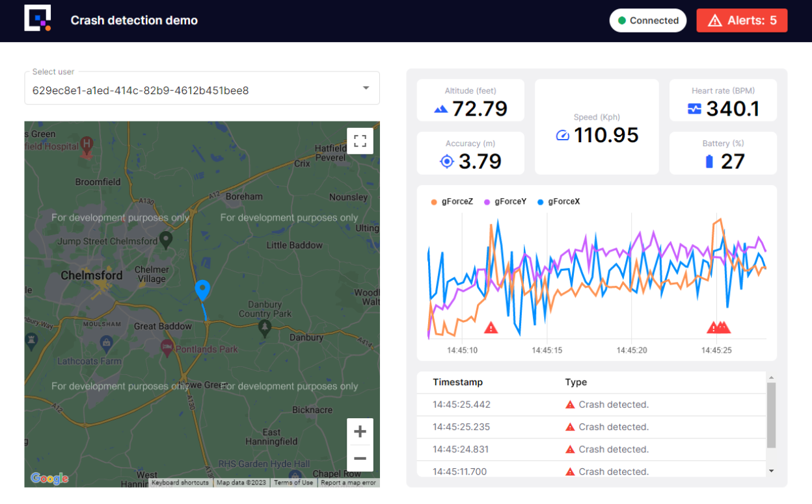

# Event Detection

In this tutorial you will learn how to build a real-time event detection pipeline. Events will be simulated crashes or accidents that could occur while driving or cycling. 

You will deploy a crash detection service to detect crashes in real time and a UI to view the location of the incident.

In this example the actual crash detection is performed using an ML model, pretrained with data from Quix. We have a tutorial that shows you how to train a basic model with a small subset of data, you can collect more data to train your model using more scenarios to ensure it’s accurate for your needs.

Once you have completed the tutorial you will see the following UI:

{width=600px}

You will see a map with the route being taken, various data values sent from the data source and the times and locations of events.

## The parts of the tutorial

This tutorial is divided into several parts to make it more a manageable learning experience. Feel free to complete the various parts at your own pace, your Quix account is free and credit renews each month.

1. [**Data Acquisition**](./data-acquisition.md). Streaming data into the crash detection pipeline will bring the solution to life. You’ll have 2 options here, stream data live from your phone or use some CSV data we prerecorded. We'll guide you through whichever option is best for you.

2. [**Build and deploy the crash detection service**](./crash-detection.md). This service uses an ML model to detect crashes in real-time. We’ll show you how to train the model using data obtained from Quix, but we also provide you with a pretrained model for convenience.

3. [**Deploy the UI**](./crash-detection-ui.md). You will deploy the demo UI. This is a prebuilt UI from the Quix Samples Library. It allows the user to see where a device is located and indicates where a crash has occurred.

!!! info

	If at any point you run into an issue or want to know more then please reach out to us in our Slack community [The Stream](https://quix.ai/slack-invite){target=_blank}.
