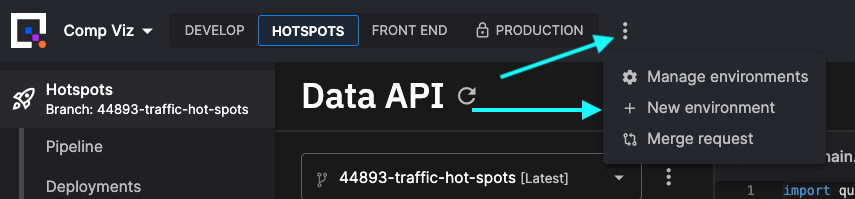
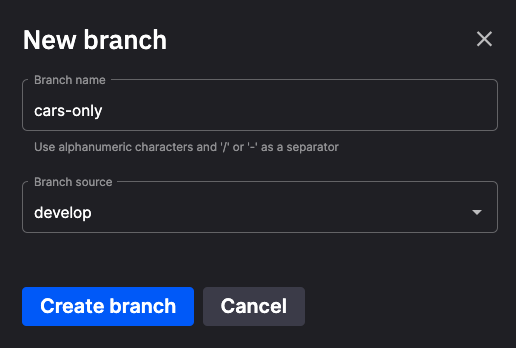
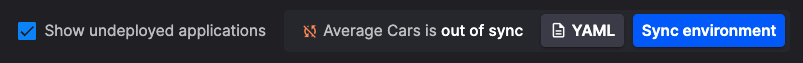
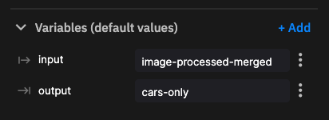
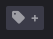
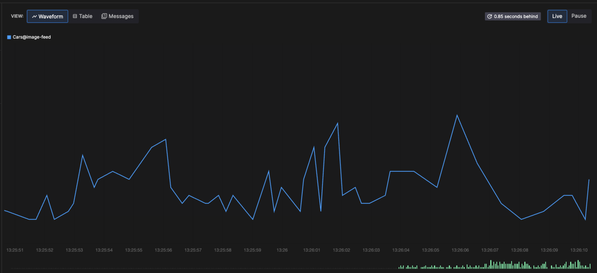

# 👩‍🔬 Lab - Add a new service

In this lab you use everything you've learned so far, to add a new service to the pipeline. Specifically, you add a service to publish the number of cars captured by the TfL cams to a new topic. You will then observe the number of cars change in real time using the waveform view of the Quix Data Explorer. This service could be useful if you want to easily store the number of cars, or perhsp create an alarm if the number of cars rises above a certain threshold. This service is a simple example of filtering - where you filter out data you are not interested in for subsequent processing.

You develop this service on a feature branch, and then, you create a PR to merge your new feature into the develop branch. This is a common pattern for development - you can test your new service on the feature branch, and then test again on the develop branch, before final integration into the production `main` branch.

## Create an environment

To create a new environment (and branch):

1. Click `+ New environment` to create a new environment (note, your screen will look slightly different to the one shown here):

    

2. Create a new environment called `Cars Only`.

3. Create a new branch called `cars-only`. To do this, from the branch dropdown click `+ New branch` which displays the New branch dialog:

    

    !!! important

      Make sure you branch from the `develop` branch, not `main`, as you are going to merge your changes onto the `develop` branch.

4. Complete creation of the environment using the default options.

5. On the projects screen, click your newly created environment, `Cars Only`.

## Sync the environment

You now see that the Quix environment is out of sync with the Git repository. You need to synchronize the Quix view of the environment, with that stored in the repository. 

To synchronize Quix with the repository:

1. Click `Sync environment`:

    

    The sync environment dialog is displayed, showing you the changes that are to be made to the `quix.yaml` file, which is the configuration file that defines the pipeline.

2. Click `Sync environment`, and then `Go to pipeline`. 

    In the pipeline view, you see the services building. Ensure all services are "Running" before continuing.

## Add a transform

You now add a transform to the output of the stream merge service. This is a convenient point, as the multiple streams are now merged to one stream (all cameras are merged into one stream), and this will make viewing the number of cars easier in the waveform view of the data explorer, as there is only one stream to examine.

To create the transform:

1. Click the small `+` on the output of the stream merge service, and then select `Transformation` from the dropdown list.

2. Click `Preview code` for the `Starter transformation` in the Code Samples view.

3. Click `Edit code`, and enter an application name of `Cars Only` and leave the path as the default, then click `Save`.

4. Replace the complete `main.py` code with the following:

    ``` python
    import quixstreams as qx
    import os
    import pandas as pd
    import datetime

    client = qx.QuixStreamingClient()

    topic_consumer = client.get_topic_consumer(os.environ["input"], consumer_group = "empty-transformation")
    topic_producer = client.get_topic_producer(os.environ["output"])

    def on_dataframe_received_handler(stream_consumer: qx.StreamConsumer, df: pd.DataFrame):
        d = df.to_dict()
        if 'car' in d:
            # Create a clean data frame
            data = qx.TimeseriesData()
            data.add_timestamp(datetime.datetime.utcnow()) \
                .add_value("Cars", d['car'][0])
        
            stream_producer = topic_producer.get_or_create_stream(stream_id = stream_consumer.stream_id)
            stream_producer.timeseries.buffer.publish(data)

    def on_stream_received_handler(stream_consumer: qx.StreamConsumer):
        stream_consumer.timeseries.on_dataframe_received = on_dataframe_received_handler

    # subscribe to new streams being received
    topic_consumer.on_stream_received = on_stream_received_handler

    print("Listening to streams. Press CTRL-C to exit.")

    # Handle termination signals and provide a graceful exit
    qx.App.run()
    ```

    ??? "Understand the code"

        The code is a little different to the starter transform. The handler for event data has been removed, along with its registration code, as you are only interested in time series data in this transform. This time series data is received in a pandas dataframe format. For ease of manipulation this is converted to a Python dictionary, so the car data can be simply extracted. 

        A new pandas dataframe is the created, as the data published to the output topic is only going to consist of a timestamp and the number of cars on it. This is an example of simple filtering. 

        Once prepared, the dataframe is then published to the output topic.


5. Edit environment variables, so that the input topic is `image-processed-merged` and the output topic is a new topic called `cars-only`, as shown in the following screenshot:

    

    !!! tip

        These environment variables are used by the code. For example, the input topic is read by the code with the code:

            ``` python
            os.environ["input"]
            ```

6. Click the tag icon (see screenshot), and give the code a tag such as `cars-only-v1`:

    

7. Click the `Deploy` button and select the version tag `cars-only-v1` from the `Version tag` dropdown, and leaving all other values at their defaults, click `Deploy`.

## View the data in real time

You now use the Quix Data Explorer to view the cars data in real time.

1. In the left-hand navigation, click `Data explorer`.

    !!! tip

        While this is the most direct way to access the Data Explorer, it's not the only way. You learn about other methods in other tutorials. You can, for example, click on the topic you want to view in the pipeline view, and then select `View live data` - that takes you into the Data Explorer.

2. Click `Live data` and make sure the `cars-only` topic is selected.

3. Check the `image-feed` stream checkbox, and also the `Cars` parameter data checkbox.

4. Make sure Waveform view is selected. 

    !!! tip

        If no data is visible, stop and start the TFL Camera Feed service, as it may be sleeping.

    You see the waveform showing the number of cars detected:

    

## Merge the feature

TBD


## 🏃‍♀️ Next step

[Part 8 - Summary :material-arrow-right-circle:{ align=right }](../image-processing/summary.md)
 
